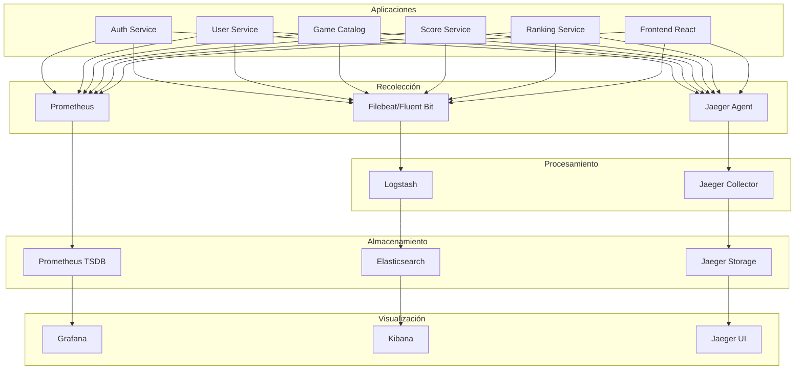

# 6.10. Estrategia de Observabilidad

Esta guía unifica toda la estrategia de observabilidad de RetroGameCloud, cubriendo el stack completo de herramientas, configuraciones y metodologías para monitorización efectiva.

## Stack de Observabilidad

### Herramientas Principales

<Tabs>
<Tab title="Métricas">
- **Prometheus**: Recolección y almacenamiento de métricas
- **Grafana**: Visualización y dashboards
- **AlertManager**: Gestión de alertas
- **Node Exporter**: Métricas del sistema
- **kube-state-metrics**: Métricas de Kubernetes
</Tab>
<Tab title="Logs">
- **Elasticsearch**: Almacenamiento y búsqueda de logs
- **Logstash**: Procesamiento y enriquecimiento
- **Kibana**: Visualización y análisis
- **Filebeat**: Recolección de logs
- **Fluent Bit**: Agregación ligera para Kubernetes
</Tab>
<Tab title="Trazas">
- **Jaeger**: Distributed tracing
- **OpenTelemetry**: Instrumentación estándar
- **Jaeger Agent**: Recolección local de spans
- **Jaeger Collector**: Procesamiento centralizado
</Tab>
</Tabs>

### Arquitectura de Observabilidad



## Métricas Doradas por Servicio

### Service Level Indicators (SLIs)

<Note>
Las métricas doradas siguen el patrón USE (Utilización, Saturación, Errores) y RED (Rate, Errors, Duration).
</Note>

<Tabs>
<Tab title="Auth Service">
```yaml
# Latencia
auth_request_duration_seconds:
  - p50: < 100ms
  - p95: < 300ms  
  - p99: < 500ms

# Tráfico
auth_requests_total:
  - login_rate: 100 req/min
  - token_validation_rate: 1000 req/min

# Errores
auth_errors_total:
  - login_failures: < 5%
  - token_validation_errors: < 1%

# Saturación
auth_active_sessions: < 10000
auth_cpu_usage: < 70%
auth_memory_usage: < 80%
```
</Tab>
<Tab title="Game Catalog">
```yaml
# Latencia
catalog_request_duration_seconds:
  - p50: < 50ms
  - p95: < 200ms
  - p99: < 500ms

# Tráfico  
catalog_requests_total:
  - game_list_rate: 500 req/min
  - game_detail_rate: 200 req/min

# Errores
catalog_errors_total:
  - database_errors: < 1%
  - s3_errors: < 2%

# Saturación
catalog_db_connections: < 80%
catalog_cache_hit_ratio: > 90%
```
</Tab>
<Tab title="Score Service">
```yaml
# Latencia
score_request_duration_seconds:
  - p50: < 80ms
  - p95: < 250ms
  - p99: < 600ms

# Tráfico
score_requests_total:
  - submit_rate: 50 req/min
  - leaderboard_rate: 300 req/min

# Errores
score_errors_total:
  - validation_errors: < 3%
  - persistence_errors: < 1%

# Saturación
score_queue_length: < 100
score_processing_time: < 30s
```
</Tab>
</Tabs>

### Queries Prometheus Específicas

```yaml
# Latencia P95 por servicio
histogram_quantile(0.95, 
  sum(rate(http_request_duration_seconds_bucket[5m])) 
  by (service, le)
)

# Error Rate por endpoint
sum(rate(http_requests_total{status=~"5.."}[5m])) by (service, endpoint) /
sum(rate(http_requests_total[5m])) by (service, endpoint) * 100

# Throughput por servicio
sum(rate(http_requests_total[5m])) by (service)

# Saturación CPU por pod
100 - (avg by(instance) (irate(node_cpu_seconds_total{mode="idle"}[5m])) * 100)

# Memoria disponible
(node_memory_MemAvailable_bytes / node_memory_MemTotal_bytes) * 100
```

## Dashboards Grafana

### Dashboard Principal - Visión General

<Warning>
Los dashboards deben configurarse con variables para filtrar por entorno (dev, staging, prod).
</Warning>

```json
{
  "dashboard": {
    "id": null,
    "title": "RetroGameCloud - Overview",
    "tags": ["retrogame", "overview"],
    "timezone": "browser",
    "panels": [
      {
        "title": "Request Rate",
        "type": "stat",
        "targets": [
          {
            "expr": "sum(rate(http_requests_total[5m]))",
            "legendFormat": "Total RPS"
          }
        ]
      },
      {
        "title": "Error Rate",
        "type": "stat",
        "targets": [
          {
            "expr": "sum(rate(http_requests_total{status=~'5..'}[5m])) / sum(rate(http_requests_total[5m])) * 100",
            "legendFormat": "Error %"
          }
        ]
      },
      {
        "title": "Response Time P95",
        "type": "stat", 
        "targets": [
          {
            "expr": "histogram_quantile(0.95, sum(rate(http_request_duration_seconds_bucket[5m])) by (le))",
            "legendFormat": "P95 Latency"
          }
        ]
      }
    ]
  }
}
```

### Dashboard por Servicio

<Tabs>
<Tab title="Auth Service Dashboard">
```json
{
  "panels": [
    {
      "title": "Login Success Rate",
      "type": "graph",
      "targets": [
        {
          "expr": "rate(auth_login_attempts_total{status='success'}[5m]) / rate(auth_login_attempts_total[5m]) * 100",
          "legendFormat": "Success Rate %"
        }
      ]
    },
    {
      "title": "Active Sessions",
      "type": "graph",
      "targets": [
        {
          "expr": "auth_active_sessions_total",
          "legendFormat": "Active Sessions"
        }
      ]
    },
    {
      "title": "Token Validation Latency",
      "type": "graph",
      "targets": [
        {
          "expr": "histogram_quantile(0.95, rate(auth_token_validation_duration_seconds_bucket[5m]))",
          "legendFormat": "P95"
        }
      ]
    }
  ]
}
```
</Tab>
<Tab title="Game Catalog Dashboard">
```json
{
  "panels": [
    {
      "title": "Database Query Performance",
      "type": "graph",
      "targets": [
        {
          "expr": "histogram_quantile(0.95, rate(catalog_db_query_duration_seconds_bucket[5m]))",
          "legendFormat": "DB Query P95"
        }
      ]
    },
    {
      "title": "Cache Hit Ratio",
      "type": "stat",
      "targets": [
        {
          "expr": "catalog_cache_hits_total / (catalog_cache_hits_total + catalog_cache_misses_total) * 100",
          "legendFormat": "Cache Hit %"
        }
      ]
    },
    {
      "title": "S3 Operations",
      "type": "graph",
      "targets": [
        {
          "expr": "rate(catalog_s3_operations_total[5m])",
          "legendFormat": "{{operation}}"
        }
      ]
    }
  ]
}
```
</Tab>
</Tabs>

## Configuración de Logs Estructurados

### Formato JSON Estándar

```javascript
// Configuración Winston para Node.js
const winston = require('winston');

const logger = winston.createLogger({
  format: winston.format.combine(
    winston.format.timestamp(),
    winston.format.errors({ stack: true }),
    winston.format.json(),
    winston.format.printf(({ timestamp, level, message, service, traceId, spanId, userId, ...meta }) => {
      return JSON.stringify({
        timestamp,
        level,
        message,
        service: service || process.env.SERVICE_NAME,
        traceId,
        spanId,
        userId,
        environment: process.env.NODE_ENV,
        version: process.env.APP_VERSION,
        ...meta
      });
    })
  ),
  transports: [
    new winston.transports.Console(),
    new winston.transports.File({ filename: '/var/log/app.log' })
  ]
});
```

### Parseo en Logstash

```ruby
# logstash.conf
input {
  beats {
    port => 5044
  }
}

filter {
  if [fields][service] {
    mutate {
      add_field => { "service_name" => "%{[fields][service]}" }
    }
  }

  json {
    source => "message"
  }

  date {
    match => [ "timestamp", "ISO8601" ]
  }

  if [traceId] {
    mutate {
      add_field => { "trace_id" => "%{traceId}" }
    }
  }

  if [error] {
    mutate {
      add_tag => [ "error" ]
    }
  }
}

output {
  elasticsearch {
    hosts => ["elasticsearch:9200"]
    index => "retrogame-logs-%{+YYYY.MM.dd}"
  }
}
```

## Distributed Tracing con Jaeger

### Configuración OpenTelemetry

```javascript
// tracing.js
const { NodeSDK } = require('@opentelemetry/sdk-node');
const { JaegerExporter } = require('@opentelemetry/exporter-jaeger');
const { getNodeAutoInstrumentations } = require('@opentelemetry/auto-instrumentations-node');

const jaegerExporter = new JaegerExporter({
  endpoint: process.env.JAEGER_ENDPOINT || 'http://jaeger-collector:14268/api/traces',
});

const sdk = new NodeSDK({
  traceExporter: jaegerExporter,
  instrumentations: [
    getNodeAutoInstrumentations({
      '@opentelemetry/instrumentation-fs': {
        enabled: false,
      },
    }),
  ],
  serviceName: process.env.SERVICE_NAME,
  serviceVersion: process.env.APP_VERSION,
});

sdk.start();
```

### Instrumentación Manual

```javascript
const opentelemetry = require('@opentelemetry/api');

class GameService {
  async getGameById(gameId) {
    const span = opentelemetry.trace.getActiveSpan();
    span?.setAttributes({
      'game.id': gameId,
      'operation': 'get_game'
    });

    try {
      // Crear span hijo para consulta DB
      const dbSpan = opentelemetry.trace.getTracer('game-service')
        .startSpan('db.query.games');
      
      dbSpan.setAttributes({
        'db.system': 'postgresql',
        'db.operation': 'select',
        'db.table': 'games'
      });

      const game = await this.repository.findById(gameId);
      
      dbSpan.setStatus({ code: opentelemetry.SpanStatusCode.OK });
      dbSpan.end();

      return game;
    } catch (error) {
      span?.recordException(error);
      span?.setStatus({ 
        code: opentelemetry.SpanStatusCode.ERROR,
        message: error.message 
      });
      throw error;
    }
  }
}
```

## Correlación para Debugging

### Ejemplo de Debugging Completo

<Note>
La correlación efectiva requiere que traceId esté presente en logs, métricas y spans.
</Note>

**Paso 1: Detectar el problema en métricas**
```promql
# Error rate aumentado en auth-service
increase(http_requests_total{service="auth-service",status="500"}[5m])
```

**Paso 2: Buscar logs relacionados**
```json
GET /retrogame-logs-*/_search
{
  "query": {
    "bool": {
      "must": [
        {"range": {"@timestamp": {"gte": "now-5m"}}},
        {"term": {"service_name": "auth-service"}},
        {"term": {"level": "error"}}
      ]
    }
  },
  "sort": [{"@timestamp": {"order": "desc"}}]
}
```

**Paso 3: Obtener traceId de los logs**
```json
{
  "_source": {
    "timestamp": "2024-01-15T10:30:45.123Z",
    "level": "error", 
    "message": "Database connection timeout",
    "service": "auth-service",
    "traceId": "1a2b3c4d5e6f7g8h",
    "error": {
      "stack": "Error: connect ETIMEDOUT..."
    }
  }
}
```

**Paso 4: Analizar trace completo en Jaeger**
```bash
# Buscar trace por ID en Jaeger UI
# URL: http://jaeger-ui:16686/trace/1a2b3c4d5e6f7g8h

# O via API
curl "http://jaeger-query:16686/api/traces/1a2b3c4d5e6f7g8h"
```

### Middleware de Correlación

```javascript
// correlation-middleware.js
const { trace, context } = require('@opentelemetry/api');

function correlationMiddleware(req, res, next) {
  const
```