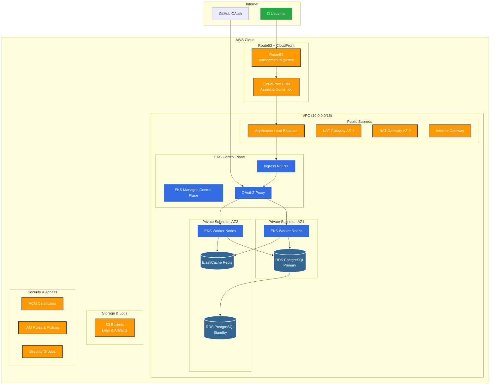

## 4.1. Infraestructura como Código

La infraestructura de Retro Game Hub está completamente gestionada con **Terraform**, asegurando despliegues reproducibles y versionados en AWS.

## 4.1.1. Arquitectura de la Infraestructura

<div className="mermaid">



</div>

## 4.1.2. Principios de Diseño

### 4.1.2.1. Alta Disponibilidad

- **Multi-AZ**: Despliegue en múltiples zonas de disponibilidad

- **Auto-scaling**: Escalado automático de nodos EKS

- **Health Checks**: Monitoreo continuo de la salud de los servicios

- **Failover**: Conmutación automática en caso de fallos

### 4.1.2.2. Escalabilidad

- **Horizontal Scaling**: Pods y nodos se escalan según demanda

- **Elastic Load Balancing**: Distribución automática del tráfico

- **Resource Optimization**: Configuración optimizada de recursos

- **Performance Monitoring**: Métricas para optimización continua

### 4.1.2.3. Seguridad

- **Network Isolation**: VPC con subnets públicas y privadas

- **IAM Least Privilege**: Permisos mínimos necesarios

- **Encryption**: Cifrado en tránsito y en reposo

- **Security Groups**: Reglas de firewall granulares

## 4.1.3. Componentes Principales

### 4.1.3.1. Capa de Red

- **VPC**: Red privada virtual aislada (10.0.0.0/16)

- **Subnets**: Segmentación en subredes públicas y privadas

- **Internet Gateway**: Acceso a internet para recursos públicos

- **NAT Gateways**: Acceso saliente para recursos privados

### 4.1.3.2. Capa de Computación

- **EKS Cluster**: Kubernetes gestionado por AWS

- **Worker Nodes**: Instancias EC2 optimizadas para contenedores

- **Auto Scaling Groups**: Escalado automático de nodos

- **Spot Instances**: Optimización de costos con instancias spot

### 4.1.3.3. Capa de Datos

- **RDS PostgreSQL**: Base de datos relacional con Multi-AZ

- **ElastiCache Redis**: Cache en memoria para sesiones

- **S3 Buckets**: Almacenamiento de objetos para logs y artifacts

### 4.1.3.4. Capa de Aplicación

- **Application Load Balancer**: Balanceador de carga de aplicación

- **Ingress NGINX**: Controlador de ingreso para Kubernetes

- **OAuth2-Proxy**: Autenticación y autorización

- **CloudFront**: CDN para optimización de contenido

## 4.1.4. Gestión y Operaciones

### 4.1.4.1. Infrastructure as Code

```hcl

# Ejemplo de configuración Terraform
module "vpc" {
  source = "./modules/vpc"

  cidr_block           = "10.0.0.0/16"
  availability_zones   = ["us-west-2a", "us-west-2b"]
  public_subnet_cidrs  = ["10.0.1.0/24", "10.0.2.0/24"]
  private_subnet_cidrs = ["10.0.3.0/24", "10.0.4.0/24"]

  tags = local.common_tags
}

```

### 4.1.4.2. Monitoreo y Logging

- **CloudWatch**: Métricas y logs centralizados

- **Prometheus**: Métricas de aplicación y Kubernetes

- **Grafana**: Dashboards y visualización

- **ELK Stack**: Agregación y análisis de logs

### 4.1.4.3. Backup y Recuperación

- **Automated Backups**: Snapshots automáticos de RDS

- **Cross-Region Replication**: Replicación de S3 entre regiones

- **Disaster Recovery**: Plan de recuperación ante desastres

- **RTO/RPO**: Objetivos de tiempo y punto de recuperación definidos

## 4.1.5. Costos y Optimización

### 4.1.5.1. Estrategias de Optimización

- **Reserved Instances**: Reserva de instancias para cargas predecibles

- **Spot Instances**: Uso de instancias spot para cargas tolerantes a fallos

- **Auto Scaling**: Escalado basado en métricas de utilización

- **Resource Tagging**: Etiquetado para seguimiento de costos

### 4.1.5.2. Estimación de Costos
| Componente | Costo Mensual Estimado | Descripción |
|------------|----------------------|-------------|
| EKS Cluster | $72 | Control plane gestionado |
| EC2 Instances | $150-300 | 3-6 nodos t3.medium |
| RDS PostgreSQL | $120 | db.t3.micro Multi-AZ |
| ElastiCache | $50 | cache.t3.micro |
| Load Balancer | $20 | Application Load Balancer |
| **Total** | **$412-562** | Estimación mensual |

<Callout type="info">
Los costos pueden variar según el uso real, región de AWS y configuraciones específicas.
</Callout>

## 4.1.6. Siguientes Pasos

Para implementar y gestionar esta infraestructura, consulta las siguientes secciones:

- **[4.2. Configuración de AWS](./aws-setup)**: Setup inicial de la cuenta AWS

- **[4.3. Terraform](./terraform)**: Configuración y despliegue con Terraform

- **[4.4. Kubernetes](./kubernetes)**: Configuración del cluster EKS

- **[4.5. Monitoreo](./monitoring)**: Setup de monitoreo y alertas

- **[4.6. Seguridad](./security)**: Implementación de medidas de seguridad