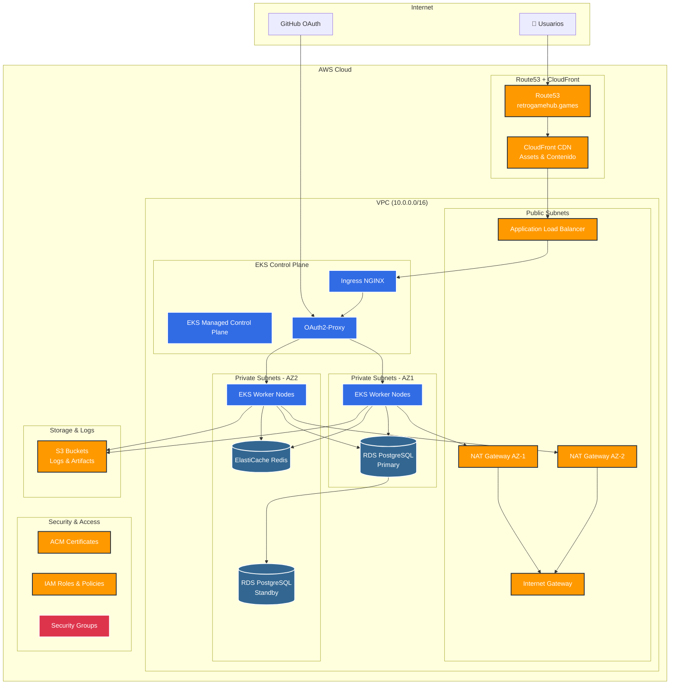

## Infraestructura como Código

La infraestructura de Retro Game Hub está completamente gestionada con **Terraform**, asegurando despliegues reproducibles y versionados en AWS.

## Arquitectura de la Infraestructura

<div className="mermaid">

</div>

## Componentes de Red y Seguridad

### Red VPC
- **CIDR:** `10.0.0.0/16`
- **Subnets Públicas:** 2 AZ con NAT Gateways e Internet Gateway
- **Subnets Privadas:** 2 AZ para workloads y bases de datos
- **Multi-AZ:** Alta disponibilidad en `us-west-2a` y `us-west-2b`

### Security Groups
- **ALB-SG:** Puertos 80/443 desde internet
- **EKS-SG:** Comunicación interna del cluster
- **RDS-SG:** Puerto 5432 solo desde EKS nodes
- **Redis-SG:** Puerto 6379 solo desde EKS nodes

## Servicios AWS Utilizados

<CardGroup cols={2}>
  <Card title="EKS" icon="dharmachakra">
    Cluster Kubernetes gestionado para orquestación de contenedores
  </Card>
  <Card title="VPC" icon="network-wired">
    Red aislada con subnets públicas y privadas multi-AZ
  </Card>
  <Card title="RDS" icon="database">
    PostgreSQL 14 con Multi-AZ y backups automáticos
  </Card>
  <Card title="ElastiCache" icon="bolt">
    Redis 7.x gestionado para caché y sesiones
  </Card>
  <Card title="ALB" icon="scale-balanced">
    Application Load Balancer con terminación SSL
  </Card>
  <Card title="Route53" icon="globe">
    Gestión DNS para retrogamehub.games
  </Card>
  <Card title="CloudFront" icon="cloud">
    CDN para assets de juegos y contenido estático
  </Card>
  <Card title="S3" icon="bucket">
    Almacenamiento de objetos para archivos y logs
  </Card>
  <Card title="ACM" icon="certificate">
    Certificados SSL/TLS automáticos
  </Card>
  <Card title="IAM" icon="shield">
    Gestión de identidad y acceso con roles específicos
  </Card>
  <Card title="Ingress NGINX" icon="route">
    Routing interno con balanceo de carga
  </Card>
  <Card title="OAuth2-Proxy" icon="lock">
    Autenticación GitHub para servicios de monitoreo
  </Card>
</CardGroup>

## Flujo de Tráfico

<Steps>
  <Step title="DNS Resolution">
    Route53 resuelve `retrogamehub.games` y subdominios
  </Step>
  <Step title="CDN Distribution">
    CloudFront sirve contenido estático y cachea responses
  </Step>
  <Step title="Load Balancing">
    ALB distribuye tráfico entre AZ con health checks
  </Step>
  <Step title="Ingress Routing">
    NGINX Ingress enruta requests a servicios específicos
  </Step>
  <Step title="Authentication">
    OAuth2-Proxy valida acceso para servicios protegidos
  </Step>
  <Step title="Application Processing">
    Pods de Kubernetes procesan requests con acceso a RDS/Redis
  </Step>
</Steps>

## Estructura de Terraform

```bash
terraform/eks_test/
├── main.tf                  # Configuración del provider AWS
├── variables.tf             # Variables de entrada y configuración
├── outputs.tf               # Valores de salida para otros módulos
├── vpc.tf                   # VPC, subnets, IGW y NAT gateways
├── eks.tf                   # Cluster EKS y node groups
├── rds.tf                   # PostgreSQL Multi-AZ con backups
├── elasticache.tf           # Redis cluster configuration
├── s3.tf                    # Buckets S3 y CloudFront distribution
├── route53.tf               # DNS records y health checks
├── alb.tf                   # Application Load Balancer
├── security-groups.tf       # Security groups y reglas
├── iam.tf                   # Roles y policies IAM
└── acm.tf                   # SSL certificates
```

## Características de Alta Disponibilidad

- **Multi-AZ Deployment:** Recursos distribuidos en 2 zonas de disponibilidad
- **Auto Scaling:** EKS node groups con escalado automático
- **Database Failover:** RDS Multi-AZ con failover automático
- **Load Balancing:** ALB con health checks y distribución inteligente
- **CDN Global:** CloudFront para baja latencia mundial
- **Backup Automatizado:** RDS snapshots diarios y retención configurable

<Note>
  La infraestructura está diseñada para soportar fallos de componentes individuales sin interrumpir el servicio.
</Note>