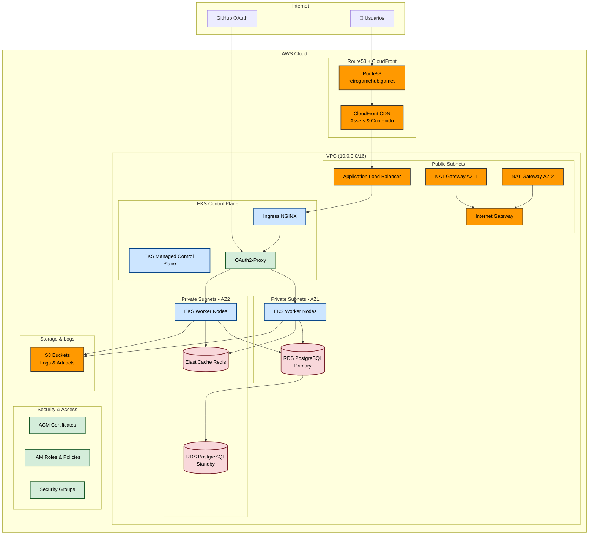

## Infraestructura como Código

La infraestructura de Retro Game Hub está completamente gestionada con **Terraform**, asegurando despliegues reproducibles y versionados en AWS.

## Arquitectura de la Infraestructura

## Componentes Principales

### 🌐 Red y Conectividad
- **VPC Multi-AZ**: Red privada virtual distribuida en múltiples zonas de disponibilidad
- **Application Load Balancer**: Distribución de tráfico con SSL termination
- **CloudFront CDN**: Distribución global de contenido estático
- **Route53**: Gestión de DNS con health checks

### 🔧 Computación
- **Amazon EKS**: Kubernetes gestionado para orquestación de contenedores
- **Auto Scaling Groups**: Escalado automático basado en métricas
- **Spot Instances**: Optimización de costos con instancias spot

### 💾 Almacenamiento y Datos
- **RDS PostgreSQL**: Base de datos relacional con Multi-AZ para alta disponibilidad
- **ElastiCache Redis**: Cache distribuido para sesiones y datos frecuentes
- **S3 Buckets**: Almacenamiento de logs, artefactos y backups

### 🔒 Seguridad
- **WAF**: Protección contra ataques web comunes
- **Security Groups**: Firewall a nivel de instancia
- **IAM Roles**: Gestión granular de permisos
- **ACM Certificates**: Certificados SSL/TLS gestionados

## Características de Alta Disponibilidad

### ⚡ Redundancia
- **Multi-AZ Deployment**: Todos los componentes críticos distribuidos en múltiples AZ
- **Database Failover**: Failover automático de RDS en caso de fallo
- **Load Balancing**: Distribución automática de carga entre instancias

### 📈 Escalabilidad
- **Horizontal Pod Autoscaler**: Escalado automático de pods según CPU/memoria
- **Cluster Autoscaler**: Escalado automático de nodos EKS
- **Database Read Replicas**: Réplicas de lectura para distribuir carga de consultas

### 🔄 Recuperación ante Desastres
- **Backups Automatizados**: Backups diarios de RDS con retención de 30 días
- **Point-in-Time Recovery**: Recuperación a cualquier punto en el tiempo
- **Cross-Region Replication**: Replicación de backups críticos entre regiones

## Monitoreo y Observabilidad

### 📊 Métricas y Alertas
- **CloudWatch**: Métricas de infraestructura y aplicación
- **Prometheus**: Métricas detalladas de Kubernetes y aplicaciones
- **Grafana**: Dashboards personalizados para visualización

### 📝 Logs y Trazabilidad
- **Centralized Logging**: Logs centralizados con ELK Stack
- **Distributed Tracing**: Trazabilidad de requests con Jaeger
- **Audit Logs**: Logs de auditoría de cambios en infraestructura

## Gestión de Costos

### 💰 Optimización
- **Resource Tagging**: Etiquetado consistente para seguimiento de costos
- **Reserved Instances**: Instancias reservadas para cargas predecibles
- **Spot Instances**: Uso de instancias spot para cargas tolerantes a interrupciones
- **Automated Scaling**: Escalado automático para optimizar recursos

### 📈 Monitoreo de Costos
- **AWS Cost Explorer**: Análisis detallado de gastos
- **Budget Alerts**: Alertas automáticas por exceso de presupuesto
- **Right Sizing**: Recomendaciones de dimensionamiento óptimo