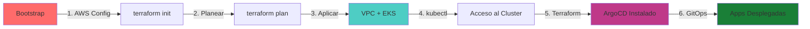

## Infraestructura como Código

La infraestructura de Retro Game Hub está completamente gestionada con **Terraform**, asegurando despliegues reproducibles y versionados.

<Warning>
  **Antes de desplegar**: Completa el [Bootstrap Inicial](/infrastructure/bootstrap) para configurar credenciales AWS, backend remoto y variables.
</Warning>

## Flujo de Despliegue


```mermaid
graph LR
    A[Bootstrap] -->|1. AWS Config| B[terraform init]
    B -->|2. Planear| C[terraform plan]
    C -->|3. Aplicar| D[VPC + EKS]
    D -->|4. kubectl| E[Acceso al Cluster]
    E -->|5. Terraform| F[ArgoCD Instalado]
    F -->|6. GitOps| G[Apps Desplegadas]
    
    style A fill:#ff6b6b
    style D fill:#4ecdc4
    style F fill:#bf3989
    style G fill:#1a7f37
```

### Orden de Despliegue Recomendado

<Steps>
  <Step title="Bootstrap (Prerequisito)">
    Configurar backend de Terraform, credenciales AWS, variables
    
    Ver [Guía de Bootstrap](/infrastructure/bootstrap)
  </Step>
  
  <Step title="Terraform Init">
    ```bash
    terraform init
    ```
    Inicializa provider y backend remoto S3
  </Step>
  
  <Step title="Terraform Apply (Una Sola Vez)">
    ```bash
    terraform apply
    ```
    Terraform resuelve dependencias automáticamente:
    1. VPC y networking (5 min)
    2. EKS cluster (10 min)
    3. RDS, S3, CloudFront (5 min)
    4. Monitoring stack (3 min)
    5. ArgoCD (2 min)
  </Step>
  
  <Step title="Configurar kubectl">
    ```bash
    aws eks update-kubeconfig --region eu-west-1 --name retrogame
    ```
  </Step>
  
  <Step title="Configurar ArgoCD Applications">
    ```bash
    kubectl apply -f argocd/apps/
    ```
    ArgoCD ahora gestiona los despliegues
  </Step>
</Steps>

### Despliegue por Fases (Solo para Troubleshooting)

Si necesitas desplegar componentes por separado:

```bash
# Fase 1: Networking
terraform apply -target=module.vpc -target=aws_security_group.eks

# Fase 2: EKS
terraform apply -target=module.eks

# Fase 3: Databases y Storage
terraform apply -target=aws_db_instance.postgres -target=aws_s3_bucket.cdn

# Fase 4: Monitoring y ArgoCD
terraform apply -target=helm_release.kube_prometheus_stack -target=helm_release.argocd

# Fase 5: Todo lo restante
terraform apply
```

<Note>
  El despliegue por fases solo es necesario si encuentras errores. En condiciones normales, `terraform apply` maneja todo.
</Note>

## Servicios AWS Utilizados

<CardGroup cols={2}>
  <Card title="EKS" icon="dharmachakra">
    Cluster Kubernetes gestionado para orquestación de contenedores
  </Card>
  <Card title="VPC" icon="network-wired">
    Red aislada con subnets públicas y privadas
  </Card>
  <Card title="RDS" icon="database">
    Base de datos PostgreSQL gestionada
  </Card>
  <Card title="ElastiCache" icon="bolt">
    Redis gestionado para caché
  </Card>
  <Card title="ALB" icon="scale-balanced">
    Application Load Balancer con terminación SSL
  </Card>
  <Card title="Route53" icon="globe">
    Gestión DNS para retrogamehub.games
  </Card>
  <Card title="CloudFront" icon="cloud">
    CDN para assets de juegos y contenido estático
  </Card>
  <Card title="S3" icon="bucket">
    Almacenamiento de objetos para archivos y logs
  </Card>
  <Card title="ACM" icon="certificate">
    Certificados SSL/TLS automáticos
  </Card>
  <Card title="IAM" icon="shield">
    Gestión de identidad y acceso
  </Card>
  <Card title="Ingress NGINX" icon="route">
    Routing con autenticación OAuth2
  </Card>
  <Card title="OAuth2-Proxy" icon="lock">
    Autenticación GitHub para monitoreo
  </Card>
</CardGroup>

## Estructura de Terraform

```
terraform/eks_test/
├── main.tf                  # Configuración del provider
├── variables.tf             # Variables de entrada
├── outputs.tf               # Valores de salida
├── vpc.tf                   # VPC y redes
├── eks.tf                   # Configuración del cluster EKS
├── rds.tf                   # Base de datos PostgreSQL
├── s3.tf                    # Buckets S3 y CloudFront
├── route53.tf               # DNS y certificados SSL
├── alb.tf                   # Application Load Balancer
├── monitoring.tf            # Prometheus, Grafana, AlertManager
├── oauth2_proxy.tf          # OAuth de GitHub para monitoreo
├── kubernetes.tf            # Deployments de K8s
├── kong.tf                  # Kong API Gateway
└── terraform.tfvars         # Valores de variables (gitignored)
```

## Arquitectura de Red

### Configuración de VPC
- **CIDR**: `10.0.0.0/16`
- **Zonas de Disponibilidad**: 3 (eu-west-1a, eu-west-1b, eu-west-1c)

### Subnets

<Tabs>
  <Tab title="Subnets Públicas">
    - `10.0.1.0/24` (eu-west-1a)
    - `10.0.2.0/24` (eu-west-1b)
    - `10.0.3.0/24` (eu-west-1c)
    
    **Contiene**:
    - Application Load Balancer
    - NAT Gateway
    - Internet Gateway
  </Tab>
  
  <Tab title="Subnets Privadas">
    - `10.0.11.0/24` (eu-west-1a)
    - `10.0.12.0/24` (eu-west-1b)
    - `10.0.13.0/24` (eu-west-1c)
    
    **Contiene**:
    - Nodos worker de EKS
    - Base de datos RDS
    - Cluster Redis
    - Pods de aplicación
  </Tab>
</Tabs>

## Gestión de Estado

<Info>
El estado de Terraform se almacena remotamente en S3 con bloqueo DynamoDB para permitir colaboración en equipo.
</Info>

```hcl
terraform {
  backend "s3" {
    bucket         = "retrogame-terraform-state"
    key            = "eks-test/terraform.tfstate"
    region         = "eu-west-1"
    dynamodb_table = "terraform-lock"
    encrypt        = true
  }
}
```

## Optimización de Costos

### Costos Actuales (Estimados)
- **Cluster EKS**: $72/mes (plano de control)
- **Instancias EC2**: ~$30-60/mes (nodos t3.medium)
- **RDS**: $15-25/mes (db.t3.micro)
- **NAT Gateway**: $32/mes
- **Transferencia de Datos**: Variable
- **Total**: ~$135-160/mes

<Warning>
Las instancias t3.micro son insuficientes para cargas de trabajo de EKS. Mínimo recomendado: **t3.medium** (4GB RAM, 17 pods/nodo).
</Warning>

### Consideraciones de Free Tier
- Plano de control EKS: **NO** cubierto por Free Tier ($72/mes inevitable)
- Instancias t3.micro: Solo 750 horas/mes = 1 instancia gratis
- RDS: 750 horas/mes db.t3.micro incluidas
- S3: 5GB de almacenamiento estándar gratis
- Transferencia de Datos: 100GB salida por mes gratis

## Flujo de Despliegue

<Steps>
  <Step title="Inicializar Terraform">
    ```bash
    cd terraform/eks_test
    terraform init
    ```
  </Step>
  
  <Step title="Planificar Cambios">
    ```bash
    terraform plan
    ```
  </Step>
  
  <Step title="Aplicar Infraestructura">
    ```bash
    terraform apply
    ```
    Duración: ~20-30 minutos
  </Step>
  
  <Step title="Configurar kubectl">
    ```bash
    aws eks update-kubeconfig --region eu-west-1 --name retrogame
    ```
  </Step>
  
  <Step title="Configurar ArgoCD">
    ```bash
    kubectl apply -f argocd/apps/
    kubectl get applications -n argocd
    ```
    ArgoCD gestiona despliegues desde aquí
  </Step>
  
  <Step title="Verificar Despliegue">
    ```bash
    kubectl get nodes
    kubectl get pods --all-namespaces
    ```
    Todo debe estar en estado Running/Healthy
  </Step>
</Steps>

Ver guía completa en [Despliegue](/deployment)

## Recursos Clave

<CardGroup cols={3}>
  <Card title="Bootstrap Inicial" icon="rocket-launch" href="/infrastructure/bootstrap">
    Configuración previa al despliegue
  </Card>
  
  <Card title="Backend de Terraform" icon="database" href="/infrastructure/terraform-backend">
    S3 + DynamoDB para state management
  </Card>
  
  <Card title="Variables de Terraform" icon="sliders" href="/infrastructure/terraform-variables">
    Referencia completa de configuración
  </Card>
  
  <Card title="Detalles del Cluster EKS" icon="dharmachakra" href="/infrastructure/eks-cluster">
    Conoce la configuración de Kubernetes
  </Card>
  
  <Card title="Configuración de Red" icon="network-wired" href="/infrastructure/networking">
    Entiende la VPC y security groups
  </Card>
  
  <Card title="CDN con CloudFront" icon="cloud" href="/infrastructure/cdn-cloudfront">
    Distribución global de juegos y assets
  </Card>
  
  <Card title="Route53 y SSL" icon="certificate" href="/infrastructure/route53-ssl">
    DNS personalizado y certificados HTTPS
  </Card>
  
  <Card title="OAuth2 Authentication" icon="lock" href="/infrastructure/oauth2-authentication">
    Protección de herramientas con GitHub
  </Card>
  
  <Card title="Stack de Monitoreo" icon="chart-line" href="/infrastructure/monitoring">
    Prometheus, Grafana, y configuración OAuth
  </Card>
  
  <Card title="ArgoCD y GitOps" icon="arrows-rotate" href="/infrastructure/argocd-gitops">
    Despliegue continuo declarativo
  </Card>
</CardGroup>

## Próximos Pasos

¿Listo para profundizar? Explora los componentes específicos de infraestructura:

<CardGroup cols={3}>
  <Card title="1. Bootstrap" icon="rocket-launch" href="/infrastructure/bootstrap">
    Configuración inicial y prerequisitos
  </Card>
  
  <Card title="2. Backend de Terraform" icon="database" href="/infrastructure/terraform-backend">
    Estado remoto S3 + DynamoDB
  </Card>
  
  <Card title="3. Variables" icon="sliders" href="/infrastructure/terraform-variables">
    Configurar terraform.tfvars
  </Card>
  
  <Card title="4. Cluster EKS" icon="dharmachakra" href="/infrastructure/eks-cluster">
    Configuración detallada de Kubernetes
  </Card>
  
  <Card title="5. Networking" icon="network-wired" href="/infrastructure/networking">
    VPC, subnets y security
  </Card>
  
  <Card title="6. CDN" icon="cloud" href="/infrastructure/cdn-cloudfront">
    S3 y CloudFront para assets
  </Card>
  
  <Card title="7. Route53" icon="globe" href="/infrastructure/route53-ssl">
    DNS y certificados SSL
  </Card>
  
  <Card title="8. OAuth2" icon="lock" href="/infrastructure/oauth2-authentication">
    Autenticación con GitHub
  </Card>
  
  <Card title="9. Monitoreo" icon="chart-line" href="/infrastructure/monitoring">
    Prometheus y Grafana
  </Card>
  
  <Card title="10. ArgoCD" icon="arrows-rotate" href="/infrastructure/argocd-gitops">
    GitOps y despliegue continuo
  </Card>
</CardGroup>
