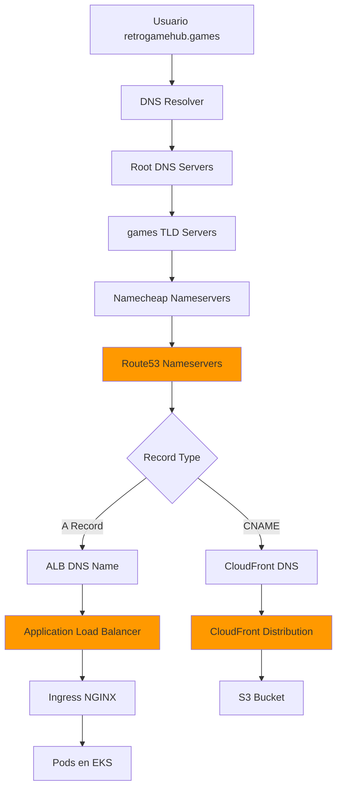

## Arquitectura DNS

Retro Game Hub utiliza **Amazon Route53** para gestión de DNS y **AWS Certificate Manager (ACM)** para certificados SSL/TLS, permitiendo acceso HTTPS en el dominio `retrogamehub.games`.

<CardGroup cols={3}>
  <Card title="Route53" icon="route">
    **Gestión DNS**
    
    Zona hostada + records
  </Card>
  
  <Card title="ACM" icon="certificate">
    **Certificados SSL**
    
    HTTPS automático
  </Card>
  
  <Card title="Namecheap" icon="n">
    **Registrar**
    
    Dominio comprado aquí
  </Card>
</CardGroup>

## Diagrama de Resolución DNS



## Configuración de Route53

### Zona Hostada

```hcl
resource "aws_route53_zone" "main" {
  name = "retrogamehub.games"

  tags = {
    Name        = "retrogamehub-zone"
    Environment = "production"
    Project     = "retrogame"
    ManagedBy   = "terraform"
  }
}
```

**Nameservers asignados por AWS** (ejemplo):
```
ns-1234.awsdns-12.org
ns-5678.awsdns-34.co.uk
ns-9012.awsdns-56.com
ns-3456.awsdns-78.net
```

<Warning>
  **Importante**: Después de crear la zona en Route53, debes actualizar los nameservers en Namecheap con estos valores.
</Warning>

### Configurar Nameservers en Namecheap

<Steps>
  <Step title="Obtener nameservers de Route53">
    ```bash
    # Via Terraform
    terraform output route53_nameservers
    
    # O via AWS CLI
    aws route53 get-hosted-zone --id Z1234EXAMPLE \
      --query 'DelegationSet.NameServers' \
      --output table
    ```
  </Step>
  
  <Step title="Acceder a Namecheap">
    1. Login en https://www.namecheap.com
    2. Ve a **Domain List**
    3. Click en **Manage** junto a `retrogamehub.games`
  </Step>
  
  <Step title="Cambiar nameservers">
    1. Ve a la pestaña **Domain**
    2. En **Nameservers**, selecciona **Custom DNS**
    3. Añade los 4 nameservers de Route53:
       ```
       ns-1234.awsdns-12.org
       ns-5678.awsdns-34.co.uk
       ns-9012.awsdns-56.com
       ns-3456.awsdns-78.net
       ```
    4. Click en el ícono de checkmark ✓ para guardar
  </Step>
  
  <Step title="Esperar propagación">
    **Tiempo de propagación**: 24-48 horas (usualmente ~2 horas)
    
    Verificar propagación:
    ```bash
    # Verificar nameservers
    dig NS retrogamehub.games
    
    # Verificar record A
    dig retrogamehub.games
    
    # Verificar desde múltiples ubicaciones
    https://dnschecker.org
    ```
  </Step>
</Steps>

## Certificados SSL con ACM

### Solicitar Certificado

```hcl
resource "aws_acm_certificate" "main" {
  domain_name       = "retrogamehub.games"
  validation_method = "DNS"

  subject_alternative_names = [
    "*.retrogamehub.games"  # Wildcard para subdominios
  ]

  tags = {
    Name        = "retrogamehub-cert"
    Environment = "production"
    Project     = "retrogame"
    ManagedBy   = "terraform"
  }

  lifecycle {
    create_before_destroy = true
  }
}
```

**Cobertura del certificado:**
- ✅ `retrogamehub.games`
- ✅ `*.retrogamehub.games` (wildcard)
  - `www.retrogamehub.games`
  - `api.retrogamehub.games`
  - `monitoring.retrogamehub.games`
  - etc.

### Validación DNS Automática

Terraform crea automáticamente los records DNS necesarios para validación:

```hcl
resource "aws_route53_record" "cert_validation" {
  for_each = {
    for dvo in aws_acm_certificate.main.domain_validation_options : dvo.domain_name => {
      name   = dvo.resource_record_name
      record = dvo.resource_record_value
      type   = dvo.resource_record_type
    }
  }

  allow_overwrite = true
  name            = each.value.name
  records         = [each.value.record]
  ttl             = 60
  type            = each.value.type
  zone_id         = aws_route53_zone.main.zone_id
}

# Esperar a que el certificado sea validado
resource "aws_acm_certificate_validation" "main" {
  certificate_arn         = aws_acm_certificate.main.arn
  validation_record_fqdns = [for record in aws_route53_record.cert_validation : record.fqdn]

  timeouts {
    create = "45m"
  }
}
```

**Proceso de validación:**
1. ACM genera un CNAME record único
2. Terraform crea el record en Route53
3. ACM verifica el record (cada 60 segundos)
4. Certificado pasa a estado `ISSUED` (~5-10 minutos)

### Verificar Estado del Certificado

```bash
# Via Terraform
terraform output ssl_certificate_arn

# Via AWS CLI
aws acm describe-certificate \
  --certificate-arn arn:aws:acm:eu-west-1:ACCOUNT:certificate/abc123... \
  --query 'Certificate.Status' \
  --output text

# Debe mostrar: ISSUED

# Ver detalles completos
aws acm describe-certificate \
  --certificate-arn arn:aws:acm:eu-west-1:ACCOUNT:certificate/abc123...
```

### Renovación Automática

<Info>
  Los certificados de ACM se renuevan automáticamente **60 días antes de expirar**, siempre que el record DNS de validación siga existiendo.
</Info>

No requiere acción manual - ACM gestiona la renovación automáticamente.

## Records DNS

### Record A Principal

Apunta el dominio raíz al Application Load Balancer:

```hcl
resource "aws_route53_record" "main" {
  zone_id = aws_route53_zone.main.zone_id
  name    = "retrogamehub.games"
  type    = "A"

  alias {
    name                   = aws_lb.main.dns_name
    zone_id                = aws_lb.main.zone_id
    evaluate_target_health = true
  }

  depends_on = [aws_lb.main]
}
```

**Características:**
- **Alias record**: No paga por queries (gratis con ALB)
- **Health check**: Evalúa salud del ALB antes de responder
- **Dinámico**: Sigue al ALB si cambia de IP

### Record A Wildcard

Apunta todos los subdominios al ALB:

```hcl
resource "aws_route53_record" "wildcard" {
  zone_id = aws_route53_zone.main.zone_id
  name    = "*.retrogamehub.games"
  type    = "A"

  alias {
    name                   = aws_lb.main.dns_name
    zone_id                = aws_lb.main.zone_id
    evaluate_target_health = true
  }

  depends_on = [aws_lb.main]
}
```

**Cubre subdominios:**
- `www.retrogamehub.games`
- `api.retrogamehub.games`
- `grafana.retrogamehub.games`
- `cualquier-cosa.retrogamehub.games`

### Otros Records Útiles

<CodeGroup>
```hcl CNAME para CloudFront (opcional)
resource "aws_route53_record" "cdn" {
  zone_id = aws_route53_zone.main.zone_id
  name    = "cdn.retrogamehub.games"
  type    = "CNAME"
  ttl     = 300
  records = [aws_cloudfront_distribution.games_cdn.domain_name]
}
```

```hcl Record MX para email (opcional)
resource "aws_route53_record" "mx" {
  zone_id = aws_route53_zone.main.zone_id
  name    = "retrogamehub.games"
  type    = "MX"
  ttl     = 3600
  records = [
    "10 mx1.emailprovider.com",
    "20 mx2.emailprovider.com"
  ]
}
```

```hcl Record TXT para verificación (opcional)
resource "aws_route53_record" "txt_verification" {
  zone_id = aws_route53_zone.main.zone_id
  name    = "retrogamehub.games"
  type    = "TXT"
  ttl     = 300
  records = [
    "v=spf1 include:_spf.emailprovider.com ~all",
    "google-site-verification=abc123..."
  ]
}
```
</CodeGroup>

## Integración con Load Balancer

El ALB utiliza el certificado ACM para terminación SSL:

```hcl
resource "aws_lb_listener" "https" {
  load_balancer_arn = aws_lb.main.arn
  port              = "443"
  protocol          = "HTTPS"
  ssl_policy        = "ELBSecurityPolicy-TLS13-1-2-2021-06"
  certificate_arn   = aws_acm_certificate.main.arn

  default_action {
    type             = "forward"
    target_group_arn = aws_lb_target_group.main.arn
  }
}

# Redirección HTTP → HTTPS
resource "aws_lb_listener" "http" {
  load_balancer_arn = aws_lb.main.arn
  port              = "80"
  protocol          = "HTTP"

  default_action {
    type = "redirect"

    redirect {
      port        = "443"
      protocol    = "HTTPS"
      status_code = "HTTP_301"
    }
  }
}
```

**Características:**
- ✅ TLS 1.3 (política `ELBSecurityPolicy-TLS13-1-2-2021-06`)
- ✅ Redirección automática HTTP → HTTPS
- ✅ Certificado válido para dominio y wildcard

### Políticas SSL Recomendadas

<Table>
  <thead>
    <tr>
      <th>Política</th>
      <th>TLS Versions</th>
      <th>Uso Recomendado</th>
    </tr>
  </thead>
  <tbody>
    <tr>
      <td>**ELBSecurityPolicy-TLS13-1-2-2021-06**</td>
      <td>TLS 1.2, 1.3</td>
      <td>✅ **Recomendado** - Balance seguridad/compatibilidad</td>
    </tr>
    <tr>
      <td>**ELBSecurityPolicy-TLS13-1-3-2021-06**</td>
      <td>TLS 1.3 solo</td>
      <td>Máxima seguridad (puede romper clientes antiguos)</td>
    </tr>
    <tr>
      <td>**ELBSecurityPolicy-2016-08**</td>
      <td>TLS 1.0, 1.1, 1.2</td>
      <td>⚠️ **Legacy** - Solo para compatibilidad antigua</td>
    </tr>
    <tr>
      <td>**ELBSecurityPolicy-FS-1-2-Res-2020-10**</td>
      <td>TLS 1.2</td>
      <td>Forward secrecy + resistencia a downgrade</td>
    </tr>
  </tbody>
</Table>

## Resolución de DNS en Funcionamiento

### Flujo Completo

<Steps>
  <Step title="Usuario ingresa URL">
    ```
    https://retrogamehub.games
    ```
  </Step>
  
  <Step title="Resolver DNS consulta Root Servers">
    ```bash
    # Consulta a . (root)
    . → Responde con nameservers de .games TLD
    ```
  </Step>
  
  <Step title="Consulta TLD .games">
    ```bash
    # Consulta a .games TLD
    .games → Responde con nameservers de Namecheap
    ```
  </Step>
  
  <Step title="Consulta Namecheap">
    ```bash
    # Namecheap delega a Route53
    Nameservers configurados → Route53 nameservers
    ```
  </Step>
  
  <Step title="Consulta Route53">
    ```bash
    # Route53 responde con record A
    retrogamehub.games → Alias a ALB
    ALB DNS: myalb-123.eu-west-1.elb.amazonaws.com
    IP: 54.123.45.67 (ejemplo)
    ```
  </Step>
  
  <Step title="Conexión HTTPS al ALB">
    ```bash
    # Handshake TLS
    Client → SYN → ALB
    ALB → SYN-ACK + Certificado SSL
    Client → Verifica certificado (ACM)
    Client → Establece sesión TLS 1.3
    ```
  </Step>
  
  <Step title="ALB forward a backend">
    ```bash
    # Terminación SSL en ALB, HTTP interno
    ALB → HTTP → Ingress NGINX (puerto 80)
    NGINX → Routing → Pods (backend services)
    ```
  </Step>
</Steps>

### Verificación Manual

```bash
# 1. Verificar resolución DNS
dig retrogamehub.games

# Debe mostrar:
# ;; ANSWER SECTION:
# retrogamehub.games. 300 IN A 54.123.45.67

# 2. Verificar certificado SSL
openssl s_client -connect retrogamehub.games:443 -servername retrogamehub.games

# Debe mostrar:
# subject=CN=retrogamehub.games
# issuer=C=US, O=Amazon, CN=Amazon RSA 2048 M02
# Verify return code: 0 (ok)

# 3. Test HTTPS completo
curl -I https://retrogamehub.games

# Debe devolver:
# HTTP/2 200
# server: nginx
# ...

# 4. Verificar redirección HTTP → HTTPS
curl -I http://retrogamehub.games

# Debe devolver:
# HTTP/1.1 301 Moved Permanently
# Location: https://retrogamehub.games/
```

## Subdominios Específicos

### Subdominio para CDN (opcional)

Si quieres usar `cdn.retrogamehub.games` en lugar del dominio CloudFront:

```hcl
resource "aws_route53_record" "cdn" {
  zone_id = aws_route53_zone.main.zone_id
  name    = "cdn.retrogamehub.games"
  type    = "CNAME"
  ttl     = 300
  records = [aws_cloudfront_distribution.games_cdn.domain_name]
}
```

Luego configura CloudFront alternate domain names:

```hcl
resource "aws_cloudfront_distribution" "games_cdn" {
  # ... configuración existente ...
  
  aliases = ["cdn.retrogamehub.games"]
  
  viewer_certificate {
    acm_certificate_arn      = aws_acm_certificate.main.arn
    ssl_support_method       = "sni-only"
    minimum_protocol_version = "TLSv1.2_2021"
  }
}
```

<Warning>
  Para usar custom domain en CloudFront, el certificado ACM **debe estar en us-east-1** (región de CloudFront).
</Warning>

### Subdominio para API (opcional)

```hcl
resource "aws_route53_record" "api" {
  zone_id = aws_route53_zone.main.zone_id
  name    = "api.retrogamehub.games"
  type    = "A"

  alias {
    name                   = aws_lb.main.dns_name
    zone_id                = aws_lb.main.zone_id
    evaluate_target_health = true
  }
}
```

<Note>
  En nuestra arquitectura actual, usamos path-based routing (`/api/*`) en el mismo dominio, por lo que este record es opcional.
</Note>

## Costos

<Table>
  <thead>
    <tr>
      <th>Servicio</th>
      <th>Precio</th>
      <th>Estimación Mensual</th>
    </tr>
  </thead>
  <tbody>
    <tr>
      <td>**Hosted Zone**</td>
      <td>$0.50/zona</td>
      <td>**$0.50**</td>
    </tr>
    <tr>
      <td>**DNS Queries**</td>
      <td>$0.40/millón (primeros 1B)</td>
      <td>**$0.40** (1M queries)</td>
    </tr>
    <tr>
      <td>**Alias Queries**</td>
      <td>Gratis para ALB/CloudFront</td>
      <td>**$0.00**</td>
    </tr>
    <tr>
      <td>**ACM Certificate**</td>
      <td>Gratis (público)</td>
      <td>**$0.00**</td>
    </tr>
    <tr>
      <td>**Domain Registration**</td>
      <td>$8.88/año (.games)</td>
      <td>**$0.74**</td>
    </tr>
    <tr>
      <td>**TOTAL**</td>
      <td>-</td>
      <td>**~$1.64/mes**</td>
    </tr>
  </tbody>
</Table>

**Ahorro con Alias Records:**
- Standard CNAME: $0.40/millón queries
- Alias Record to ALB: **$0.00** ✅

## Monitoreo

### Health Checks de Route53 (opcional)

```hcl
resource "aws_route53_health_check" "main" {
  fqdn              = "retrogamehub.games"
  port              = 443
  type              = "HTTPS"
  resource_path     = "/health"
  failure_threshold = 3
  request_interval  = 30

  tags = {
    Name = "retrogamehub-health-check"
  }
}

# Alarma en CloudWatch si falla
resource "aws_cloudwatch_metric_alarm" "route53_health" {
  alarm_name          = "retrogamehub-health-check-failed"
  comparison_operator = "LessThanThreshold"
  evaluation_periods  = 2
  metric_name         = "HealthCheckStatus"
  namespace           = "AWS/Route53"
  period              = 60
  statistic           = "Minimum"
  threshold           = 1
  alarm_description   = "This metric monitors Route53 health check"
  alarm_actions       = [aws_sns_topic.alerts.arn]

  dimensions = {
    HealthCheckId = aws_route53_health_check.main.id
  }
}
```

**Costo**: $0.50/mes por health check

### Query Logs (opcional)

Habilitar logging de consultas DNS:

```hcl
resource "aws_cloudwatch_log_group" "route53_query_logs" {
  name              = "/aws/route53/retrogamehub.games"
  retention_in_days = 7
}

resource "aws_route53_query_log" "main" {
  depends_on = [aws_cloudwatch_log_resource_policy.route53]

  cloudwatch_log_group_arn = aws_cloudwatch_log_group.route53_query_logs.arn
  zone_id                  = aws_route53_zone.main.zone_id
}
```

**Costo**: ~$0.50/mes (primera 5GB gratis, luego $0.50/GB)

## Troubleshooting

<AccordionGroup>
  <Accordion title="DNS no resuelve después de cambiar nameservers">
    **Causa**: Propagación DNS aún en proceso o nameservers incorrectos
    
    ```bash
    # Verificar nameservers actuales
    dig NS retrogamehub.games +short
    
    # Debe mostrar nameservers de Route53:
    # ns-1234.awsdns-12.org
    # ns-5678.awsdns-34.co.uk
    # ns-9012.awsdns-56.com
    # ns-3456.awsdns-78.net
    
    # Si muestra nameservers de Namecheap, espera propagación
    # O verifica que actualizaste correctamente en Namecheap
    
    # Test desde múltiples ubicaciones
    https://dnschecker.org
    ```
  </Accordion>
  
  <Accordion title="Certificado SSL no válido o expired">
    **Causa**: Certificado no validado o record de validación eliminado
    
    ```bash
    # Verificar estado del certificado
    aws acm describe-certificate \
      --certificate-arn arn:aws:acm:eu-west-1:ACCOUNT:certificate/abc123...
    
    # Si Status != ISSUED:
    # 1. Verificar que el record DNS de validación existe
    aws route53 list-resource-record-sets \
      --hosted-zone-id Z1234EXAMPLE \
      --query "ResourceRecordSets[?Type=='CNAME']"
    
    # 2. Si no existe, Terraform debe recrearlo
    terraform apply
    
    # 3. Esperar 5-10 minutos para validación
    ```
  </Accordion>
  
  <Accordion title="Browser muestra 'NET::ERR_CERT_COMMON_NAME_INVALID'">
    **Causa**: ALB usando certificado incorrecto o dominio no incluido en certificate
    
    ```bash
    # Verificar dominio del certificado
    aws acm describe-certificate \
      --certificate-arn arn:aws:acm:eu-west-1:ACCOUNT:certificate/abc123... \
      --query 'Certificate.[DomainName,SubjectAlternativeNames]'
    
    # Debe incluir:
    # ["retrogamehub.games", ["retrogamehub.games", "*.retrogamehub.games"]]
    
    # Verificar listener del ALB usa el certificado correcto
    aws elbv2 describe-listeners \
      --load-balancer-arn arn:aws:elasticloadbalancing:eu-west-1:ACCOUNT:loadbalancer/app/retrogame-alb/abc123
    
    # Verificar que certificate_arn coincide
    ```
  </Accordion>
  
  <Accordion title="HTTP no redirige a HTTPS">
    **Causa**: Listener HTTP no configurado o redirección faltante
    
    ```bash
    # Verificar listener HTTP existe
    aws elbv2 describe-listeners \
      --load-balancer-arn arn:aws:elasticloadbalancing:eu-west-1:ACCOUNT:loadbalancer/app/retrogame-alb/abc123
    
    # Debe tener:
    # - Listener en puerto 80
    # - DefaultAction.Type = "redirect"
    # - RedirectConfig.Protocol = "HTTPS"
    # - RedirectConfig.StatusCode = "HTTP_301"
    
    # Si falta, terraform apply debe crearlo
    ```
  </Accordion>
  
  <Accordion title="Record A no apunta correctamente al ALB">
    **Causa**: Alias record incorrecto o ALB DNS cambió
    
    ```bash
    # Verificar DNS actual del ALB
    aws elbv2 describe-load-balancers \
      --load-balancer-arns arn:aws:elasticloadbalancing:eu-west-1:ACCOUNT:loadbalancer/app/retrogame-alb/abc123 \
      --query 'LoadBalancers[0].DNSName'
    
    # Verificar record en Route53
    aws route53 list-resource-record-sets \
      --hosted-zone-id Z1234EXAMPLE \
      --query "ResourceRecordSets[?Name=='retrogamehub.games.']"
    
    # AliasTarget.DNSName debe coincidir con el DNS del ALB
    
    # Si no coincide, terraform apply debe actualizarlo
    terraform apply
    ```
  </Accordion>
</AccordionGroup>

## Outputs de Terraform

```bash
# Zona Route53
terraform output route53_zone_id
# Z1234EXAMPLEZONEID

# Nameservers (para Namecheap)
terraform output route53_nameservers
# [
#   "ns-1234.awsdns-12.org",
#   "ns-5678.awsdns-34.co.uk",
#   "ns-9012.awsdns-56.com",
#   "ns-3456.awsdns-78.net"
# ]

# ARN del certificado SSL
terraform output ssl_certificate_arn
# arn:aws:acm:eu-west-1:ACCOUNT:certificate/abc123...

# URL del dominio
terraform output domain_url
# https://retrogamehub.games
```

## Checklist de Configuración

<Steps>
  <Step title="✅ Crear zona Route53">
    ```bash
    terraform apply
    # Crear aws_route53_zone.main
    ```
  </Step>
  
  <Step title="✅ Actualizar nameservers en Namecheap">
    Copiar nameservers de Route53 y configurar en Namecheap
    
    Esperar propagación (2-48 horas)
  </Step>
  
  <Step title="✅ Solicitar certificado ACM">
    ```bash
    terraform apply
    # Crear aws_acm_certificate.main
    # Validación DNS automática
    ```
  </Step>
  
  <Step title="✅ Esperar validación del certificado">
    Verificar estado: `ISSUED`
    
    Tiempo: 5-10 minutos
  </Step>
  
  <Step title="✅ Crear records DNS">
    ```bash
    terraform apply
    # Crear aws_route53_record.main (A)
    # Crear aws_route53_record.wildcard (A)
    ```
  </Step>
  
  <Step title="✅ Configurar ALB con SSL">
    ```bash
    terraform apply
    # ALB listener 443 con certificate_arn
    # ALB listener 80 con redirect a HTTPS
    ```
  </Step>
  
  <Step title="✅ Verificar acceso HTTPS">
    ```bash
    curl -I https://retrogamehub.games
    # HTTP/2 200
    ```
  </Step>
</Steps>

## Próximos Pasos

<CardGroup cols={2}>
  <Card title="CDN y CloudFront" icon="cloud" href="/infrastructure/cdn-cloudfront">
    Distribución de contenido estático
  </Card>
  
  <Card title="OAuth2 Authentication" icon="lock" href="/infrastructure/oauth2-authentication">
    Proteger herramientas de monitoreo
  </Card>
  
  <Card title="Load Balancer" icon="scale-balanced" href="/infrastructure/networking">
    Configuración del ALB
  </Card>
  
  <Card title="Despliegue" icon="rocket" href="/deployment">
    Guía completa de despliegue
  </Card>
</CardGroup>
