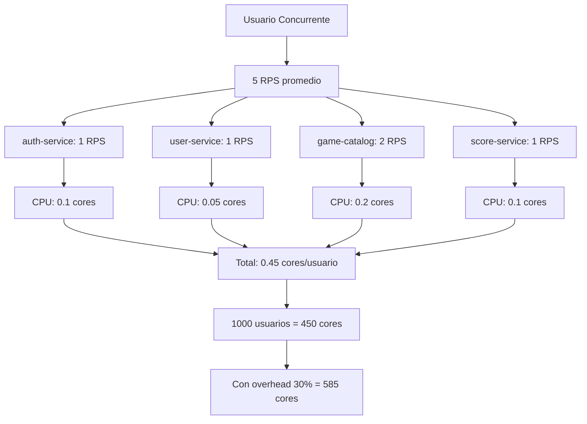

# 6.10. Escalado y Dimensionamiento

Esta guía describe las estrategias de escalado para cada componente de RetroGameCloud, incluyendo configuración de autoscaling automático, umbrales críticos y planificación de capacidad.

## Estrategias de Escalado por Componente

### Escalado de Microservicios en EKS

<Tabs>
<Tab title="Horizontal Pod Autoscaler">

```yaml

# hpa-auth-service.yaml
apiVersion: autoscaling/v2
kind: HorizontalPodAutoscaler
metadata:
  name: auth-service-hpa
  namespace: retrogame
spec:
  scaleTargetRef:
    apiVersion: apps/v1
    kind: Deployment
    name: auth-service
  minReplicas: 2
  maxReplicas: 20
  metrics:
  - type: Resource
    resource:
      name: cpu
      target:
        type: Utilization
        averageUtilization: 70
  - type: Resource
    resource:
      name: memory
      target:
        type: Utilization
        averageUtilization: 80
  behavior:
    scaleUp:
      stabilizationWindowSeconds: 60
      policies:
      - type: Percent
        value: 100
        periodSeconds: 15
    scaleDown:
      stabilizationWindowSeconds: 300
      policies:
      - type: Percent
        value: 50
        periodSeconds: 60

```

</Tab>
<Tab title="Vertical Pod Autoscaler">

```yaml

# vpa-game-catalog.yaml
apiVersion: autoscaling.k8s.io/v1
kind: VerticalPodAutoscaler
metadata:
  name: game-catalog-vpa
  namespace: retrogame
spec:
  targetRef:
    apiVersion: apps/v1
    kind: Deployment
    name: game-catalog-service
  updatePolicy:
    updateMode: "Auto"
  resourcePolicy:
    containerPolicies:
    - containerName: game-catalog
      minAllowed:
        cpu: 100m
        memory: 128Mi
      maxAllowed:
        cpu: 2
        memory: 2Gi
      controlledResources: ["cpu", "memory"]

```

</Tab>
</Tabs>

<Note>
El HPA escala pods basándose en CPU (>70%) y memoria (>80%). El VPA ajusta recursos automáticamente para optimizar el uso.
</Note>

### Cluster Autoscaler para EKS

```yaml

# cluster-autoscaler-deployment.yaml
apiVersion: apps/v1
kind: Deployment
metadata:
  name: cluster-autoscaler
  namespace: kube-system
spec:
  replicas: 1
  selector:
    matchLabels:
      app: cluster-autoscaler
  template:
    metadata:
      labels:
        app: cluster-autoscaler
    spec:
      serviceAccountName: cluster-autoscaler
      containers:
      - image: k8s.gcr.io/autoscaling/cluster-autoscaler:v1.21.0
        name: cluster-autoscaler
        resources:
          limits:
            cpu: 100m
            memory: 300Mi
        command:
        - ./cluster-autoscaler
        - --v=4
        - --stderrthreshold=info
        - --cloud-provider=aws
        - --skip-nodes-with-local-storage=false
        - --expander=least-waste
        - --node-group-auto-discovery=asg:tag=k8s.io/cluster-autoscaler/enabled,k8s.io/cluster-autoscaler/retrogame-cluster
        - --scale-down-delay-after-add=10m
        - --scale-down-unneeded-time=10m
        env:
        - name: AWS_REGION
          value: eu-west-1

```

<Warning>
Configura límites de nodos mínimos (3) y máximos (50) en los Auto Scaling Groups de AWS para evitar costes descontrolados.
</Warning>

## Escalado de Base de Datos PostgreSQL

### RDS Scaling Triggers

<Tabs>
<Tab title="Métricas Críticas">
| Métrica | Umbral | Acción Recomendada |
|---------|---------|-------------------|
| CPU Utilization | > 80% | Escalar verticalmente |
| Connection Count | > 80% del máximo | Añadir read replicas |
| Read IOPS | > 20,000 | Crear read replica |
| Memory Usage | > 85% | Aumentar instancia |
| Queue Depth | > 10 | Optimizar consultas/escalar |
</Tab>
<Tab title="Read Replicas">

```terraform

# rds-read-replica.tf
resource "aws_db_instance" "retrogame_read_replica" {
  count = var.enable_read_replica ? 2 : 0

  identifier = "retrogame-read-replica-${count.index + 1}"
  replicate_source_db = aws_db_instance.retrogame_primary.id

  instance_class = "db.t3.large"
  publicly_accessible = false

  # Diferentes AZ para HA
  availability_zone = data.aws_availability_zones.available.names[count.index]

  tags = {
    Name = "RetroGame Read Replica ${count.index + 1}"
    Environment = var.environment
  }
}

# Output para connection strings
output "read_replica_endpoints" {
  value = aws_db_instance.retrogame_read_replica[*].endpoint
}

```

</Tab>
</Tabs>

### Configuración de Connection Pooling

```yaml

# pgbouncer-config.yaml
apiVersion: v1
kind: ConfigMap
metadata:
  name: pgbouncer-config
data:
  pgbouncer.ini: |
    [databases]
    retrogame = host=retrogame-db.cluster-xyz.eu-west-1.rds.amazonaws.com port=5432 dbname=retrogame
    retrogame_ro = host=retrogame-read-replica-1.xyz.eu-west-1.rds.amazonaws.com port=5432 dbname=retrogame

    [pgbouncer]
    pool_mode = transaction
    max_client_conn = 1000
    default_pool_size = 100
    max_db_connections = 100
    listen_port = 6432
    auth_type = md5

```

## Escalado de Redis

### Redis Cluster Mode

<Tabs>
<Tab title="ElastiCache Configuration">

```terraform

# elasticache-cluster.tf
resource "aws_elasticache_replication_group" "retrogame_redis" {
  description          = "RetroGame Redis Cluster"
  replication_group_id = "retrogame-redis"

  node_type            = "cache.r6g.large"
  port                 = 6379
  parameter_group_name = "default.redis7.cluster.on"

  # Cluster mode enabled
  num_cache_clusters         = 0  # Se ignora en cluster mode
  num_node_groups           = 3   # 3 shards
  replicas_per_node_group   = 2   # 2 replicas por shard

  # Auto scaling
  automatic_failover_enabled = true
  multi_az_enabled          = true

  # Seguridad
  subnet_group_name = aws_elasticache_subnet_group.retrogame.name
  security_group_ids = [aws_security_group.redis.id]

  # Backup
  snapshot_retention_limit = 3
  snapshot_window         = "03:00-05:00"

  tags = {
    Name = "RetroGame Redis Cluster"
  }
}

```

</Tab>
<Tab title="Monitoring y Alertas">

```yaml

# redis-monitoring.yaml
apiVersion: v1
kind: ServiceMonitor
metadata:
  name: redis-exporter
spec:
  selector:
    matchLabels:
      app: redis-exporter
  endpoints:
  - port: metrics
    interval: 30s

- --
apiVersion: monitoring.coreos.com/v1
kind: PrometheusRule
metadata:
  name: redis-alerts
spec:
  groups:
  - name: redis.rules
    rules:
    - alert: RedisMemoryHigh
      expr: redis_memory_used_bytes / redis_memory_max_bytes > 0.75
      for: 5m
      labels:
        severity: warning
      annotations:
        summary: "Redis memory usage is high"
        description: "Redis memory usage is {{ $value | humanizePercentage }}"

    - alert: RedisConnectionsHigh
      expr: redis_connected_clients > 8000
      for: 2m
      labels:
        severity: critical
      annotations:
        summary: "Too many connections to Redis"

```

</Tab>
</Tabs>

<Note>
Cuando el uso de memoria de Redis supere el 75%, evalúa migrar a cluster mode para distribuir la carga entre múltiples nodos.
</Note>

## Planificación de Capacidad

### Estimación de Recursos por Usuario



### Matriz de Dimensionamiento

<Tabs>
<Tab title="Usuarios Concurrentes">
| Usuarios | Pods Totales | Cores CPU | Memoria (GB) | RDS Connections |
|----------|--------------|-----------|--------------|-----------------|
| 100      | 20           | 60        | 120          | 50              |
| 500      | 50           | 150       | 300          | 200             |
| 1,000    | 80           | 250       | 500          | 350             |
| 5,000    | 200          | 600       | 1,200        | 800             |
| 10,000   | 350          | 1,000     | 2,000        | 1,200           |
</Tab>
<Tab title="Configuración por Tier">

```yaml

# capacity-planning.yaml
apiVersion: v1
kind: ConfigMap
metadata:
  name: capacity-config
data:
  small-tier.yaml: |
    # Hasta 1,000 usuarios concurrentes
    resources:
      auth-service:
        replicas: 3
        cpu: "500m"
        memory: "512Mi"
      user-service:
        replicas: 2
        cpu: "300m"
        memory: "384Mi"
      game-catalog:
        replicas: 4
        cpu: "800m"
        memory: "1Gi"

  medium-tier.yaml: |
    # 1,000 - 5,000 usuarios
    resources:
      auth-service:
        replicas: 8
        cpu: "1"
        memory: "1Gi"
      user-service:
        replicas: 6
        cpu: "500m"
        memory: "768Mi"
      game-catalog:
        replicas: 12
        cpu: "1200m"
        memory: "2Gi"

  large-tier.yaml: |
    # 5,000+ usuarios
    resources:
      auth-service:
        replicas: 15
        cpu: "2"
        memory: "2Gi"
      user-service:
        replicas: 12
        cpu: "1"
        memory: "1.5Gi"
      game-catalog:
        replicas: 25
        cpu: "2"
        memory: "4Gi"

```

</Tab>
</Tabs>

### Algoritmo de Escalado Automático

```python

# scaling-algorithm.py
import boto3
import kubernetes
from datetime import datetime, timedelta

class AutoScalingManager:
    def __init__(self):
        self.cloudwatch = boto3.client('cloudwatch')
        self.k8s_apps_v1 = kubernetes.client.AppsV1Api()

    def get_user_metrics(self):
        """Obtiene métricas de usuarios activos"""
        end_time = datetime.utcnow()
        start_time = end_time - timedelta(minutes=5)

        response = self.cloudwatch.get_metric_statistics(
            Namespace='RetroGame/Users',
            MetricName='ConcurrentUsers',
            StartTime=start_time,
            EndTime=end_time,
            Period=300,
            Statistics=['Average']
        )

        if response['Datapoints']:
            return response['Datapoints'][-1]['Average']
        return 0

    def calculate_required_replicas(self, service_name, concurrent_users):
        """Calcula replicas necesarias basándose en usuarios"""
        config = {
            'auth-service': {'rps_per_user': 1, 'rps_per_pod': 100},
            'user-service': {'rps_per_user': 1, 'rps_per_pod': 150},
            'game-catalog': {'rps_per_user': 2, 'rps_per_pod': 80},
            'score-service': {'rps_per_user': 1, 'rps_per_pod': 120}
        }

        if service_name not in config:
            return 2  # Default mínimo

        total_rps = concurrent_users * config[service_name]['rps_per_user']
        required_pods = max(2, int(total_rps / config[service_name]['rps_per_pod'] * 1.3))

        return min(required_pods, 50)  # Máximo 50 pods

    def scale_service(self, service_name, target_replicas):
        """Escala un servicio específico"""
        try:
            # Actualizar deployment
            deployment = self.k8s_apps_v1.read_namespaced_deployment(
                name=f"{service_name}",
                namespace="retrogame"
            )

            deployment.spec.replicas = target_replicas

            self.k8s_apps_v1.patch_namespaced_deployment(
                name=f"{service_name}",
                namespace="retrogame",
                body=deployment
            )

            print(f"Escalado {service_name} a {target_replicas} replicas")

        except Exception as e:
            print(f"Error escalando {service_name}: {e}")

```

## Monitorización y Alertas de Escalado

### Dashboard de Capacity Planning

```yaml

# grafana-capacity-dashboard.json
{
  "dashboard": {
    "title": "RetroGame - Capacity Planning",
    "panels": [
      {
        "title": "Usuarios Concurrentes vs Capacidad",
        "type": "stat",
        "targets": [
          {
            "expr": "concurrent_users",

```