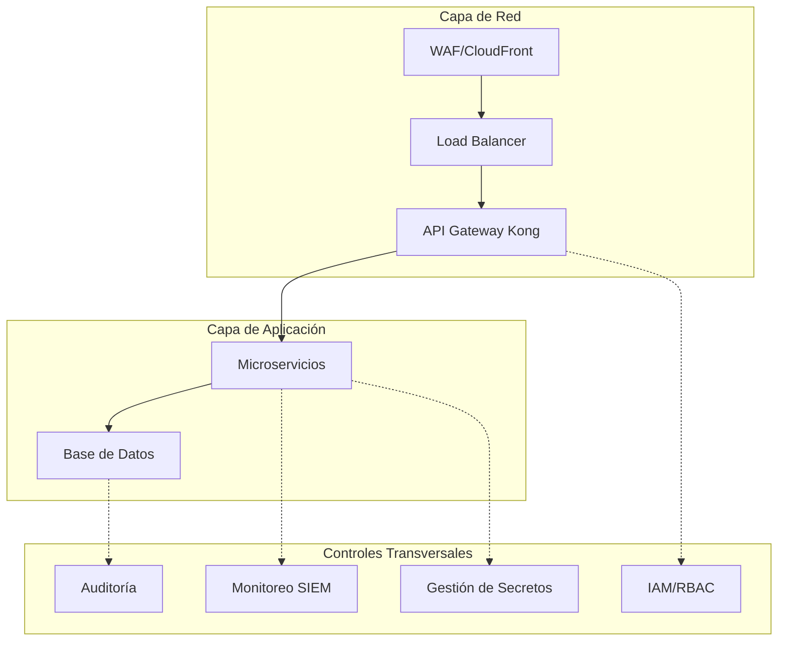
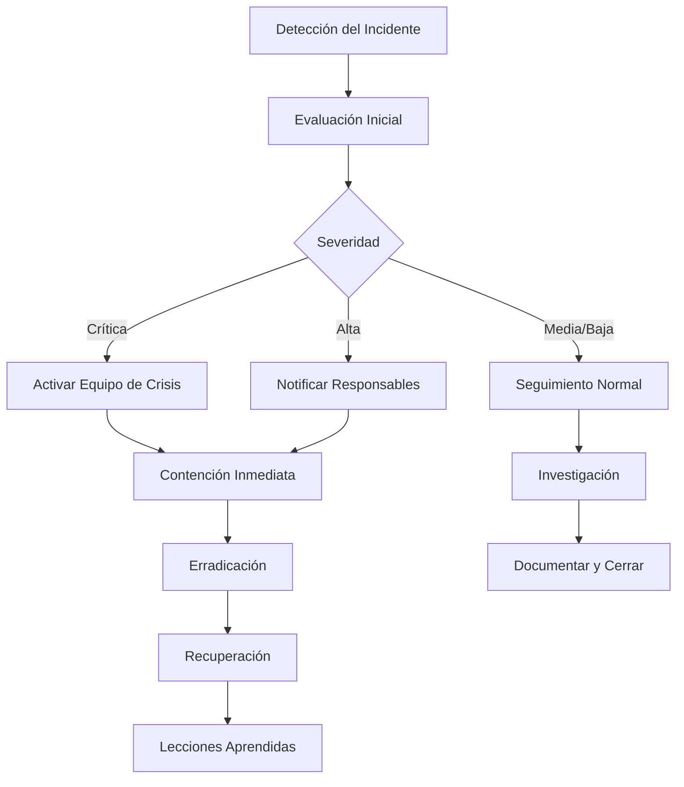

# 5.3. Políticas de Seguridad y Cumplimiento

Esta guía establece las políticas de seguridad, procedimientos de cumplimiento y mejores prácticas para la plataforma RetroGameCloud, incluyendo la implementación de controles de seguridad basados en OWASP Top 10.

## Marco de Seguridad General

### Principios Fundamentales

<Card title="Principios de Seguridad" icon="lock">

- **Defensa en profundidad**: Múltiples capas de seguridad

- **Principio de menor privilegio**: Acceso mínimo necesario

- **Seguridad por diseño**: Integrada desde el desarrollo

- **Transparencia**: Auditoría y monitoreo continuo
</Card>

### Arquitectura de Seguridad



## OWASP Top 10 - Controles Implementados

### A01: Broken Access Control

<Tabs>
<Tab title="Controles Implementados">

* *Autenticación y Autorización:**

- OAuth2/JWT con Kong API Gateway

- RBAC granular por microservicio

- Validación de tokens en cada request

- Session management seguro

* *Implementación:**

```javascript
// Middleware de autorización
const authorize = (requiredRole) => {
  return (req, res, next) => {
    const token = req.headers.authorization?.split(' ')[1];

    if (!token) {
      return res.status(401).json({ error: 'Token requerido' });
    }

    try {
      const decoded = jwt.verify(token, process.env.JWT_SECRET);

      if (!hasPermission(decoded.role, requiredRole)) {
        return res.status(403).json({ error: 'Permisos insuficientes' });
      }

      req.user = decoded;
      next();
    } catch (error) {
      return res.status(401).json({ error: 'Token inválido' });
    }
  };
};

```

</Tab>
<Tab title="Políticas IAM">

* *Roles Definidos:**

- `admin`: Acceso completo al sistema

- `moderator`: Gestión de contenido y usuarios

- `user`: Acceso básico a funcionalidades

- `readonly`: Solo consulta

* *Configuración AWS IAM:**

```yaml

# terraform/iam-policies.tf
resource "aws_iam_policy" "retrogame_readonly" {
  name = "RetroGame-ReadOnly"

  policy = jsonencode({
    Version = "2012-10-17"
    Statement = [
      {
        Effect = "Allow"
        Action = [
          "s3:GetObject",
          "dynamodb:Query",
          "dynamodb:GetItem"
        ]
        Resource = [
          "arn:aws:s3:::retrogame-assets/*",
          "arn:aws:dynamodb:*:*:table/retrogame-*"
        ]
      }
    ]
  })
}

```

</Tab>
</Tabs>

### A02: Cryptographic Failures

<Warning>
Todos los datos sensibles deben estar cifrados tanto en tránsito como en reposo
</Warning>

* *Implementación de Cifrado:**

- TLS 1.3 para todas las comunicaciones

- AES-256 para cifrado de datos en reposo

- Bcrypt para hash de contraseñas

- AWS KMS para gestión de claves

```javascript
// Cifrado de datos sensibles
const crypto = require('crypto');
const bcrypt = require('bcrypt');

class SecurityService {
  static async hashPassword(password) {
    return await bcrypt.hash(password, 12);
  }

  static encryptSensitiveData(data, key) {
    const iv = crypto.randomBytes(16);
    const cipher = crypto.createCipher('aes-256-gcm', key, iv);

    let encrypted = cipher.update(data, 'utf8', 'hex');
    encrypted += cipher.final('hex');

    return {
      encrypted,
      iv: iv.toString('hex'),
      tag: cipher.getAuthTag().toString('hex')
    };
  }
}

```

### A03: Injection

* *Prevención SQL Injection:**

- Uso de ORMs con queries parametrizadas

- Validación y sanitización de inputs

- Prepared statements en PostgreSQL

```javascript
// Ejemplo con Prisma ORM
const getUserScores = async (userId, gameId) => {
  // Query parametrizada - protegida contra SQL injection
  return await prisma.score.findMany({
    where: {
      userId: parseInt(userId), // Validación de tipo
      gameId: parseInt(gameId),
      AND: {
        userId: {
          gt: 0 // Validación adicional
        }
      }
    },
    orderBy: {
      score: 'desc'
    }
  });
};

```

### A04: Insecure Design

<Note>
La seguridad está integrada en el diseño de arquitectura desde el inicio
</Note>

* *Controles de Diseño:**

- Threat modeling en fase de diseño

- Arquitectura de microservicios con aislamiento

- Circuit breakers y rate limiting

- Validación de datos en múltiples capas

### A05: Security Misconfiguration

* *Configuraciones de Seguridad:**

<Tabs>
<Tab title="Kubernetes">

```yaml

# security-policies.yaml
apiVersion: v1
kind: SecurityContext
metadata:
  name: retrogame-security-context
spec:
  runAsNonRoot: true
  runAsUser: 1000
  readOnlyRootFilesystem: true
  capabilities:
    drop:
      - ALL
  seccompProfile:
    type: RuntimeDefault

```

</Tab>
<Tab title="Nginx/Kong">

```nginx

# Configuración segura de Kong
server {
    # Ocultar versión del servidor
    server_tokens off;

    # Headers de seguridad
    add_header X-Frame-Options "SAMEORIGIN" always;
    add_header X-Content-Type-Options "nosniff" always;
    add_header X-XSS-Protection "1; mode=block" always;
    add_header Strict-Transport-Security "max-age=31536000; includeSubDomains" always;

    # Rate limiting
    limit_req_zone $binary_remote_addr zone=api:10m rate=10r/s;
    limit_req zone=api burst=20 nodelay;
}

```

</Tab>
</Tabs>

### A06: Vulnerable Components

* *Gestión de Vulnerabilidades:**

- Escaneo automático con Snyk en CI/CD

- Actualizaciones regulares de dependencias

- Base images mínimas en contenedores

- Monitoreo de CVEs

```yaml

# .github/workflows/security-scan.yml
name: Security Scan
on: [push, pull_request]

jobs:
  security:
    runs-on: ubuntu-latest
    steps:
      - uses: actions/checkout@v3
      - name: Run Snyk to check for vulnerabilities
        uses: snyk/actions/node@master
        with:
          args: --severity-threshold=high
        env:
          SNYK_TOKEN: ${{ secrets.SNYK_TOKEN }}

```

### A07-A10: Otras Vulnerabilidades

<Card title="Controles Adicionales" icon="security">

- **A07 Identity/Auth Failures**: MFA obligatorio para admins

- **A08 Software Integrity**: Firma de artefactos con Cosign

- **A09 Logging Failures**: Logs centralizados con ELK Stack

- **A10 SSRF**: Validación de URLs y network policies
</Card>

## Gestión de Secretos

### AWS Secrets Manager Integration

```javascript
// services/secrets-manager.js
const AWS = require('aws-sdk');
const secretsManager = new AWS.SecretsManager({ region: 'eu-west-1' });

class SecretsService {
  static async getSecret(secretName) {
    try {
      const result = await secretsManager.getSecretValue({
        SecretId: secretName
      }).promise();

      return JSON.parse(result.SecretString);
    } catch (error) {
      console.error('Error retrieving secret:', error);
      throw error;
    }
  }

  static async rotateSecret(secretName) {
    return await secretsManager.rotateSecret({
      SecretId: secretName,
      ForceRotateSecrets: true
    }).promise();
  }
}

```

### Políticas de Rotación

<Warning>
Los secretos críticos deben rotarse cada 30 días automáticamente
</Warning>

```yaml

# terraform/secrets.tf
resource "aws_secretsmanager_secret" "db_password" {
  name = "retrogame/db/password"

  rotation_rules {
    automatically_after_days = 30
  }
}

```

## Auditoría y Logging

### Configuración de Logs de Seguridad

```javascript
// middleware/audit-logger.js
const winston = require('winston');

const auditLogger = winston.createLogger({
  level: 'info',
  format: winston.format.combine(
    winston.format.timestamp(),
    winston.format.json()
  ),
  transports: [
    new winston.transports.File({ filename: 'audit.log' }),
    new winston.transports.Console()
  ]
});

const auditMiddleware = (req, res, next) => {
  const auditData = {
    timestamp: new Date().toISOString(),
    userId: req.user?.id,
    ip: req.ip,
    method: req.method,
    endpoint: req.path,
    userAgent: req.get('User-Agent')
  };

  auditLogger.info('API Access', auditData);
  next();
};

```

### Monitoreo de Eventos de Seguridad

<Tabs>
<Tab title="CloudWatch Alarms">

```yaml

# terraform/monitoring.tf
resource "aws_cloudwatch_metric_alarm" "failed_logins" {
  alarm_name          = "retrogame-failed-logins"
  comparison_operator = "GreaterThanThreshold"
  evaluation_periods  = "2"
  metric_name         = "FailedLogins"
  namespace           = "RetroGame/Security"
  period              = "300"
  statistic           = "Sum"
  threshold           = "10"
  alarm_description   = "Too many failed login attempts"

  alarm_actions = [aws_sns_topic.security_alerts.arn]
}

```

</Tab>
<Tab title="Alertas de Seguridad">

* *Eventos que generan alertas:**

- Múltiples intentos de login fallidos

- Acceso desde IPs sospechosas

- Elevación de privilegios

- Acceso a recursos sensibles

- Modificaciones de configuración de seguridad

- Fallos en la verificación de integridad

* *Configuración de Alertas:**

```javascript
// services/security-monitor.js
class SecurityMonitor {
  static async checkSuspiciousActivity(userId, ip, action) {
    const recentAttempts = await redis.get(`failed_attempts:${ip}`);

    if (recentAttempts > 5) {
      await this.triggerAlert({
        type: 'SUSPICIOUS_ACTIVITY',
        userId,
        ip,
        action,
        attempts: recentAttempts
      });

      // Bloquear IP temporalmente
      await redis.setex(`blocked_ip:${ip}`, 3600, 'true');
    }
  }
}

```

</Tab>
</Tabs>

## Respuesta a Incidentes

### Procedimiento de Respuesta



### Playbooks de Respuesta

<Tabs>
<Tab title="Compromiso de Credenciales">

* *Pasos Inmediatos:**
1. Revocar tokens/credenciales comprometidas
2. Forzar logout de todas las sesiones del usuario
3. Revisar logs de acceso recientes
4. Notificar al usuario afectado
5. Activar rotación de secretos relacionados

* *Script de Respuesta:**

```bash
#!/bin/bash

# incident-response-credentials.sh

USER_ID=$1
REASON="Credential compromise"

echo "Iniciando respuesta para compromiso de credenciales: $USER_ID"

# Revocar tokens activos
kubectl exec -it auth-service -- npm run revoke-user-tokens $USER_ID

# Bloquear cuenta temporalmente
kubectl exec -it auth-service -- npm run lock-account $USER_ID "$REASON"

# Generar reporte de actividad
kubectl logs -l app=auth-service --since=24h | grep $USER_ID > incident-${USER_ID}-$(date +%Y%m%d).log

echo "Respuesta completada. Revisar logs en incident-${USER_ID}-$(date +%Y%m%d).log"

```

</Tab>
<Tab title="Ataque DDoS">

* *Medidas de Contención:**
1. Activar protección DDoS en CloudFront
2. Implementar rate limiting agresivo
3. Analizar patrones de tráfico
4. Contactar con AWS Support si es necesario
5. Comunicar estado a usuarios

* *Configuración de Emergencia:**

```yaml

# emergency-rate-limit.yaml
apiVersion: configuration.konghq.com/v1
kind: KongPlugin
metadata:
  name: emergency-rate-limit
plugin: rate-limiting
config:
  minute: 5
  hour: 100
  policy: redis
  fault_tolerant: false
  hide_client_headers: true

```

</Tab>
</Tabs>

### Comunicación de Incidentes

* *Canales de Comunicación:**

- Slack #security-alerts (inmediato)

- Email security@retrogamecloud.com (formal)

- Status page para usuarios (si afecta servicio)

- Informe post-incidente (48h después)

## Cumplimiento Normativo

### GDPR Compliance

<Card title="Derechos del Usuario GDPR" icon="user-shield">
</Card>