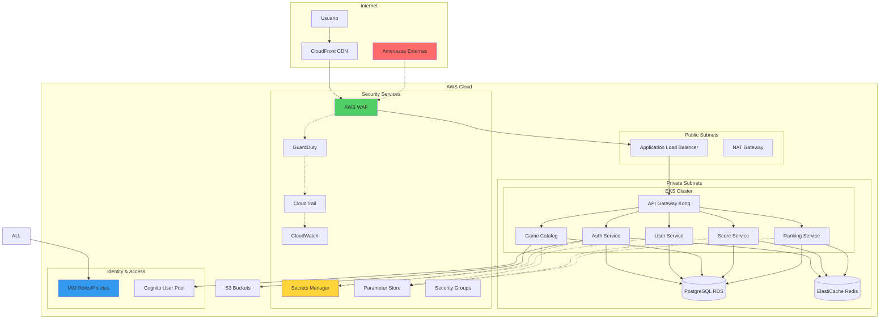

# Seguridad y Gestión de Secretos

Esta guía detalla las políticas de seguridad, gestión de secretos, implementación de OWASP Top 10 y mejores prácticas implementadas en RetroGameCloud para garantizar la protección de datos y sistemas.

## Arquitectura de Seguridad



## OWASP Top 10 - Implementación de Mitigaciones

### A01:2021 – Broken Access Control

<Warning>
El control de acceso roto es la vulnerabilidad #1 según OWASP. Implementamos múltiples capas de protección.
</Warning>

#### Implementación de Controles

```typescript
// middleware/rbac.ts
import { Request, Response, NextFunction } from 'express';
import { JwtService } from '../services/jwt.service';
import { UserRole } from '../types/user.types';

export class RBACMiddleware {
  constructor(private jwtService: JwtService) {}

  // Control de acceso basado en roles
  requireRole(allowedRoles: UserRole[]) {
    return async (req: Request, res: Response, next: NextFunction) => {
      try {
        const token = this.extractToken(req);
        const payload = await this.jwtService.verify(token);

        // Verificar rol de usuario
        if (!allowedRoles.includes(payload.role)) {
          return res.status(403).json({
            error: 'INSUFFICIENT_PERMISSIONS',
            message: 'Access denied'
          });
        }

        // Verificar propiedad de recursos
        if (req.params.userId && payload.sub !== req.params.userId) {
          const hasAdminRole = payload.role === UserRole.ADMIN;
          if (!hasAdminRole) {
            return res.status(403).json({
              error: 'RESOURCE_ACCESS_DENIED',
              message: 'Cannot access other user resources'
            });
          }
        }

        req.user = payload;
        next();
      } catch (error) {
        res.status(401).json({
          error: 'INVALID_TOKEN',
          message: 'Authentication failed'
        });
      }
    };
  }

  private extractToken(req: Request): string {
    const authHeader = req.headers.authorization;
    if (!authHeader?.startsWith('Bearer ')) {
      throw new Error('No token provided');
    }
    return authHeader.substring(7);
  }
}

```

#### Políticas de Acceso a Recursos

```yaml

# k8s/rbac-policies.yml
apiVersion: rbac.authorization.k8s.io/v1
kind: Role
metadata:
  namespace: retrogame-prod
  name: service-account-role
rules:

- apiGroups: [""]
  resources: ["secrets"]
  verbs: ["get", "list"]
  resourceNames: ["db-credentials", "jwt-secrets"]

- apiGroups: [""]
  resources: ["configmaps"]
  verbs: ["get", "list"]

- --
apiVersion: rbac.authorization.k8s.io/v1
kind: RoleBinding
metadata:
  name: service-account-binding
  namespace: retrogame-prod
subjects:

- kind: ServiceAccount
  name: retrogame-service-account
  namespace: retrogame-prod
roleRef:
  kind: Role
  name: service-account-role
  apiGroup: rbac.authorization.k8s.io

```

### A02:2021 – Cryptographic Failures

#### Implementación de Cifrado

```typescript
// services/encryption.service.ts
import { createCipher, createDecipher, randomBytes, scrypt } from 'crypto';
import { promisify } from 'util';

export class EncryptionService {
  private readonly algorithm = 'aes-256-gcm';
  private readonly keyLength = 32;

  async encryptSensitiveData(data: string, password: string): Promise<string> {
    const salt = randomBytes(16);
    const iv = randomBytes(16);

    // Derivar clave usando scrypt
    const key = await promisify(scrypt)(password, salt, this.keyLength) as Buffer;

    const cipher = createCipher(this.algorithm, key);
    cipher.setAAD(salt); // Datos adicionales autenticados

    let encrypted = cipher.update(data, 'utf8', 'hex');
    encrypted += cipher.final('hex');

    const authTag = cipher.getAuthTag();

    // Combinar salt, iv, authTag y datos cifrados
    return salt.toString('hex') + ':' +
           iv.toString('hex') + ':' +
           authTag.toString('hex') + ':' +
           encrypted;
  }

  // Validación de contraseñas seguras
  validatePasswordStrength(password: string): boolean {
    const minLength = 12;
    const hasUpperCase = /[A-Z]/.test(password);
    const hasLowerCase = /[a-z]/.test(password);
    const hasNumbers = /\d/.test(password);
    const hasSpecialChar = /[!@#$%^&*(),.?":{}|<>]/.test(password);

    return password.length >= minLength &&
           hasUpperCase &&
           hasLowerCase &&
           hasNumbers &&
           hasSpecialChar;
  }
}

```

### A03:2021 – Injection

#### Prevención de Inyección SQL

```typescript
// repositories/user.repository.ts
import { Pool } from 'pg';
import { User, CreateUserDto } from '../types/user.types';

export class UserRepository {
  constructor(private db: Pool) {}

  // Uso de consultas parametrizadas
  async findById(id: string): Promise<User | null> {
    const query = `
      SELECT id, email, username, role, created_at, updated_at
      FROM users
      WHERE id = $1 AND deleted_at IS NULL
    `;

    const result = await this.db.query(query, [id]);
    return result.rows[0] || null;
  }

  async create(userData: CreateUserDto): Promise<User> {
    const query = `
      INSERT INTO users (id, email, username, password_hash, role)
      VALUES ($1, $2, $3, $4, $5)
      RETURNING id, email, username, role, created_at
    `;

    const values = [
      userData.id,
      userData.email,
      userData.username,
      userData.passwordHash,
      userData.role
    ];

    const result = await this.db.query(query, values);
    return result.rows[0];
  }

  // Validación y sanitización de entrada
  async searchUsers(searchTerm: string, limit: number = 10): Promise<User[]> {
    // Sanitizar entrada
    const sanitizedTerm = searchTerm.replace(/[%_]/g, '\\$&');

    const query = `
      SELECT id, email, username, role
      FROM users
      WHERE (username ILIKE $1 OR email ILIKE $1)
        AND deleted_at IS NULL
      LIMIT $2
    `;

    const result = await this.db.query(query, [`%${sanitizedTerm}%`, limit]);
    return result.rows;
  }
}

```

### A04:2021 – Insecure Design

#### Implementación de Rate Limiting

```typescript
// middleware/rate-limiting.ts
import rateLimit from 'express-rate-limit';
import RedisStore from 'rate-limit-redis';
import Redis from 'ioredis';

const redis = new Redis(process.env.REDIS_URL);

export const createRateLimit = (options: {
  windowMs: number;
  max: number;
  message: string;
  skipSuccessfulRequests?: boolean;
}) => {
  return rateLimit({
    store: new RedisStore({
      sendCommand: (...args: string[]) => redis.call(...args),
    }),
    windowMs: options.windowMs,
    max: options.max,
    message: {
      error: 'RATE_LIMIT_EXCEEDED',
      message: options.message,
    },
    skipSuccessfulRequests: options.skipSuccessfulRequests || false,
    standardHeaders: true,
    legacyHeaders: false,
  });
};

// Rate limits específicos por endpoint
export const authRateLimit = createRateLimit({
  windowMs: 15 * 60 * 1000, // 15 minutos
  max: 5, // 5 intentos de login por IP
  message: 'Too many authentication attempts',
  skipSuccessfulRequests: true,
});

export const apiRateLimit = createRateLimit({
  windowMs: 15 * 60 * 1000, // 15 minutos
  max: 100, // 100 requests por IP
  message: 'Too many API requests',
});

```

### A05:2021 – Security Misconfiguration

#### Configuración Segura de Headers

```typescript
// middleware/security-headers.ts
import helmet from 'helmet';
import { Application } from 'express';

export const configureSecurityHeaders = (app: Application) => {
  app.use(helmet({
    contentSecurityPolicy: {
      directives: {
        defaultSrc: ["'self'"],
        styleSrc: ["'self'", "'unsafe-inline'", "https://fonts.googleapis.com"],
        fontSrc: ["'self'", "https://fonts.gstatic.com"],
        imgSrc: ["'self'", "data:", "https:"],
        scriptSrc: ["'self'"],
        objectSrc: ["'none'"],
        upgradeInsecureRequests: [],
      },
    },
    hsts: {
      maxAge: 31536000,
      includeSubDomains: true,
      preload: true
    },
    noSniff: true,
    frameguard: { action: 'deny' },
    xssFilter: true,
  }));

  // Headers adicionales de seguridad
  app.use((req, res, next) => {
    res.setHeader('X-API-Version', '1.0');
    res.setHeader('Cache-Control', 'no-store');
    res.removeHeader('X-Powered-By');
    next();
  });
};

```

### A06:2021 – Vulnerable and Outdated Components

#### Monitoreo de Vulnerabilidades

```yaml

# .github/workflows/security-scan.yml
name: Security Vulnerability Scan
on:
  schedule:
    - cron: '0 2 * * *' # Diario a las 2 AM
  push:
    branches: [main]
  pull_request:

jobs:
  vulnerability-scan:
    runs-on: ubuntu-latest
    steps:
      - uses: actions/checkout@v3

      - name: Setup Node.js
        uses: actions/setup-node@v3
        with:
          node-version: '18'

      - name: Install dependencies
        run: npm ci

      - name: Run npm audit
        run: npm audit --audit-level high

      - name: Run Snyk test
        run: |
          npm install -g snyk
          snyk auth ${{ secrets.SNYK_TOKEN }}
          snyk test --severity-threshold=high

      - name: Trivy vulnerability scanner
        uses: aquasecurity/trivy-action@master
        with:
          scan-type: 'fs'
          scan-ref: '.'
          format: 'sarif'
          output: 'trivy-results.sarif'

      - name: Upload Trivy scan results
        uses: github/codeql-action/upload-sarif@v2
        with:
          sarif_file: 'trivy-results.sarif'

```

## Gestión de Secretos

### AWS Secrets Manager

<Note>
AWS Secrets Manager se utiliza para almacenar secretos críticos como credenciales de base de datos, claves JWT y tokens OAuth2.
</Note>

#### Configuración de Secretos

```yaml

# secrets-manager-setup.yml
apiVersion: external-secrets.io/v1beta1
kind: SecretStore
metadata:
  name: aws-secrets-store
  namespace: retrogame-prod
spec:
  provider:
    aws:
      service: SecretsManager
      region: us-east-1
      auth:
        secretRef:
          accessKeyID:
            name: aws-credentials
            key: access-key-id
          secretAccessKey:
            name: aws-credentials
            key: secret-access-key

- --
apiVersion: external-secrets.io/v1beta1
kind: ExternalSecret
metadata:
  name: database-credentials
  namespace: retrogame-prod
spec:
  refreshInterval: 1h
  secretStoreRef:
    name: aws-secrets-store
    kind: SecretStore
  target:
    name: db-credentials
    creationPolicy: Owner
  data:
  - secretKey: username
    remoteRef:
      key: retrogame/database/credentials
      property: username
  - secretKey: password
    remoteRef:
      key: retrogame/database/credentials
      property: password
  - secretKey: host
    remoteRef:
      key: retrogame/database/credentials
      property: host

```

#### Rotación Automática de Secretos

```typescript
// services/secret-rotation.service.ts
import { SecretsManagerClient, UpdateSecretCommand } from '@aws-sdk

```