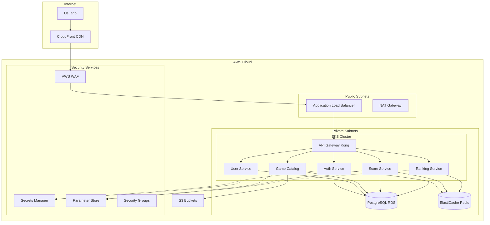

# Seguridad y Gestión de Secretos

Esta guía detalla las políticas de seguridad, gestión de secretos y mejores prácticas implementadas en RetroGameCloud para garantizar la protección de datos y sistemas.

## Arquitectura de Seguridad



## Gestión de Secretos

### AWS Secrets Manager

<Note>
AWS Secrets Manager se utiliza para almacenar secretos críticos como credenciales de base de datos, claves JWT y tokens OAuth2.
</Note>

#### Configuración de Secretos

```yaml

# secrets-manager-setup.yml
apiVersion: external-secrets.io/v1beta1
kind: SecretStore
metadata:
  name: retrogame-secrets
  namespace: retrogame-cloud
spec:
  provider:
    aws:
      service: SecretsManager
      region: eu-west-1
      auth:
        jwt:
          serviceAccountRef:
            name: external-secrets-sa

- --
apiVersion: external-secrets.io/v1beta1
kind: ExternalSecret
metadata:
  name: database-credentials
  namespace: retrogame-cloud
spec:
  refreshInterval: 1h
  secretStoreRef:
    name: retrogame-secrets
    kind: SecretStore
  target:
    name: db-secret
    creationPolicy: Owner
  data:
  - secretKey: username
    remoteRef:
      key: retrogame/database
      property: username
  - secretKey: password
    remoteRef:
      key: retrogame/database
      property: password

```

#### Estructura de Secretos

<Tabs>
<Tab title="Base de Datos">

```json
{
  "retrogame/database": {
    "username": "retrogame_user",
    "password": "generated-secure-password",
    "host": "retrogame-db.cluster-xxx.eu-west-1.rds.amazonaws.com",
    "port": 5432,
    "dbname": "retrogame"
  }
}

```

</Tab>
<Tab title="JWT Secrets">

```json
{
  "retrogame/jwt": {
    "access_secret": "base64-encoded-access-secret",
    "refresh_secret": "base64-encoded-refresh-secret",
    "issuer": "retrogame-cloud",
    "audience": "retrogame-api"
  }
}

```

</Tab>
<Tab title="OAuth2">

```json
{
  "retrogame/oauth2": {
    "google_client_id": "xxx.apps.googleusercontent.com",
    "google_client_secret": "GOCSPX-xxx",
    "github_client_id": "Iv1.xxx",
    "github_client_secret": "xxx",
    "discord_client_id": "xxx",
    "discord_client_secret": "xxx"
  }
}

```

</Tab>
</Tabs>

### AWS Systems Manager Parameter Store

Para configuraciones no sensibles pero importantes:

```bash

# Configurar parámetros del sistema
aws ssm put-parameter \
    --name "/retrogame/config/jwt-expiry" \
    --value "3600" \
    --type "String" \
    --description "JWT access token expiry in seconds"

aws ssm put-parameter \
    --name "/retrogame/config/session-timeout" \
    --value "7200" \
    --type "String" \
    --description "User session timeout in seconds"

aws ssm put-parameter \
    --name "/retrogame/config/max-game-sessions" \
    --value "10" \
    --type "String" \
    --description "Maximum concurrent game sessions per user"

```

## Rotación de Secretos

### Rotación Automática de Credenciales de Base de Datos

```python

# lambda-rotation-function.py
import boto3
import json
import logging

logger = logging.getLogger()
logger.setLevel(logging.INFO)

def lambda_handler(event, context):
    """
    Función Lambda para rotación automática de credenciales RDS
    """
    secrets_client = boto3.client('secretsmanager')
    rds_client = boto3.client('rds')

    secret_arn = event['Step']
    token = event['ClientRequestToken']
    step = event['Step']

    if step == "createSecret":
        create_secret(secrets_client, secret_arn, token)
    elif step == "setSecret":
        set_secret(secrets_client, rds_client, secret_arn, token)
    elif step == "testSecret":
        test_secret(secrets_client, secret_arn, token)
    elif step == "finishSecret":
        finish_secret(secrets_client, secret_arn, token)

    return {"statusCode": 200}

def create_secret(secrets_client, secret_arn, token):
    """Crear nueva versión del secreto"""
    try:
        current_secret = secrets_client.get_secret_value(
            SecretId=secret_arn,
            VersionStage="AWSCURRENT"
        )

        # Generar nueva contraseña
        new_password = secrets_client.get_random_password(
            PasswordLength=32,
            ExcludeCharacters='"@/\\'
        )['RandomPassword']

        # Actualizar secreto con nueva contraseña
        new_secret = json.loads(current_secret['SecretString'])
        new_secret['password'] = new_password

        secrets_client.put_secret_value(
            SecretId=secret_arn,
            VersionId=token,
            SecretString=json.dumps(new_secret),
            VersionStages=['AWSPENDING']
        )

        logger.info("Nuevo secreto creado con éxito")

    except Exception as e:
        logger.error(f"Error creando secreto: {str(e)}")
        raise e

```

### Rotación de JWT Secrets

```yaml

# jwt-rotation-cronjob.yml
apiVersion: batch/v1
kind: CronJob
metadata:
  name: jwt-rotation
  namespace: retrogame-cloud
spec:
  schedule: "0 2 1 * *"  # Primer día de cada mes a las 2:00 AM
  jobTemplate:
    spec:
      template:
        spec:
          serviceAccountName: jwt-rotation-sa
          containers:
          - name: jwt-rotator
            image: retrogame/jwt-rotator:latest
            env:
            - name: AWS_REGION
              value: eu-west-1
            - name: SECRET_NAME
              value: retrogame/jwt
            command:
            - /bin/sh
            - -c
            - |
              # Generar nuevos secretos JWT
              NEW_ACCESS_SECRET=$(openssl rand -base64 64)
              NEW_REFRESH_SECRET=$(openssl rand -base64 64)

              # Actualizar en Secrets Manager
              aws secretsmanager update-secret \
                --secret-id $SECRET_NAME \
                --secret-string "{
                  \"access_secret\": \"$NEW_ACCESS_SECRET\",
                  \"refresh_secret\": \"$NEW_REFRESH_SECRET\",
                  \"issuer\": \"retrogame-cloud\",
                  \"audience\": \"retrogame-api\"
                }"

              # Reiniciar servicios para aplicar nuevos secretos
              kubectl rollout restart deployment/auth-service
              kubectl rollout restart deployment/user-service
          restartPolicy: OnFailure

```

## Políticas de Seguridad IAM

### Roles para Servicios

<Warning>
Aplicar el principio de menor privilegio. Cada servicio debe tener acceso únicamente a los recursos que necesita.
</Warning>

```json
{
  "Version": "2012-10-17",
  "Statement": [
    {
      "Sid": "SecretsManagerAccess",
      "Effect": "Allow",
      "Action": [
        "secretsmanager:GetSecretValue",
        "secretsmanager:DescribeSecret"
      ],
      "Resource": [
        "arn:aws:secretsmanager:eu-west-1:*:secret:retrogame/database*",
        "arn:aws:secretsmanager:eu-west-1:*:secret:retrogame/jwt*"
      ]
    },
    {
      "Sid": "ParameterStoreAccess",
      "Effect": "Allow",
      "Action": [
        "ssm:GetParameter",
        "ssm:GetParameters",
        "ssm:GetParametersByPath"
      ],
      "Resource": "arn:aws:ssm:eu-west-1:*:parameter/retrogame/*"
    },
    {
      "Sid": "S3GameAssetsAccess",
      "Effect": "Allow",
      "Action": [
        "s3:GetObject",
        "s3:PutObject"
      ],
      "Resource": "arn:aws:s3:::retrogame-assets/*"
    }
  ]
}

```

### Service Account para Kubernetes

```yaml

# service-account.yml
apiVersion: v1
kind: ServiceAccount
metadata:
  name: retrogame-service-account
  namespace: retrogame-cloud
  annotations:
    eks.amazonaws.com/role-arn: arn:aws:iam::ACCOUNT-ID:role/RetroGameServiceRole

- --
apiVersion: rbac.authorization.k8s.io/v1
kind: Role
metadata:
  name: retrogame-role
  namespace: retrogame-cloud
rules:

- apiGroups: [""]
  resources: ["secrets", "configmaps"]
  verbs: ["get", "list"]

- apiGroups: ["apps"]
  resources: ["deployments"]
  verbs: ["get", "list", "patch"]

- --
apiVersion: rbac.authorization.k8s.io/v1
kind: RoleBinding
metadata:
  name: retrogame-binding
  namespace: retrogame-cloud
roleRef:
  apiGroup: rbac.authorization.k8s.io
  kind: Role
  name: retrogame-role
subjects:

- kind: ServiceAccount
  name: retrogame-service-account
  namespace: retrogame-cloud

```

## Seguridad de Red

### Security Groups

```json
{
  "SecurityGroups": [
    {
      "GroupName": "retrogame-alb-sg",
      "Description": "Security group for Application Load Balancer",
      "InboundRules": [
        {
          "IpProtocol": "tcp",
          "FromPort": 80,
          "ToPort": 80,
          "CidrIp": "0.0.0.0/0"
        },
        {
          "IpProtocol": "tcp",
          "FromPort": 443,
          "ToPort": 443,
          "CidrIp": "0.0.0.0/0"
        }
      ]
    },
    {
      "GroupName": "retrogame-eks-sg",
      "Description": "Security group for EKS nodes",
      "InboundRules": [
        {
          "IpProtocol": "tcp",
          "FromPort": 30000,
          "ToPort": 32767,
          "SourceSecurityGroupId": "sg-alb-xxx"
        },
        {
          "IpProtocol": "tcp",
          "FromPort": 443,
          "ToPort": 443,
          "SourceSecurityGroupId": "sg-alb-xxx"
        }
      ]
    },
    {
      "GroupName": "retrogame-rds-sg",
      "Description": "Security group for RDS PostgreSQL",
      "InboundRules": [
        {
          "IpProtocol": "tcp",
          "FromPort": 5432,
          "ToPort": 5432,
          "SourceSecurityGroupId": "sg-eks-xxx"
        }
      ]
    }
  ]
}

```

### Network ACLs

```json
{
  "NetworkAcls": [
    {
      "NetworkAclId": "acl-retrogame-private",
      "Entries": [
        {
          "RuleNumber": 100,
          "Protocol": "6",
          "RuleAction": "allow",
          "PortRange": {
            "From": 5432,
            "To": 5432
          },
          "CidrBlock": "10.0.0.0/8"
        },
        {
          "RuleNumber": 110,
          "Protocol": "6",
          "RuleAction": "allow",
          "PortRange": {
            "From": 6379,
            "To": 6379
          },
          "CidrBlock": "10.0.0.0/8"
        },
        {
          "RuleNumber": 900,
          "Protocol": "-1",
          "RuleAction": "deny",
          "CidrBlock": "0.0.0.0/0"
        }
      ]
    }
  ]
}

```

## Cifrado

### Cifrado en Tránsito

<Card title="TLS/SSL Configuración" icon="lock">
Todos los servicios utilizan TLS 1.2 o superior para comunicaciones.
</Card>

```yaml

# nginx-tls-config.yml
apiVersion: v1
kind: ConfigMap
metadata:
  name: nginx-tls-config
data:
  nginx.conf: |
    upstream backend {
        server auth-service:8080;
        server user-service:8080;
        server game-catalog:8080;
    }

    server {
        listen 443 ssl http2;
        server_name api.retrogamecloud.com;

        ssl_certificate /etc/ssl/certs/retrogame.crt;
        ssl_certificate_key /etc/ssl/private/retrogame.key;
        ssl_protocols TLSv1.2 TLSv1.3;
        ssl_ciphers ECDHE-RSA-AES256-GCM-SHA512:DHE-RS
```