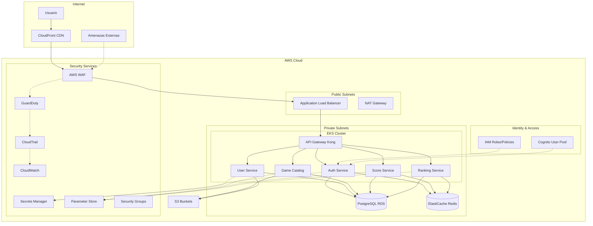

# 4. Seguridad y Gestión de Secretos

Esta guía detalla las políticas de seguridad, gestión de secretos, implementación de OWASP Top 10 y mejores prácticas implementadas en RetroGameCloud para garantizar la protección de datos y sistemas.

## 4.1. Arquitectura de Seguridad



## 4.2. Gestión de Secretos

### 4.2.1. AWS Secrets Manager

Configuración para secretos críticos como credenciales de base de datos y claves de API:

```yaml
# terraform/secrets.tf
resource "aws_secretsmanager_secret" "database_credentials" {
  name        = "retrogame/database/credentials"
  description = "Database credentials for RetroGameCloud"
  
  replica {
    region = "us-west-2"
  }
  
  tags = {
    Environment = var.environment
    Service     = "database"
  }
}

resource "aws_secretsmanager_secret_version" "database_credentials" {
  secret_id = aws_secretsmanager_secret.database_credentials.id
  secret_string = jsonencode({
    username = var.db_username
    password = var.db_password
  })
}
```

### 4.2.2. Parameter Store

Para configuraciones no sensibles y parámetros de aplicación:

```yaml
# terraform/parameter-store.tf
resource "aws_ssm_parameter" "api_config" {
  name  = "/retrogame/api/config"
  type  = "StringList"
  value = "production,us-east-1,443"
  
  tags = {
    Environment = var.environment
  }
}

resource "aws_ssm_parameter" "jwt_config" {
  name  = "/retrogame/auth/jwt-expiry"
  type  = "String"
  value = "24h"
}
```

### 4.2.3. Implementación en Kubernetes

```yaml
# k8s/secrets/secret-provider-class.yaml
apiVersion: secrets-store.csi.x-k8s.io/v1
kind: SecretProviderClass
metadata:
  name: retrogame-secrets
  namespace: retrogame
spec:
  provider: aws
  parameters:
    objects: |
      - objectName: "retrogame/database/credentials"
        objectType: "secretsmanager"
        jmesPath:
          - path: "username"
            objectAlias: "db-username"
          - path: "password"
            objectAlias: "db-password"
      - objectName: "/retrogame/api/jwt-secret"
        objectType: "ssmparameter"
  secretObjects:
  - secretName: database-secret
    type: Opaque
    data:
    - objectName: "db-username"
      key: username
    - objectName: "db-password"
      key: password
```

## 4.3. OWASP Top 10 - Implementación

### 4.3.1. A01 - Broken Access Control

```typescript
// src/auth/guards/permission.guard.ts
import { Injectable, CanActivate, ExecutionContext, ForbiddenException } from '@nestjs/common';
import { Reflector } from '@nestjs/core';

@Injectable()
export class PermissionGuard implements CanActivate {
  constructor(private reflector: Reflector) {}

  canActivate(context: ExecutionContext): boolean {
    const requiredPermissions = this.reflector.getAllAndOverride<string[]>('permissions', [
      context.getHandler(),
      context.getClass(),
    ]);

    if (!requiredPermissions) {
      return true;
    }

    const request = context.switchToHttp().getRequest();
    const user = request.user;

    const hasPermission = requiredPermissions.some(permission => 
      user.permissions?.includes(permission)
    );

    if (!hasPermission) {
      throw new ForbiddenException('Insufficient permissions');
    }

    return true;
  }
}

// Uso en controlador
@Controller('admin')
@UseGuards(JwtAuthGuard, PermissionGuard)
export class AdminController {
  @Get('users')
  @Permissions('admin:users:read')
  async getUsers() {
    // Lógica del endpoint
  }
}
```

### 4.3.2. A02 - Cryptographic Failures

```typescript
// src/common/utils/encryption.service.ts
import { Injectable } from '@nestjs/common';
import * as crypto from 'crypto';
import * as bcrypt from 'bcryptjs';

@Injectable()
export class EncryptionService {
  private readonly algorithm = 'aes-256-gcm';
  private readonly keyLength = 32;

  async hashPassword(password: string): Promise<string> {
    const saltRounds = 12;
    return bcrypt.hash(password, saltRounds);
  }

  async verifyPassword(password: string, hash: string): Promise<boolean> {
    return bcrypt.compare(password, hash);
  }

  encryptSensitiveData(data: string, key: Buffer): {
    encrypted: string;
    iv: string;
    authTag: string;
  } {
    const iv = crypto.randomBytes(16);
    const cipher = crypto.createCipher(this.algorithm, key);
    
    let encrypted = cipher.update(data, 'utf8', 'hex');
    encrypted += cipher.final('hex');
    
    const authTag = cipher.getAuthTag();

    return {
      encrypted,
      iv: iv.toString('hex'),
      authTag: authTag.toString('hex')
    };
  }
}
```

### 4.3.3. A03 - Injection

```typescript
// src/common/pipes/sql-injection-prevention.pipe.ts
import { Injectable, PipeTransform, BadRequestException } from '@nestjs/common';

@Injectable()
export class SqlInjectionPreventionPipe implements PipeTransform {
  private readonly sqlInjectionPatterns = [
    /(\b(SELECT|INSERT|UPDATE|DELETE|DROP|CREATE|ALTER|EXEC|EXECUTE)\b)/gi,
    /(UNION|OR|AND)\s+\d+\s*=\s*\d+/gi,
    /[';--]/g,
    /\/\*.*\*\//g
  ];

  transform(value: any) {
    if (typeof value === 'string') {
      for (const pattern of this.sqlInjectionPatterns) {
        if (pattern.test(value)) {
          throw new BadRequestException('Invalid input detected');
        }
      }
    }

    if (typeof value === 'object') {
      Object.keys(value).forEach(key => {
        value[key] = this.transform(value[key]);
      });
    }

    return value;
  }
}

// Uso con TypeORM Repository Pattern
@Injectable()
export class UserRepository {
  constructor(
    @InjectRepository(User)
    private userRepository: Repository<User>
  ) {}

  async findUserByEmail(email: string): Promise<User> {
    // Uso de parámetros preparados para prevenir SQL injection
    return this.userRepository.findOne({
      where: { email },
      select: ['id', 'email', 'username', 'createdAt']
    });
  }

  async updateUserScore(userId: number, score: number): Promise<void> {
    // Query builder con parámetros seguros
    await this.userRepository
      .createQueryBuilder()
      .update(User)
      .set({ currentScore: () => `current_score + :score` })
      .where('id = :userId')
      .setParameters({ score, userId })
      .execute();
  }
}
```

### 4.3.4. A04 - Insecure Design

```typescript
// src/common/decorators/rate-limit.decorator.ts
import { SetMetadata } from '@nestjs/common';

export const RateLimit = (requests: number, windowMs: number) =>
  SetMetadata('rateLimit', { requests, windowMs });

// src/auth/guards/rate-limit.guard.ts
import { Injectable, CanActivate, ExecutionContext, HttpException, HttpStatus } from '@nestjs/common';
import { Reflector } from '@nestjs/core';
import { RedisService } from '../redis/redis.service';

@Injectable()
export class RateLimitGuard implements CanActivate {
  constructor(
    private reflector: Reflector,
    private redisService: RedisService
  ) {}

  async canActivate(context: ExecutionContext): Promise<boolean> {
    const rateLimitConfig = this.reflector.get<{requests: number, windowMs: number}>('rateLimit', context.getHandler());
    
    if (!rateLimitConfig) {
      return true;
    }

    const request = context.switchToHttp().getRequest();
    const clientIp = request.ip;
    const key = `rate_limit:${clientIp}:${context.getHandler().name}`;

    const current = await this.redisService.incr(key);
    
    if (current === 1) {
      await this.redisService.expire(key, Math.ceil(rateLimitConfig.windowMs / 1000));
    }

    if (current > rateLimitConfig.requests) {
      throw new HttpException('Too Many Requests', HttpStatus.TOO_MANY_REQUESTS);
    }

    return true;
  }
}

// Uso en controlador
@Controller('auth')
export class AuthController {
  @Post('login')
  @RateLimit(5, 60000) // 5 intentos por minuto
  @UseGuards(RateLimitGuard)
  async login(@Body() loginDto: LoginDto) {
    return this.authService.login(loginDto);
  }
}
```

### 4.3.5. A05 - Security Misconfiguration

```yaml
# k8s/network-policies/deny-all-default.yaml
apiVersion: networking.k8s.io/v1
kind: NetworkPolicy
metadata:
  name: deny-all-default
  namespace: retrogame
spec:
  podSelector: {}
  policyTypes:
  - Ingress
  - Egress
---
# k8s/network-policies/allow-api-traffic.yaml
apiVersion: networking.k8s.io/v1
kind: NetworkPolicy
metadata:
  name: allow-api-traffic
  namespace: retrogame
spec:
  podSelector:
    matchLabels:
      app: retrogame-api
  policyTypes:
  - Ingress
  - Egress
  ingress:
  - from:
    - namespaceSelector:
        matchLabels:
          name: ingress-nginx
    ports:
    - protocol: TCP
      port: 3000
  egress:
  - to:
    - podSelector:
        matchLabels:
          app: postgres
    ports:
    - protocol: TCP
      port: 5432
  - to:
    - podSelector:
        matchLabels:
          app: redis
    ports:
    - protocol: TCP
      port: 6379
```

### 4.3.6. A06 - Vulnerable Components

```json
// package.json - Audit y actualización automática
{
  "scripts": {
    "audit": "npm audit --audit-level=moderate",
    "audit:fix": "npm audit fix",
    "security:check": "npm run audit && npm run test:security"
  },
  "devDependencies": {
    "@types/node": "^20.0.0",
    "snyk": "^1.1200.0"
  }
}
```

```yaml
# .github/workflows/security-scan.yml
name: Security Scan
on:
  push:
    branches: [ main, develop ]
  pull_request:
    branches: [ main ]

jobs:
  security-scan:
    runs-on: ubuntu-latest
    steps:
    - uses: actions/checkout@v3
    
    - name: Setup Node.js
      uses: actions/setup-node@v3
      with:
        node-version: '18'
        cache: 'npm'
        
    - name: Install dependencies
      run: npm ci
      
    - name: Run npm audit
      run: npm audit --audit-level=high
      
    - name: Run Snyk security scan
      uses: snyk/actions/node@master
      env:
        SNYK_TOKEN: ${{ secrets.SNYK_TOKEN }}
      with:
        args: --severity-threshold=high
        
    - name: Container Security Scan
      uses: aquasecurity/trivy-action@master
      with:
        image-ref: 'retrogame:${{ github.sha }}'
        format: 'sarif'
        output: 'trivy-results.sarif'
```

## 4.4. Políticas de Seguridad IAM

### 4.4.1. Principio de Menor Privilegio

```json
{
  "Version": "2012-10-17",
  "Statement": [
    {
      "Sid": "RetroGameAPIRole",
      "Effect": "Allow",
      "Action": [
        "secretsmanager:GetSecretValue",
        "ssm:GetParameter",
        "ssm:GetParameters"
      ],
      "Resource": [
        "arn:aws:secretsmanager:*:*:secret:retrogame/*",
        "arn:aws:ssm:*:*:parameter/retrogame/*"
      ]
    },
    {
      "Sid": "S3GameAssetsAccess",
      "Effect": "Allow",
      "Action": [
```