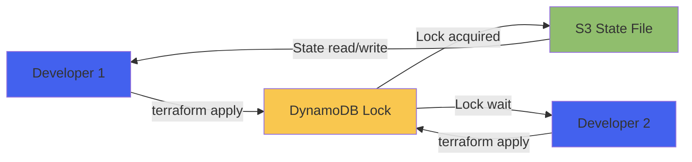

# Backend Remoto de Terraform

El backend remoto es la configuración que permite a Terraform almacenar su estado de forma compartida y segura en AWS S3, con bloqueo mediante DynamoDB.

## ¿Por qué Necesitas un Backend Remoto?

<CardGroup cols={2}>
  <Card title="Colaboración en Equipo" icon="users">
    Múltiples desarrolladores pueden trabajar sin conflictos
    
    Estado compartido en la nube
  </Card>
  
  <Card title="State Locking" icon="lock">
    Previene ejecuciones simultáneas de Terraform
    
    Evita corrupción del estado
  </Card>
  
  <Card title="Versionado Automático" icon="clock-rotate-left">
    S3 versioning guarda histórico de cambios
    
    Rollback fácil en caso de error
  </Card>
  
  <Card title="Seguridad Mejorada" icon="shield">
    Encriptación en reposo (AES-256)
    
    Control de acceso con IAM
  </Card>
</CardGroup>

---

## Arquitectura del Backend



**Componentes**:
- **S3 Bucket**: Almacena el archivo `terraform.tfstate`
- **DynamoDB Table**: Gestiona el lock para prevenir accesos simultáneos
- **Versioning**: Mantiene historial de todos los cambios del estado
- **Encryption**: Protege datos sensibles en el estado

---

## Script de Bootstrap Completo

### bootstrap-terraform-backend.sh

```bash
#!/bin/bash
# 
# Bootstrap script para configurar backend remoto de Terraform
# Uso: ./bootstrap-terraform-backend.sh [region] [bucket-suffix]
#

set -e  # Exit on any error
set -u  # Exit on undefined variable

# Colores para output
RED='\033[0;31m'
GREEN='\033[0;32m'
YELLOW='\033[1;33m'
NC='\033[0m' # No Color

# Función de logging
log_info() {
    echo -e "${GREEN}[INFO]${NC} $1"
}

log_warn() {
    echo -e "${YELLOW}[WARN]${NC} $1"
}

log_error() {
    echo -e "${RED}[ERROR]${NC} $1"
}

# Configuración
AWS_REGION="${1:-eu-west-1}"
BUCKET_SUFFIX="${2:-$(date +%s)}"
BUCKET_NAME="retrogame-terraform-state-${BUCKET_SUFFIX}"
DYNAMODB_TABLE="terraform-lock"

# Verificar AWS CLI
if ! command -v aws &> /dev/null; then
    log_error "AWS CLI no está instalado"
    exit 1
fi

# Verificar credenciales
log_info "Verificando credenciales AWS..."
ACCOUNT_ID=$(aws sts get-caller-identity --query Account --output text 2>/dev/null) || {
    log_error "Credenciales AWS no configuradas"
    log_info "Ejecuta: aws configure"
    exit 1
}

log_info "Account ID: $ACCOUNT_ID"
log_info "Region: $AWS_REGION"
log_info "Bucket Name: $BUCKET_NAME"
log_info "DynamoDB Table: $DYNAMODB_TABLE"

echo ""
read -p "¿Continuar con la creación del backend? (y/n) " -n 1 -r
echo ""
if [[ ! $REPLY =~ ^[Yy]$ ]]; then
    log_warn "Operación cancelada"
    exit 0
fi

# ============================================
# 1. CREAR BUCKET S3
# ============================================
echo ""
log_info "📦 Creando bucket S3..."

# Verificar si el bucket ya existe
if aws s3 ls "s3://$BUCKET_NAME" 2>/dev/null; then
    log_warn "El bucket $BUCKET_NAME ya existe"
else
    if [ "$AWS_REGION" = "us-east-1" ]; then
        aws s3api create-bucket \
            --bucket "$BUCKET_NAME" \
            --region "$AWS_REGION"
    else
        aws s3api create-bucket \
            --bucket "$BUCKET_NAME" \
            --region "$AWS_REGION" \
            --create-bucket-configuration LocationConstraint="$AWS_REGION"
    fi
    log_info "Bucket creado exitosamente"
fi

# ============================================
# 2. HABILITAR VERSIONADO
# ============================================
log_info "🔄 Habilitando versionado..."
aws s3api put-bucket-versioning \
    --bucket "$BUCKET_NAME" \
    --versioning-configuration Status=Enabled

# ============================================
# 3. HABILITAR ENCRIPTACIÓN
# ============================================
log_info "🔐 Habilitando encriptación AES-256..."
aws s3api put-bucket-encryption \
    --bucket "$BUCKET_NAME" \
    --server-side-encryption-configuration '{
        "Rules": [{
            "ApplyServerSideEncryptionByDefault": {
                "SSEAlgorithm": "AES256"
            },
            "BucketKeyEnabled": true
        }]
    }'

# ============================================
# 4. BLOQUEAR ACCESO PÚBLICO
# ============================================
log_info "🔒 Bloqueando acceso público..."
aws s3api put-public-access-block \
    --bucket "$BUCKET_NAME" \
    --public-access-block-configuration \
        "BlockPublicAcls=true,IgnorePublicAcls=true,BlockPublicPolicy=true,RestrictPublicBuckets=true"

# ============================================
# 5. CONFIGURAR LIFECYCLE POLICY
# ============================================
log_info "♻️  Configurando lifecycle policy..."
cat > /tmp/lifecycle.json <<EOF
{
    "Rules": [
        {
            "Id": "DeleteOldVersions",
            "Status": "Enabled",
            "NoncurrentVersionExpiration": {
                "NoncurrentDays": 90
            }
        }
    ]
}
EOF

aws s3api put-bucket-lifecycle-configuration \
    --bucket "$BUCKET_NAME" \
    --lifecycle-configuration file:///tmp/lifecycle.json

rm /tmp/lifecycle.json

# ============================================
# 6. AÑADIR TAGS
# ============================================
log_info "🏷️  Añadiendo tags..."
aws s3api put-bucket-tagging \
    --bucket "$BUCKET_NAME" \
    --tagging 'TagSet=[
        {Key=Project,Value=RetroGameHub},
        {Key=ManagedBy,Value=Terraform},
        {Key=Purpose,Value=TerraformState}
    ]'

# ============================================
# 7. CREAR TABLA DYNAMODB
# ============================================
echo ""
log_info "🔐 Creando tabla DynamoDB para state locking..."

# Verificar si la tabla ya existe
if aws dynamodb describe-table --table-name "$DYNAMODB_TABLE" --region "$AWS_REGION" &>/dev/null; then
    log_warn "La tabla $DYNAMODB_TABLE ya existe"
else
    aws dynamodb create-table \
        --table-name "$DYNAMODB_TABLE" \
        --attribute-definitions AttributeName=LockID,AttributeType=S \
        --key-schema AttributeName=LockID,KeyType=HASH \
        --billing-mode PAY_PER_REQUEST \
        --region "$AWS_REGION" \
        --tags Key=Project,Value=RetroGameHub Key=ManagedBy,Value=Terraform
    
    log_info "Esperando a que la tabla esté activa..."
    aws dynamodb wait table-exists \
        --table-name "$DYNAMODB_TABLE" \
        --region "$AWS_REGION"
    
    log_info "Tabla DynamoDB creada exitosamente"
fi

# ============================================
# 8. GENERAR CONFIGURACIÓN
# ============================================
echo ""
log_info "📝 Generando archivos de configuración..."

# Backend config para Terraform
cat > terraform-backend.txt <<EOF
# Configuración del Backend de Terraform
# Generado: $(date)

BUCKET_NAME=$BUCKET_NAME
DYNAMODB_TABLE=$DYNAMODB_TABLE
AWS_REGION=$AWS_REGION
ACCOUNT_ID=$ACCOUNT_ID
EOF

# Snippet para main.tf
cat > backend-config.tf <<EOF
# Backend configuration for Terraform
# Add this to your main.tf file

terraform {
  backend "s3" {
    bucket         = "$BUCKET_NAME"
    key            = "terraform.tfstate"  # Cambiar según el proyecto
    region         = "$AWS_REGION"
    dynamodb_table = "$DYNAMODB_TABLE"
    encrypt        = true
  }
}
EOF

# Script de inicialización
cat > init-backend.sh <<'EOF'
#!/bin/bash
# Script para inicializar el backend en otros entornos

source terraform-backend.txt

terraform init \
  -backend-config="bucket=$BUCKET_NAME" \
  -backend-config="key=terraform.tfstate" \
  -backend-config="region=$AWS_REGION" \
  -backend-config="dynamodb_table=$DYNAMODB_TABLE" \
  -backend-config="encrypt=true"
EOF
chmod +x init-backend.sh

# ============================================
# 9. SUMMARY
# ============================================
echo ""
echo "━━━━━━━━━━━━━━━━━━━━━━━━━━━━━━━━━━━━━━━━━━━━━━━━━━"
log_info "✅ Backend de Terraform configurado exitosamente!"
echo "━━━━━━━━━━━━━━━━━━━━━━━━━━━━━━━━━━━━━━━━━━━━━━━━━━"
echo ""
echo "📦 Bucket S3:        $BUCKET_NAME"
echo "🔐 DynamoDB Table:   $DYNAMODB_TABLE"
echo "🌍 Region:           $AWS_REGION"
echo ""
echo "📝 Archivos generados:"
echo "   • terraform-backend.txt    - Variables de configuración"
echo "   • backend-config.tf        - Snippet para main.tf"
echo "   • init-backend.sh          - Script de inicialización"
echo ""
echo "🚀 Próximos pasos:"
echo "   1. Copiar contenido de backend-config.tf a tu main.tf"
echo "   2. Ejecutar: terraform init"
echo "   3. Verificar: terraform state list"
echo ""
echo "💡 Para compartir con el equipo:"
echo "   • Compartir terraform-backend.txt (sin incluir en Git)"
echo "   • Dar permisos IAM al bucket y tabla DynamoDB"
echo ""
echo "━━━━━━━━━━━━━━━━━━━━━━━━━━━━━━━━━━━━━━━━━━━━━━━━━━"
```

### Ejecutar el Script

```bash
# Hacer ejecutable
chmod +x bootstrap-terraform-backend.sh

# Ejecutar con valores por defecto
./bootstrap-terraform-backend.sh

# O especificar región y sufijo personalizado
./bootstrap-terraform-backend.sh eu-west-1 myproject
```

---

## Configuración Manual (Alternativa)

Si prefieres crear los recursos manualmente:

<Steps>
  <Step title="Crear Bucket S3">
    ```bash
    aws s3api create-bucket \
      --bucket retrogame-terraform-state \
      --region eu-west-1 \
      --create-bucket-configuration LocationConstraint=eu-west-1
    
    aws s3api put-bucket-versioning \
      --bucket retrogame-terraform-state \
      --versioning-configuration Status=Enabled
    
    aws s3api put-bucket-encryption \
      --bucket retrogame-terraform-state \
      --server-side-encryption-configuration '{
        "Rules": [{
          "ApplyServerSideEncryptionByDefault": {
            "SSEAlgorithm": "AES256"
          }
        }]
      }'
    ```
  </Step>
  
  <Step title="Crear Tabla DynamoDB">
    ```bash
    aws dynamodb create-table \
      --table-name terraform-lock \
      --attribute-definitions AttributeName=LockID,AttributeType=S \
      --key-schema AttributeName=LockID,KeyType=HASH \
      --billing-mode PAY_PER_REQUEST \
      --region eu-west-1
    ```
  </Step>
  
  <Step title="Configurar en Terraform">
    Añadir a `main.tf`:
    
    ```hcl
    terraform {
      backend "s3" {
        bucket         = "retrogame-terraform-state"
        key            = "terraform.tfstate"
        region         = "eu-west-1"
        dynamodb_table = "terraform-lock"
        encrypt        = true
      }
    }
    ```
  </Step>
  
  <Step title="Inicializar">
    ```bash
    terraform init
    ```
  </Step>
</Steps>

---

## Migrar Estado Existente

Si ya tienes un estado local y quieres migrarlo:

```bash
# 1. Añadir backend config a main.tf (ver arriba)

# 2. Inicializar con migración
terraform init -migrate-state

# Terraform preguntará:
# "Do you want to copy existing state to the new backend?"
# Responder: yes

# 3. Verificar
terraform state list

# 4. Eliminar estado local (opcional)
rm terraform.tfstate*
```

<Warning>
  Haz un backup del `terraform.tfstate` local antes de migrar:
  ```bash
  cp terraform.tfstate terraform.tfstate.backup
  ```
</Warning>

---

## Compartir Backend con el Equipo

### Para Nuevos Miembros del Equipo

**Paso 1**: Compartir configuración (sin Git)

```bash
# Enviar por canal seguro (Slack privado, 1Password, etc.)
cat terraform-backend.txt
```

**Paso 2**: Dar permisos IAM

```bash
# Crear política para acceso al backend
cat > backend-access-policy.json <<EOF
{
  "Version": "2012-10-17",
  "Statement": [
    {
      "Effect": "Allow",
      "Action": [
        "s3:ListBucket",
        "s3:GetObject",
        "s3:PutObject"
      ],
      "Resource": [
        "arn:aws:s3:::retrogame-terraform-state",
        "arn:aws:s3:::retrogame-terraform-state/*"
      ]
    },
    {
      "Effect": "Allow",
      "Action": [
        "dynamodb:GetItem",
        "dynamodb:PutItem",
        "dynamodb:DeleteItem"
      ],
      "Resource": "arn:aws:dynamodb:eu-west-1:*:table/terraform-lock"
    }
  ]
}
EOF

# Aplicar al usuario
aws iam put-user-policy \
  --user-name developer-name \
  --policy-name TerraformBackendAccess \
  --policy-document file://backend-access-policy.json
```

**Paso 3**: El nuevo miembro inicializa

```bash
cd infrastructure/terraform/eks_test
terraform init  # Lee backend de main.tf automáticamente
```

---

## Verificación del Backend

### Verificar Bucket S3

```bash
# Ver configuración del bucket
aws s3api get-bucket-versioning --bucket retrogame-terraform-state
aws s3api get-bucket-encryption --bucket retrogame-terraform-state

# Listar versiones del estado
aws s3api list-object-versions \
  --bucket retrogame-terraform-state \
  --prefix terraform.tfstate

# Ver contenido (con precaución - puede contener secrets)
aws s3 cp s3://retrogame-terraform-state/terraform.tfstate - | jq .
```

### Verificar Tabla DynamoDB

```bash
# Ver estado de la tabla
aws dynamodb describe-table --table-name terraform-lock

# Ver locks activos (debería estar vacío si nadie está ejecutando terraform)
aws dynamodb scan --table-name terraform-lock
```

### Test de Locking

Terminal 1:
```bash
terraform plan
# Mantener running...
```

Terminal 2:
```bash
terraform plan
# Debería mostrar:
# Error: Error acquiring the state lock
```

---

## Recuperación de Desastres

### Restaurar desde Versión Anterior

```bash
# 1. Listar versiones
aws s3api list-object-versions \
  --bucket retrogame-terraform-state \
  --prefix terraform.tfstate

# 2. Identificar VersionId de la versión buena
VERSION_ID="xxx..."

# 3. Restaurar
aws s3api get-object \
  --bucket retrogame-terraform-state \
  --key terraform.tfstate \
  --version-id $VERSION_ID \
  terraform.tfstate.restored

# 4. Re-subir como versión actual
aws s3 cp terraform.tfstate.restored \
  s3://retrogame-terraform-state/terraform.tfstate

# 5. Re-inicializar Terraform
terraform init -reconfigure
```

### Desbloquear Manualmente

Si Terraform se interrumpe y deja el estado bloqueado:

```bash
# Ver lock ID
aws dynamodb scan --table-name terraform-lock

# Eliminar lock (⚠️ solo si estás seguro de que nadie está ejecutando terraform)
terraform force-unlock <LOCK_ID>
```

---

## Costos del Backend

<Table>
  <thead>
    <tr>
      <th>Recurso</th>
      <th>Costo Mensual</th>
      <th>Detalles</th>
    </tr>
  </thead>
  <tbody>
    <tr>
      <td>**S3 Bucket**</td>
      <td>~$0.05 - 0.10</td>
      <td>Archivo tfstate ~1-5 MB</td>
    </tr>
    <tr>
      <td>**DynamoDB**</td>
      <td>~$0.01 - 0.05</td>
      <td>Pay-per-request, uso bajo</td>
    </tr>
    <tr>
      <td>**S3 Requests**</td>
      <td>~$0.01</td>
      <td>GET/PUT durante terraform apply</td>
    </tr>
    <tr>
      <td>**TOTAL**</td>
      <td>**< $0.20/mes**</td>
      <td>Prácticamente gratis</td>
    </tr>
  </tbody>
</Table>

<Note>
  El backend está **completamente cubierto** por el Free Tier de AWS durante el primer año.
</Note>

---

## Best Practices

<CardGroup cols={2}>
  <Card title="Usar Prefijos por Ambiente" icon="folder-tree">
    ```hcl
    # Staging
    key = "staging/terraform.tfstate"
    
    # Production
    key = "production/terraform.tfstate"
    ```
  </Card>
  
  <Card title="Habilitar MFA Delete" icon="shield">
    ```bash
    aws s3api put-bucket-versioning \
      --bucket retrogame-terraform-state \
      --versioning-configuration \
        Status=Enabled,MFADelete=Enabled \
      --mfa "arn:aws:iam::ACCOUNT:mfa/root-account-mfa-device CODE"
    ```
  </Card>
  
  <Card title="Monitorear Accesos" icon="eye">
    ```bash
    # Habilitar S3 access logging
    aws s3api put-bucket-logging \
      --bucket retrogame-terraform-state \
      --bucket-logging-status file://logging.json
    ```
  </Card>
  
  <Card title="Backups Regulares" icon="download">
    ```bash
    # Cron job diario
    0 2 * * * aws s3 cp \
      s3://retrogame-terraform-state/terraform.tfstate \
      /backups/tfstate-$(date +\%Y\%m\%d).json
    ```
  </Card>
</CardGroup>

---

## Troubleshooting

<AccordionGroup>
  <Accordion title="Error: Backend initialization required">
    **Síntoma**: `Backend initialization required, please run "terraform init"`
    
    **Solución**:
    ```bash
    terraform init -reconfigure
    ```
  </Accordion>
  
  <Accordion title="Error: Failed to get existing workspaces">
    **Causa**: Permisos IAM insuficientes en S3
    
    **Solución**:
    ```bash
    # Verificar permisos
    aws s3 ls s3://retrogame-terraform-state/
    
    # Si falla, añadir política IAM (ver sección "Compartir Backend")
    ```
  </Accordion>
  
  <Accordion title="Error: Error locking state: ConditionalCheckFailedException">
    **Causa**: Tabla DynamoDB no configurada correctamente
    
    **Solución**:
    ```bash
    # Verificar tabla
    aws dynamodb describe-table --table-name terraform-lock
    
    # Verificar que tiene Key Schema: LockID (tipo S)
    ```
  </Accordion>
  
  <Accordion title="Estado corrupto o inconsistente">
    **Solución nuclear**: Restaurar desde backup
    ```bash
    # Descargar última versión buena
    aws s3api list-object-versions \
      --bucket retrogame-terraform-state \
      --prefix terraform.tfstate
    
    # Restaurar (ver sección "Recuperación de Desastres")
    ```
  </Accordion>
</AccordionGroup>

---

## Siguiente Paso

<Card title="Configurar Variables de Terraform" icon="sliders" href="/infrastructure/terraform-variables">
  Ahora que el backend está configurado, define las variables para tu infraestructura
</Card>
