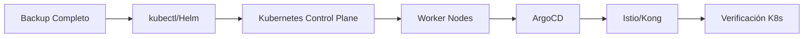
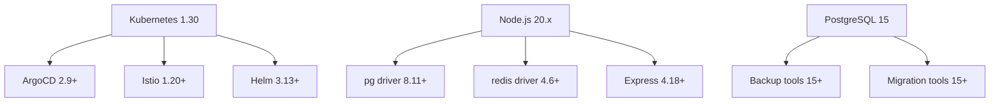

# 6.10. Matriz de Compatibilidad de Versiones

Esta documentación proporciona una matriz completa de compatibilidad entre las diferentes versiones de los componentes del stack tecnológico de RetroGameCloud, junto con los procesos recomendados para actualizaciones entre versiones mayores.

## Versiones Soportadas Actualmente

<Tabs>
<Tab title="Infraestructura Base">
| Componente | Versión Mínima | Versión Recomendada | Próxima a Deprecar | Estado |
|------------|----------------|--------------------|--------------------|---------|
| Kubernetes | 1.28.0 | 1.30.x | 1.27.x | ✅ Estable |
| kubectl | 1.28.0 | 1.30.x | 1.27.x | ✅ Estable |
| Helm | 3.12.0 | 3.14.x | 3.11.x | ✅ Estable |
| ArgoCD | 2.8.0 | 2.10.x | 2.7.x | ✅ Estable |
| Istio | 1.18.0 | 1.20.x | 1.17.x | ✅ Estable |
</Tab>
<Tab title="Runtime y Base de Datos">
| Componente | Versión Mínima | Versión Recomendada | Próxima a Deprecar | Estado |
|------------|----------------|--------------------|--------------------|---------|
| Node.js | 18.17.0 | 20.11.x | 18.x (EOL: Apr 2025) | ✅ LTS |
| npm | 9.0.0 | 10.4.x | 8.x | ✅ Estable |
| PostgreSQL | 14.9 | 15.6 | 13.x (EOL: Nov 2025) | ✅ Estable |
| Redis | 7.0.0 | 7.2.x | 6.x | ✅ Estable |
| Kong Gateway | 3.4.0 | 3.6.x | 3.3.x | ✅ Estable |
</Tab>
<Tab title="Frontend y Herramientas">
| Componente | Versión Mínima | Versión Recomendada | Próxima a Deprecar | Estado |
|------------|----------------|--------------------|--------------------|---------|
| React | 18.2.0 | 18.2.x | 17.x | ✅ Estable |
| js-dos | 6.22.74 | 6.22.x | 6.21.x | ✅ Estable |
| Vite | 4.4.0 | 5.1.x | 4.3.x | ✅ Estable |
| Docker | 24.0.0 | 25.0.x | 23.x | ✅ Estable |
| AWS CLI | 2.13.0 | 2.15.x | 2.12.x | ✅ Estable |
</Tab>
</Tabs>

## Matriz de Compatibilidad Cruzada

### Kubernetes y Herramientas Asociadas

<Note>
La regla general es que kubectl debe estar dentro de ±1 versión menor de la versión del clúster de Kubernetes.
</Note>

| Kubernetes | kubectl | Helm | ArgoCD | Istio | Compatibilidad |
|------------|---------|------|--------|-------|----------------|
| 1.28.x | 1.27-1.29 | 3.12+ | 2.8+ | 1.18+ | ✅ Completa |
| 1.29.x | 1.28-1.30 | 3.12+ | 2.8+ | 1.19+ | ✅ Completa |
| 1.30.x | 1.29-1.31 | 3.13+ | 2.9+ | 1.20+ | ✅ Completa |

### Node.js y Dependencias

| Node.js | npm | PostgreSQL Client | Redis Client | Kubernetes | Estado |
|---------|-----|-------------------|--------------|------------|---------|
| 18.17+ | 9.0+ | pg@8.11+ | redis@4.6+ | 1.28+ | ✅ LTS |
| 20.9+ | 10.0+ | pg@8.11+ | redis@4.6+ | 1.28+ | ✅ Recomendado |
| 21.x | 10.0+ | pg@8.11+ | redis@4.6+ | 1.29+ | ⚠️ Current |

### Base de Datos y Persistencia

| PostgreSQL | pgAdmin | Redis | Kong | Backup Tool | Compatibilidad |
|------------|---------|-------|------|-------------|----------------|
| 14.9+ | 4.30+ | 7.0+ | 3.4+ | pg_dump 14+ | ✅ Producción |
| 15.6+ | 4.30+ | 7.2+ | 3.6+ | pg_dump 15+ | ✅ Recomendado |

## Proceso de Actualización entre Versiones Mayores

### 1. Planificación Pre-Actualización

<Warning>
Las actualizaciones entre versiones mayores requieren planificación cuidadosa y pueden incluir cambios incompatibles.
</Warning>

#### Lista de Verificación Previa

```bash

# Verificar versiones actuales
kubectl version --short
node --version
psql --version
redis-server --version
kong version

# Backup completo antes de la actualización
./scripts/backup-full-system.sh

# Verificar estado del clúster
kubectl get nodes -o wide
kubectl get pods --all-namespaces | grep -v Running

```

#### Ventanas de Mantenimiento Estimadas

<Tabs>
<Tab title="Kubernetes">

- **Minor Version** (1.29 → 1.30): 2-4 horas

- **Patch Version** (1.30.1 → 1.30.2): 30-60 minutos

- **Rollback**: 15-30 minutos

- **Validación Post-upgrade**: 1 hora
</Tab>
<Tab title="Node.js">

- **Major Version** (18 → 20): 4-6 horas

- **Minor Version** (20.9 → 20.11): 1-2 horas

- **Rollback**: 30-45 minutos

- **Testing completo**: 2 horas
</Tab>
<Tab title="PostgreSQL">

- **Major Version** (14 → 15): 6-8 horas

- **Minor Version** (15.5 → 15.6): 2-3 horas

- **Rollback**: 4-6 horas (restauración backup)

- **Migración de datos**: Variable según tamaño
</Tab>
</Tabs>

### 2. Secuencia de Actualización Recomendada

#### Fase 1: Componentes de Infraestructura



#### Fase 2: Servicios de Datos

```bash

# 1. PostgreSQL (requiere downtime)
kubectl scale deployment auth-service --replicas=0
kubectl scale deployment user-service --replicas=0

# Actualizar PostgreSQL
./scripts/upgrade-postgresql.sh

# Verificar migración de datos
./scripts/verify-db-migration.sh

# 2. Redis (rolling update)
helm upgrade redis-cluster ./charts/redis \
  --set image.tag=7.2.4-alpine \
  --wait --timeout=600s

```

#### Fase 3: Aplicaciones

```bash

# 1. Actualizar imágenes base de microservicios
docker build --build-arg NODE_VERSION=20.11 \
  -t retrogame/auth-service:v2.1.0 .

# 2. Deploy gradual con ArgoCD
kubectl patch application auth-service \
  --type='merge' \
  -p='{"spec":{"source":{"targetRevision":"v2.1.0"}}}'

# 3. Verificar health checks
kubectl get pods -l app=auth-service -w

```

### 3. Plan de Rollback

<Warning>
Siempre ten preparado un plan de rollback antes de iniciar cualquier actualización mayor.
</Warning>

#### Rollback Automático

```yaml

# rollback-playbook.yaml
apiVersion: v1
kind: ConfigMap
metadata:
  name: rollback-procedures
data:
  kubernetes: |
    kubectl rollout undo deployment/auth-service
    kubectl rollout undo deployment/user-service
    kubectl rollout undo deployment/game-catalog-service

  database: |
    # Restaurar desde backup automático
    pg_restore -h postgres-primary -U postgres \
      --clean --create /backups/pre-upgrade-backup.sql

  applications: |
    argocd app rollback auth-service
    argocd app rollback user-service
    argocd app sync game-catalog-service

```

#### Tiempos de Rollback por Componente

| Componente | Tiempo de Rollback | Pérdida de Datos | Complejidad |
|------------|-------------------|------------------|-------------|
| Kubernetes Pods | 2-5 minutos | Ninguna | Baja |
| Kong Gateway | 1-2 minutos | Configuración | Baja |
| PostgreSQL | 30-60 minutos | Posible* | Alta |
| Redis | 5-10 minutos | Cache únicamente | Media |
| Frontend | 2-5 minutos | Ninguna | Baja |

<Note>

* La pérdida de datos en PostgreSQL durante rollback depende del tiempo transcurrido y los cambios de esquema realizados.
</Note>

### 4. Validación Post-Actualización

#### Tests Automatizados

```bash
#!/bin/bash

# post-upgrade-validation.sh

echo "=== Validación de Infraestructura ==="
kubectl cluster-info
kubectl get nodes | grep Ready

echo "=== Validación de Servicios ==="
kubectl get pods --all-namespaces | grep -v Running
kubectl get services --all-namespaces

echo "=== Tests de Conectividad ==="
curl -f http://api.retrogamecloud.com/health
curl -f http://api.retrogamecloud.com/v1/auth/health
curl -f http://api.retrogamecloud.com/v1/games/health

echo "=== Validación de Base de Datos ==="
psql -h postgres-primary -U postgres -c "SELECT version();"
redis-cli -h redis-primary ping

echo "=== Tests E2E Críticos ==="
npm run test:e2e:smoke

```

#### Métricas de Validación

<Tabs>
<Tab title="SLA Targets">

- **Tiempo de respuesta API**: < 200ms (p95)

- **Disponibilidad**: > 99.9%

- **Error rate**: < 0.1%

- **Tiempo de inicio pods**: < 60s
</Tab>
<Tab title="Métricas de Recursos">

- **CPU usage**: < 70% (promedio)

- **Memory usage**: < 80% (promedio)

- **Disk I/O**: < 80% capacidad

- **Network latency**: < 10ms (interno)
</Tab>
</Tabs>

## Matriz de Incompatibilidades Conocidas

### Combinaciones No Soportadas

<Warning>
Estas combinaciones pueden causar fallos o comportamientos inesperados.
</Warning>

| Componente A | Versión | Componente B | Versión | Problema |
|--------------|---------|--------------|---------|----------|
| Kubernetes | < 1.28 | Istio | 1.20+ | CRDs incompatibles |
| Node.js | 16.x | PostgreSQL | 15+ | Driver compatibility |
| Kong | < 3.4 | Kubernetes | 1.30+ | API deprecations |
| ArgoCD | < 2.8 | Kubernetes | 1.30+ | RBAC changes |

### Dependencias Transitivas Críticas



## Calendario de Actualizaciones 2024

| Mes | Componente | Acción | Versión Objetivo | Impacto |
|-----|------------|--------|------------------|---------|
| Q2 2024 | Node.js | Migración 18→20 | 20.11.x | Alto |
| Q2 2024 | Kubernetes | Upgrade | 1.30.x | Medio |
| Q3 2024 | PostgreSQL | Upgrade | 15.6 | Alto |
| Q3 2024 | Kong | Upgrade | 3.6.x | Bajo |
| Q4 2024 | Redis | Upgrade | 7.2.x | Medio |

<Note>
Este calendario está sujeto a cambios basados en la disponibilidad de versiones estables y ventanas de mantenimiento del negocio.
</Note>