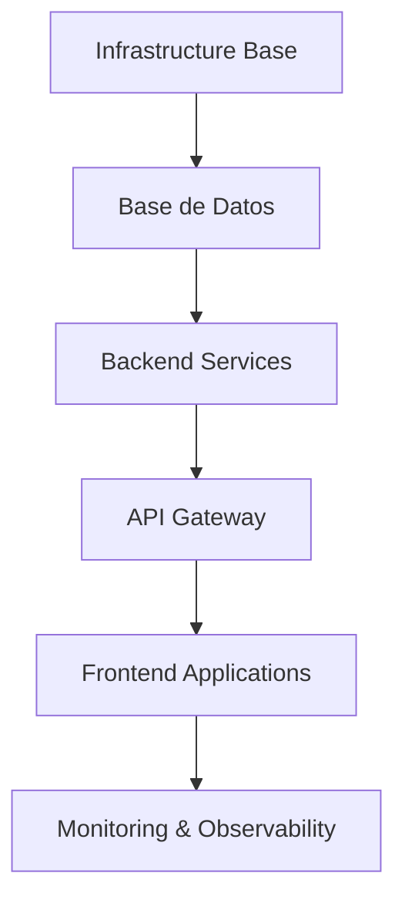

# 6.10. Matriz de Compatibilidad de Versiones

Esta documentación proporciona una matriz completa de compatibilidad entre las diferentes versiones de los componentes del stack tecnológico de RetroGameCloud, junto con los procesos recomendados para actualizaciones entre versiones mayores.

## Versiones Soportadas Actualmente

<Tabs>
<Tab title="Infraestructura Base">
| Componente | Versión Mínima | Versión Recomendada | Próxima a Deprecar | Estado |
|------------|----------------|--------------------|--------------------|---------|
| Kubernetes | 1.28.0 | 1.30.x | 1.27.x | ✅ Estable |
| kubectl | 1.28.0 | 1.30.x | 1.27.x | ✅ Estable |
| Helm | 3.12.0 | 3.14.x | 3.11.x | ✅ Estable |
| ArgoCD | 2.8.0 | 2.10.x | 2.7.x | ✅ Estable |
| Istio | 1.18.0 | 1.20.x | 1.17.x | ✅ Estable |
</Tab>
<Tab title="Runtime y Base de Datos">
| Componente | Versión Mínima | Versión Recomendada | Próxima a Deprecar | Estado |
|------------|----------------|--------------------|--------------------|---------|
| Node.js | 18.17.0 | 20.11.x | 18.x (EOL: Apr 2025) | ✅ LTS |
| npm | 9.0.0 | 10.4.x | 8.x | ✅ Estable |
| PostgreSQL | 14.9 | 15.6 | 13.x (EOL: Nov 2025) | ✅ Estable |
| Redis | 7.0.0 | 7.2.x | 6.x | ✅ Estable |
| Kong Gateway | 3.4.0 | 3.6.x | 3.3.x | ✅ Estable |
</Tab>
<Tab title="Frontend y Herramientas">
| Componente | Versión Mínima | Versión Recomendada | Próxima a Deprecar | Estado |
|------------|----------------|--------------------|--------------------|---------|
| React | 18.2.0 | 18.2.x | 17.x | ✅ Estable |
| js-dos | 6.22.74 | 6.22.x | 6.21.x | ✅ Estable |
| Vite | 4.4.0 | 5.1.x | 4.3.x | ✅ Estable |
| Docker | 24.0.0 | 25.0.x | 23.x | ✅ Estable |
| AWS CLI | 2.13.0 | 2.15.x | 2.12.x | ✅ Estable |
</Tab>
</Tabs>

## Matriz de Compatibilidad Cruzada

### Compatibilidad Kubernetes vs Componentes Core

La siguiente matriz muestra las combinaciones de versiones testeadas y validadas para los componentes principales del stack:

<table>
  <thead>
    <tr>
      <th>Kubernetes</th>
      <th>Node.js</th>
      <th>PostgreSQL</th>
      <th>Redis</th>
      <th>Kong Gateway</th>
      <th>Estado</th>
      <th>Notas</th>
    </tr>
  </thead>
  <tbody>
    <tr>
      <td>1.30.x</td>
      <td>20.11.x</td>
      <td>15.6</td>
      <td>7.2.x</td>
      <td>3.6.x</td>
      <td>✅ Validado</td>
      <td>Configuración recomendada actual</td>
    </tr>
    <tr>
      <td>1.30.x</td>
      <td>18.19.x</td>
      <td>15.6</td>
      <td>7.2.x</td>
      <td>3.6.x</td>
      <td>✅ Validado</td>
      <td>Node.js LTS compatible</td>
    </tr>
    <tr>
      <td>1.30.x</td>
      <td>20.11.x</td>
      <td>14.9</td>
      <td>7.0.x</td>
      <td>3.5.x</td>
      <td>✅ Validado</td>
      <td>Versiones mínimas soportadas</td>
    </tr>
    <tr>
      <td>1.29.x</td>
      <td>20.11.x</td>
      <td>15.6</td>
      <td>7.2.x</td>
      <td>3.6.x</td>
      <td>✅ Validado</td>
      <td>K8s versión anterior estable</td>
    </tr>
    <tr>
      <td>1.29.x</td>
      <td>18.19.x</td>
      <td>14.9</td>
      <td>7.0.x</td>
      <td>3.4.x</td>
      <td>✅ Validado</td>
      <td>Configuración conservadora</td>
    </tr>
    <tr>
      <td>1.28.x</td>
      <td>20.11.x</td>
      <td>15.6</td>
      <td>7.2.x</td>
      <td>3.5.x</td>
      <td>⚠️ Limitado</td>
      <td>Kong 3.6.x requiere validación adicional</td>
    </tr>
    <tr>
      <td>1.28.x</td>
      <td>18.17.x</td>
      <td>14.9</td>
      <td>7.0.x</td>
      <td>3.4.x</td>
      <td>✅ Validado</td>
      <td>Mínima configuración soportada</td>
    </tr>
    <tr>
      <td>1.27.x</td>
      <td>20.x</td>
      <td>15.x</td>
      <td>7.x</td>
      <td>3.6.x</td>
      <td>❌ No Soportado</td>
      <td>K8s próximo a deprecación</td>
    </tr>
    <tr>
      <td>1.31.x</td>
      <td>20.11.x</td>
      <td>16.x</td>
      <td>7.2.x</td>
      <td>3.7.x</td>
      <td>🧪 Beta</td>
      <td>En evaluación para próxima release</td>
    </tr>
  </tbody>
</table>

### Leyenda de Estados

- **✅ Validado**: Combinación completamente testeada y aprobada para producción
- **⚠️ Limitado**: Funcional con restricciones o configuración especial
- **❌ No Soportado**: Combinación no recomendada o con problemas conocidos  
- **🧪 Beta**: En proceso de validación para futuras versiones

### Notas de Compatibilidad Importantes

<Note>
**Kubernetes 1.28.x + Kong 3.6.x**: Requiere configuración adicional de RBAC y validación de políticas de red debido a cambios en la API de networking.
</Note>

<Warning>
**Node.js 18.x**: Aunque funcional, se recomienda migrar a 20.x antes de abril 2025 cuando finaliza el soporte LTS.
</Warning>

<Tip>
**PostgreSQL 15.x + Redis 7.2.x**: Esta combinación ofrece mejoras significativas de rendimiento para operaciones de caché híbrida.
</Tip>

## Dependencias de Versiones Frontend

### React y js-dos Compatibility Matrix

| React | js-dos | Vite | Estado | Notas |
|-------|---------|------|---------|--------|
| 18.2.x | 6.22.74+ | 5.1.x | ✅ Validado | Configuración actual optimizada |
| 18.2.x | 6.22.60+ | 4.4.x | ✅ Validado | Vite versión anterior compatible |
| 18.2.x | 6.21.x | 5.1.x | ⚠️ Limitado | js-dos requiere patches de compatibilidad |
| 17.x | 6.22.x | 5.x | ❌ No Soportado | React versión deprecada |

## Proceso de Actualización Entre Versiones Mayores

### 1. Planificación de Actualización

<Steps>
  <Step title="Análisis de Dependencias">
    Revisar matriz de compatibilidad y identificar componentes afectados
  </Step>
  <Step title="Ambiente de Pruebas">
    Configurar entorno de staging con nuevas versiones
  </Step>
  <Step title="Plan de Rollback">
    Preparar procedimientos de reversión completos
  </Step>
  <Step title="Ventana de Mantenimiento">
    Programar actualización en horario de menor impacto
  </Step>
</Steps>

### 2. Orden de Actualización Recomendado

### 3. Validación Post-Actualización

- **Health Checks**: Verificar endpoints críticos
- **Performance Tests**: Ejecutar suite de pruebas de carga
- **Integration Tests**: Validar comunicación entre servicios
- **User Acceptance**: Pruebas funcionales de características principales

## Políticas de Soporte de Versiones

### Lifecycle de Versiones

- **Current**: Última versión mayor con soporte completo
- **LTS**: Versión de soporte extendido (18 meses)
- **Maintenance**: Solo corrección de bugs críticos (6 meses)
- **End of Life**: Sin soporte activo

### Criterios de Deprecación

1. **Seguridad**: Vulnerabilidades sin parches disponibles
2. **Compatibilidad**: Conflictos con dependencias críticas  
3. **Upstream Support**: Fin de soporte por parte del proveedor
4. **Performance**: Degradación significativa comparado con versiones nuevas

<Tip>
Mantenemos al menos 2 versiones mayores soportadas simultáneamente para facilitar migraciones graduales.
</Tip>