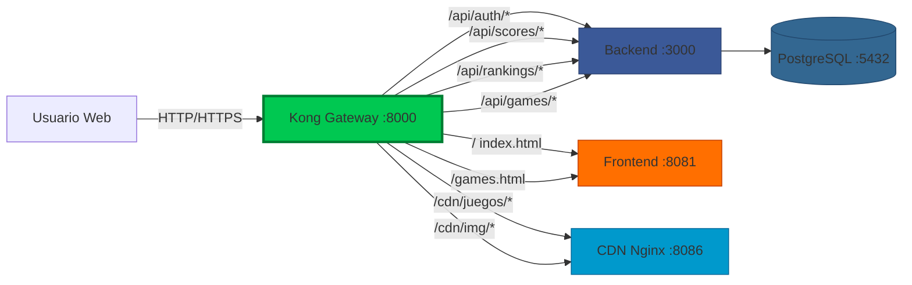

## Descripción

Kong API Gateway actúa como **punto único de entrada** (single point of entry) para RetroGameCloud, enrutando todas las peticiones HTTP hacia los servicios correspondientes: Backend, Frontend y CDN. Utiliza configuración declarativa YAML (DB-less mode) para simplificar el despliegue.

<CardGroup cols={3}>
  <Card title="Enrutamiento" icon="route">
    Redirige tráfico a Backend/Frontend/CDN
  </Card>
  <Card title="CORS Automático" icon="globe">
    Cross-Origin configurado para producción
  </Card>
  <Card title="Rate Limiting" icon="gauge">
    100 requests/minuto por IP
  </Card>
</CardGroup>

## Funcionalidad Principal

### 1. Enrutamiento de Tráfico

Kong actúa como proxy inverso:

```
Usuario → Kong (8000/8443) → Backend/Frontend/CDN
```

**Rutas configuradas:**
- `/api/*` → Backend API (3000)
- `/` (root) → Frontend (8081)
- `/cdn/*` → Games CDN (8086)

### 2. CORS (Cross-Origin Resource Sharing)

Configuración automática de headers CORS:

- **Origen permitido**: `https://retrogamehub.games`
- **Métodos**: GET, POST, PUT, DELETE, OPTIONS
- **Headers permitidos**: Content-Type, Authorization
- **Credentials**: true (permite cookies/auth)
- **Max Age**: 3600 segundos (1 hora)

### 3. Rate Limiting

Protección contra abuso y DoS:

- **Límite**: 100 requests por minuto por IP
- **Política**: Local (en memoria)
- **Almacenamiento**: En memoria del pod (no requiere Redis)
- **Headers informativos**: `X-RateLimit-Remaining`, `X-RateLimit-Limit`

### 4. Autenticación JWT

Validación de tokens en endpoints protegidos:

- Verifica firma del JWT
- Valida expiración
- Extrae información del usuario
- Rechaza requests sin token válido

### 5. Logging y Monitoreo

Registro de todas las peticiones:

- Método HTTP, ruta, status code
- Latencia de respuesta
- IP del cliente
- User agent

## Stack Tecnológico

| Componente | Versión | Descripción |
|-----------|---------|-------------|
| **Kong** | 3.3-alpine | API Gateway |
| **Runtime** | Alpine Linux | Base image minimalista |
| **Config** | YAML | Declarativa (sin BD) |
| **Puertos** | 8000 (HTTP), 8443 (HTTPS), 8001 (Admin) | |

### Plugins Incluidos

| Plugin | Propósito |
|--------|-----------|
| **CORS** | Cross-Origin requests automáticos |
| **Rate-Limiting** | Throttling por IP |
| **JWT** | Autenticación de tokens |
| **Request Logging** | Auditoría de requests |
| **Response Logging** | Auditoría de responses |
| **Compression** | Gzip de respuestas |

## Arquitectura



## Rutas Configuradas

### Backend Routes

| Path | Destino | Métodos | Auth JWT |
|------|---------|---------|----------|
| `/api/auth/*` | backend:3000 | POST | ❌ No |
| `/api/users/*` | backend:3000 | GET, PUT | ✅ Sí |
| `/api/scores/*` | backend:3000 | GET, POST | ✅ Sí |
| `/api/rankings/*` | backend:3000 | GET | ❌ No |
| `/api/games/*` | backend:3000 | GET | ❌ No |

### Frontend Routes

| Path | Destino | Descripción |
|------|---------|-------------|
| `/` | frontend:8081 | Landing page |
| `/index.html` | frontend:8081 | Login page |
| `/games.html` | frontend:8081 | Catálogo de juegos |
| `/health.html` | frontend:8081 | Health dashboard |

### CDN Routes

| Path | Destino | Descripción |
|------|---------|-------------|
| `/cdn/juegos/*` | cdn:8086 | Archivos .jsdos de juegos |
| `/cdn/img/*` | cdn:8086 | Thumbnails e imágenes |

## Configuración Declarativa

### Archivo kong.yml

Ubicación: `kong/kong.yml`

```yaml
_format_version: "3.0"
_info:
  title: RetroGameCloud API Gateway
  
# Servicios (destinos finales)
services:
  # Backend API
  - name: backend
    url: http://backend:3000
    routes:
      - name: api-auth
        paths: [/api/auth]
        strip_path: false
      - name: api-users
        paths: [/api/users]
        strip_path: false
        plugins:
          - name: jwt
      - name: api-scores
        paths: [/api/scores]
        strip_path: false
        plugins:
          - name: jwt
      - name: api-rankings
        paths: [/api/rankings]
        strip_path: false
      - name: api-games
        paths: [/api/games]
        strip_path: false
  
  # Frontend
  - name: frontend
    url: http://frontend:8081
    routes:
      - name: frontend-root
        paths: [/]
        strip_path: false
  
  # CDN
  - name: cdn
    url: http://cdn:8086
    routes:
      - name: cdn-games
        paths: [/cdn]
        strip_path: true

# Plugins globales
plugins:
  - name: cors
    config:
      origins:
        - https://retrogamehub.games
      methods:
        - GET
        - POST
        - PUT
        - DELETE
        - OPTIONS
      headers:
        - Content-Type
        - Authorization
      credentials: true
      max_age: 3600
  
  - name: rate-limiting
    config:
      minute: 100
      policy: local
      fault_tolerant: true
```

## Docker Compose

```yaml
services:
  kong:
    image: kong:3.3-alpine
    container_name: kong-gateway
    ports:
      - "8000:8000"  # Proxy HTTP
      - "8443:8443"  # Proxy HTTPS
      - "8001:8001"  # Admin API
    environment:
      KONG_DATABASE: "off"
      KONG_DECLARATIVE_CONFIG: /kong/kong.yml
      KONG_PROXY_ACCESS_LOG: /dev/stdout
      KONG_ADMIN_ACCESS_LOG: /dev/stdout
      KONG_PROXY_ERROR_LOG: /dev/stderr
      KONG_ADMIN_ERROR_LOG: /dev/stderr
      KONG_ADMIN_LISTEN: "0.0.0.0:8001"
    volumes:
      - ./kong/kong.yml:/kong/kong.yml:ro
    depends_on:
      - backend
      - frontend
      - cdn
    restart: unless-stopped
```

## Kubernetes Deployment

```yaml
apiVersion: apps/v1
kind: Deployment
metadata:
  name: kong
  namespace: retrogamecloud
spec:
  replicas: 2
  selector:
    matchLabels:
      app: kong
  template:
    metadata:
      labels:
        app: kong
    spec:
      containers:
      - name: kong
        image: ghcr.io/retrogamecloud/kong:v1.0.0
        ports:
        - containerPort: 8000
          name: proxy
        - containerPort: 8001
          name: admin
        env:
        - name: KONG_DATABASE
          value: "off"
        - name: KONG_DECLARATIVE_CONFIG
          value: /usr/local/kong/declarative/kong.yml
        volumeMounts:
        - name: kong-config
          mountPath: /usr/local/kong/declarative
      volumes:
      - name: kong-config
        configMap:
          name: kong-config
---
apiVersion: v1
kind: Service
metadata:
  name: kong-service
  namespace: retrogamecloud
spec:
  type: LoadBalancer
  ports:
  - port: 80
    targetPort: 8000
    name: proxy
  selector:
    app: kong
```

## Testing Local

### Verificar Kong está corriendo

```bash
# Health check
curl http://localhost:8000

# Admin API
curl http://localhost:8001

# Respuesta: {"version":"3.3.0",...}
```

### Probar Rutas

```bash
# Health del Backend (vía Kong)
curl http://localhost:8000/health

# Frontend
curl http://localhost:8000/

# Games list
curl http://localhost:8000/api/games

# Con token JWT
TOKEN="eyJhbGciOiJIUzI1NiIs..."
curl -H "Authorization: Bearer $TOKEN" \
     http://localhost:8000/api/scores
```

### Verificar CORS

```bash
# Preflight request
curl -X OPTIONS http://localhost:8000/api/games \
     -H "Origin: https://retrogamehub.games" \
     -H "Access-Control-Request-Method: GET"

# Debería incluir headers:
# Access-Control-Allow-Origin: https://retrogamehub.games
# Access-Control-Allow-Methods: GET, POST, PUT, DELETE, OPTIONS
```

### Verificar Rate Limiting

```bash
# Enviar 150 requests rápidos
for i in {1..150}; do 
  curl -s http://localhost:8000/api/games > /dev/null
  echo "Request $i"
done

# Después de 100 requests debería devolver 429 (Too Many Requests)
```

## Troubleshooting

### Error: 502 Bad Gateway

**Causa:** Backend o Frontend no responde

```bash
# Verificar servicios
docker-compose ps

# Verificar conectividad
docker-compose exec kong ping backend
docker-compose exec kong ping frontend
```

### Error: CORS Policy

**Causa:** Origen no permitido

```bash
# Verificar CORS config
curl -I http://localhost:8000/api/games \
     -H "Origin: https://retrogamehub.games"

# Debe incluir:
# Access-Control-Allow-Origin: https://retrogamehub.games
```

### Error: 401 Unauthorized

**Causa:** Token JWT inválido o faltante

```bash
# Request SIN token
curl http://localhost:8000/api/scores
# → 401 Unauthorized

# Request CON token válido
curl -H "Authorization: Bearer $TOKEN" \
     http://localhost:8000/api/scores
# → 200 OK
```

## Próximos Pasos

<CardGroup cols={2}>
  <Card title="Configuración Avanzada" icon="gear" href="/kong/configuration">
    Configuración detallada de kong.yml
  </Card>
  <Card title="Plugins" icon="puzzle-piece" href="/kong/plugins">
    Documentación de plugins utilizados
  </Card>
  <Card title="Backend API" icon="code" href="/backend/api-endpoints">
    Endpoints que enruta Kong
  </Card>
  <Card title="Frontend" icon="browser" href="/frontend/overview">
    Aplicación web que consume la API
  </Card>
</CardGroup>
