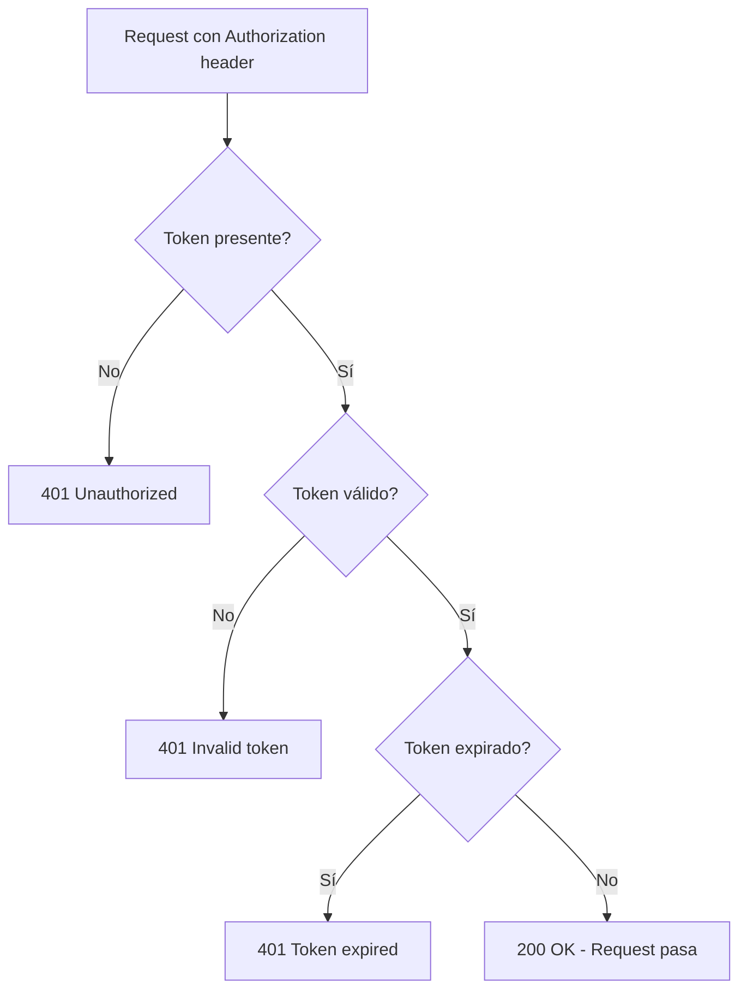

## Plugins Utilizados

Kong incluye más de 50 plugins nativos. En RetroGameCloud utilizamos los siguientes:

<CardGroup cols={3}>
  <Card title="CORS" icon="globe">
    Cross-Origin Resource Sharing
  </Card>
  <Card title="Rate Limiting" icon="gauge">
    Protección contra abuso
  </Card>
  <Card title="JWT" icon="key">
    Validación de tokens
  </Card>
</CardGroup>

## CORS Plugin

### Descripción

Habilita automáticamente Cross-Origin Resource Sharing (CORS) para permitir que el frontend en `retrogamehub.games` acceda a la API desde el navegador.

### Configuración

```yaml
plugins:
  - name: cors
    config:
      origins:
        - https://retrogamehub.games
        - http://localhost:3000  # Desarrollo
      methods:
        - GET
        - POST
        - PUT
        - DELETE
        - OPTIONS
        - HEAD
      headers:
        - Accept
        - Content-Type
        - Authorization
      exposed_headers:
        - X-RateLimit-Limit
        - X-RateLimit-Remaining
      credentials: true
      max_age: 3600
      preflight_continue: false
```

### Parámetros

| Parámetro | Valor | Descripción |
|-----------|-------|-------------|
| `origins` | Array de URLs | Dominios permitidos para CORS |
| `methods` | Array de HTTP methods | Métodos permitidos |
| `headers` | Array de headers | Headers que el cliente puede enviar |
| `exposed_headers` | Array de headers | Headers expuestos al cliente |
| `credentials` | boolean | Permite cookies y Authorization header |
| `max_age` | seconds | Tiempo de caché del preflight |
| `preflight_continue` | boolean | Si false, Kong responde OPTIONS directamente |

### Headers Generados

**Request del navegador:**
```http
OPTIONS /api/games HTTP/1.1
Origin: https://retrogamehub.games
Access-Control-Request-Method: GET
Access-Control-Request-Headers: authorization, content-type
```

**Response de Kong:**
```http
HTTP/1.1 200 OK
Access-Control-Allow-Origin: https://retrogamehub.games
Access-Control-Allow-Methods: GET, POST, PUT, DELETE, OPTIONS, HEAD
Access-Control-Allow-Headers: Accept, Content-Type, Authorization
Access-Control-Allow-Credentials: true
Access-Control-Max-Age: 3600
```

### Testing

```bash
# Preflight request
curl -X OPTIONS http://localhost:8000/api/games \
  -H "Origin: https://retrogamehub.games" \
  -H "Access-Control-Request-Method: GET" \
  -v

# Verificar headers en response:
# < Access-Control-Allow-Origin: https://retrogamehub.games
# < Access-Control-Allow-Credentials: true
```

### Troubleshooting

<AccordionGroup>
  <Accordion title="Error: CORS policy blocked">
    **Causa:** Origen no incluido en `origins`
    
    **Solución:**
    ```yaml
    origins:
      - https://retrogamehub.games
      - https://www.retrogamehub.games  # Agregar subdominios
    ```
  </Accordion>

  <Accordion title="Error: Credentials flag is true but Access-Control-Allow-Credentials is not">
    **Causa:** `credentials: false` en Kong
    
    **Solución:**
    ```yaml
    credentials: true  # Debe estar en true
    ```
  </Accordion>
</AccordionGroup>

---

## Rate Limiting Plugin

### Descripción

Limita el número de requests por IP para proteger contra abuso y ataques DoS/DDoS.

### Configuración

```yaml
plugins:
  - name: rate-limiting
    config:
      second: null
      minute: 100
      hour: null
      day: null
      policy: local
      fault_tolerant: true
      hide_client_headers: false
```

### Parámetros

| Parámetro | Valor | Descripción |
|-----------|-------|-------------|
| `minute` | 100 | Límite de requests por minuto |
| `policy` | local | Almacenamiento de contadores (local/cluster) |
| `fault_tolerant` | true | Continúa si falla el rate limiter |
| `hide_client_headers` | false | Incluye headers informativos |

### Políticas de Almacenamiento

| Política | Descripción | Uso |
|----------|-------------|-----|
| `local` | En memoria de Kong | ✅ Desarrollo y producción actual |
| `cluster` | Compartido entre nodos Kong | ✅ Producción con múltiples instancias |

<Note>
**Actualmente usamos `policy: local`** que almacena contadores en memoria del pod Kong.
Para producción con múltiples réplicas de Kong, considerar `cluster` o Redis externo.
</Note>

### Headers de Response

Kong agrega headers informativos en cada response:

```http
HTTP/1.1 200 OK
X-RateLimit-Limit-Minute: 100
X-RateLimit-Remaining-Minute: 87
X-RateLimit-Reset: 1702142400
```

### Response al Exceder Límite

```http
HTTP/1.1 429 Too Many Requests
X-RateLimit-Limit-Minute: 100
X-RateLimit-Remaining-Minute: 0
X-RateLimit-Reset: 1702142460
Retry-After: 60

{
  "message": "API rate limit exceeded"
}
```

### Testing

```bash
# Enviar 150 requests
for i in {1..150}; do
  curl -s -o /dev/null -w "%{http_code}\n" http://localhost:8000/api/games
done

# Primeros 100: 200
# Siguientes 50: 429
```

### Rate Limiting por Ruta

Aplicar límites diferentes por endpoint:

```yaml
routes:
  - name: api-auth
    paths: [/api/auth]
    plugins:
      - name: rate-limiting
        config:
          minute: 10  # Solo 10 logins/minuto
  
  - name: api-games
    paths: [/api/games]
    plugins:
      - name: rate-limiting
        config:
          minute: 200  # 200 requests/minuto para games
```

### Troubleshooting

<AccordionGroup>
  <Accordion title="Rate limit no funciona en cluster">
    **Causa:** Usando `policy: local` con múltiples instancias
    
    **Solución:**
    ```yaml
    policy: cluster  # O local para desarrollo
    ```
  </Accordion>

  <Accordion title="Redis connection failed">
    **Causa:** Redis no accesible
    
    **Solución:**
    ```yaml
    fault_tolerant: true  # Permite requests si Redis falla
    ```
  </Accordion>
</AccordionGroup>

---

## JWT Plugin

### Descripción

Valida JSON Web Tokens (JWT) en el header `Authorization` antes de permitir acceso a rutas protegidas.

### Configuración

```yaml
routes:
  - name: api-scores
    paths: [/api/scores]
    plugins:
      - name: jwt
        config:
          header_names:
            - authorization
          uri_param_names: []
          cookie_names: []
          key_claim_name: iss
          secret_is_base64: false
          claims_to_verify:
            - exp
          maximum_expiration: 0
          anonymous: null
          run_on_preflight: false
```

### Parámetros

| Parámetro | Valor | Descripción |
|-----------|-------|-------------|
| `header_names` | [authorization] | Headers donde buscar el token |
| `claims_to_verify` | [exp] | Claims a validar (expiración) |
| `secret_is_base64` | false | Si el secret está en base64 |
| `run_on_preflight` | false | No validar en OPTIONS |
| `anonymous` | null | Permitir requests anónimos |

### Flujo de Validación



### Request Válido

```bash
TOKEN="jwt_access_token_here"

curl -X POST http://localhost:8000/api/scores \
  -H "Authorization: Bearer $TOKEN" \
  -H "Content-Type: application/json" \
  -d '{"game_id": 1, "score": 12000}'
```

### Errors Responses

**Token faltante:**
```http
HTTP/1.1 401 Unauthorized
{
  "message": "Unauthorized"
}
```

**Token inválido:**
```http
HTTP/1.1 401 Unauthorized
{
  "message": "Invalid authentication credentials"
}
```

**Token expirado:**
```http
HTTP/1.1 401 Unauthorized
{
  "message": "jwt expired"
}
```

### Configuración con Consumers (avanzado)

```yaml
consumers:
  - username: frontend-app
    jwt_secrets:
      - key: frontend_key
        secret: ${JWT_SECRET}
        algorithm: HS256

plugins:
  - name: jwt
    config:
      key_claim_name: iss
```

<Warning>
Actualmente NO usamos consumers de Kong. El backend valida y genera los JWT, Kong solo verifica su presencia.
</Warning>

### Testing

```bash
# Obtener token desde backend
TOKEN=$(curl -X POST http://localhost:8000/api/auth/login \
  -H "Content-Type: application/json" \
  -d '{"username":"player1","password":"pass123"}' \
  | jq -r '.accessToken')

# Usar token en request protegido
curl -H "Authorization: Bearer $TOKEN" \
  http://localhost:8000/api/scores
```

### Troubleshooting

<AccordionGroup>
  <Accordion title="Error: jwt malformed">
    **Causa:** Token no tiene formato JWT válido (3 partes separadas por puntos)
    
    **Solución:** Verificar que el token tenga formato `header.payload.signature`
  </Accordion>

  <Accordion title="Error: invalid signature">
    **Causa:** JWT_SECRET diferente entre backend y Kong
    
    **Solución:** Verificar que ambos usen el mismo secret
    ```bash
    docker exec backend printenv | grep JWT_SECRET
    docker exec kong printenv | grep JWT_SECRET
    ```
  </Accordion>
</AccordionGroup>

---

## Logging Plugins

### File Log

Registra requests en archivo o stdout:

```yaml
plugins:
  - name: file-log
    config:
      path: /dev/stdout
      reopen: true
```

**Output:**
```json
{
  "request": {
    "method": "GET",
    "uri": "/api/games",
    "size": "123",
    "headers": {
      "host": "retrogamehub.games",
      "user-agent": "Mozilla/5.0"
    }
  },
  "response": {
    "status": 200,
    "size": "456",
    "headers": {
      "content-type": "application/json"
    }
  },
  "latencies": {
    "request": 100,
    "kong": 2,
    "proxy": 98
  }
}
```

### HTTP Log

Envía logs a servicio externo:

```yaml
plugins:
  - name: http-log
    config:
      http_endpoint: https://logs.retrogamehub.games/collect
      method: POST
      timeout: 10000
      keepalive: 60000
```

## Próximos Pasos

<CardGroup cols={2}>
  <Card title="Configuración" icon="gear" href="/kong/configuration">
    Configuración detallada de kong.yml
  </Card>
  <Card title="Kong Overview" icon="shield" href="/kong/overview">
    Arquitectura del API Gateway
  </Card>
</CardGroup>
