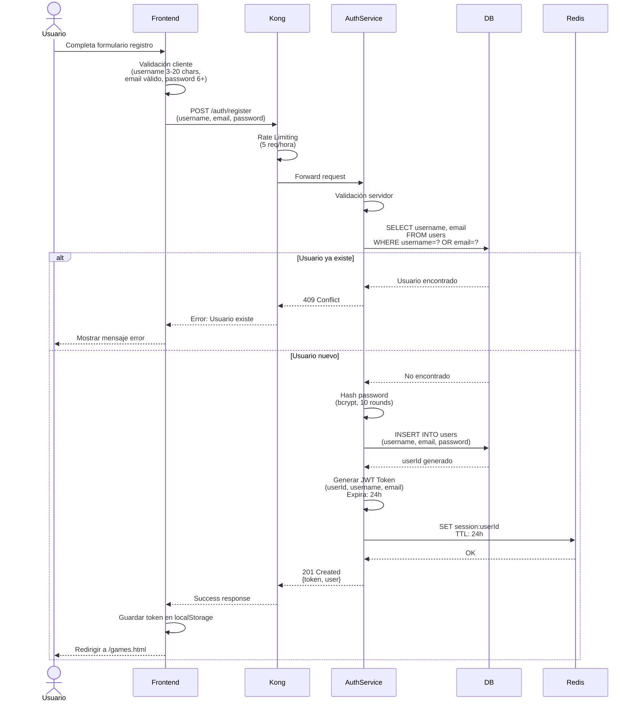
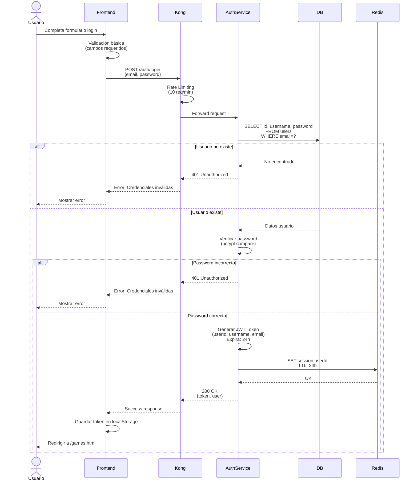
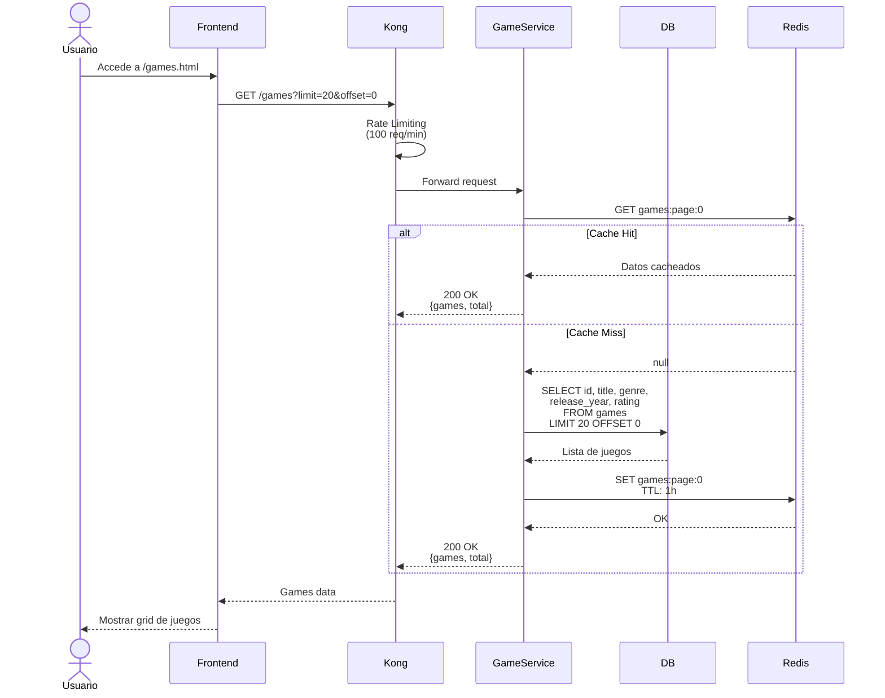
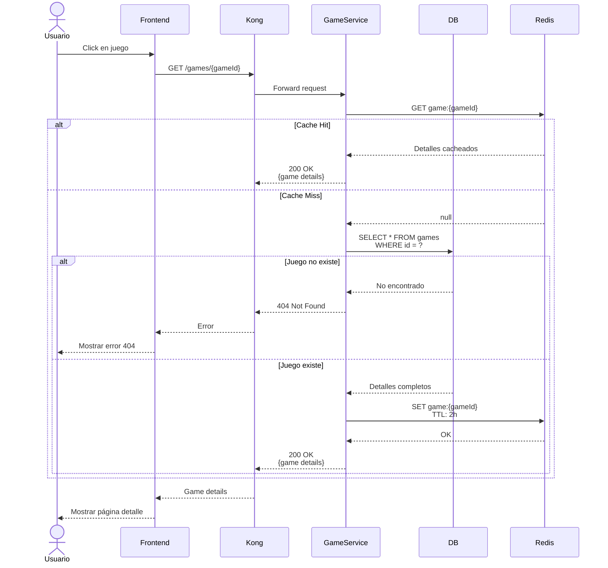
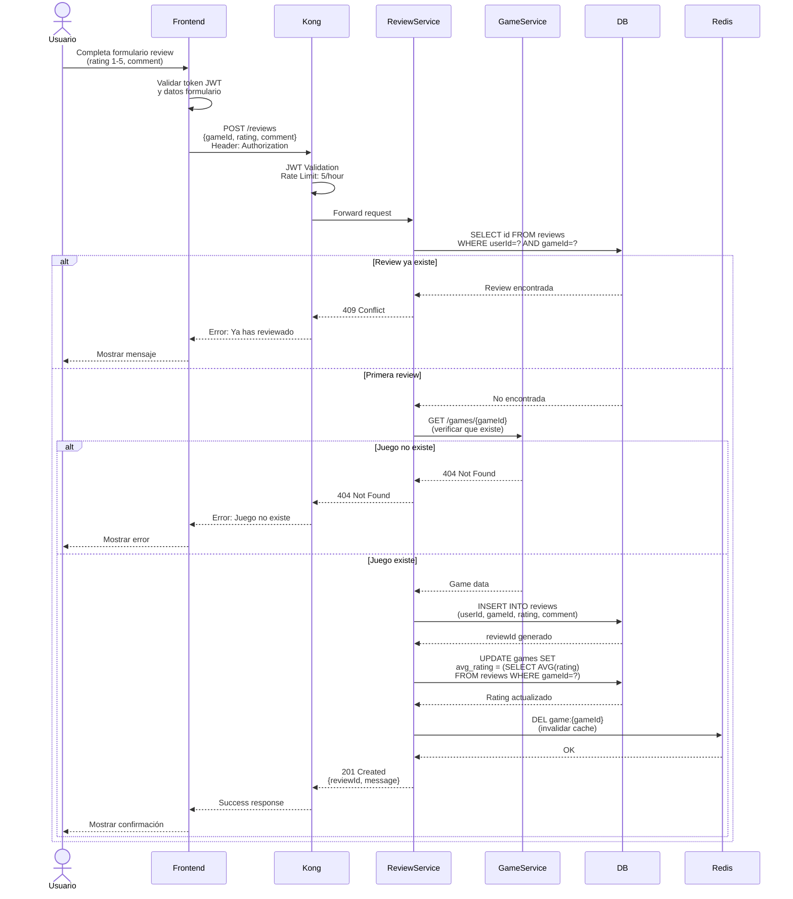
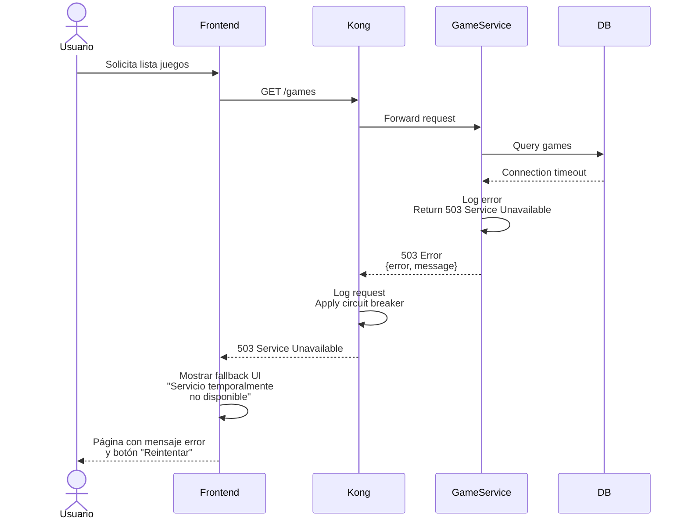

# 🔄 Diagramas de Secuencia

Diagramas detallados que muestran el flujo de datos entre componentes para los procesos más importantes de Retro Game Hub.

---

## 🔐 Flujo de Autenticación

### Registro de Usuario

### Login de Usuario

---

## 🎮 Flujo de Juegos

### Listado de Juegos

### Detalles de Juego

---

## ⭐ Flujo de Reviews

### Crear Review

---

## 🔍 Flujo de Búsqueda

### Búsqueda de Juegos

```mermaid
sequenceDiagram
    actor Usuario
    participant Frontend
    participant Kong
    participant GameService
    participant DB
    participant Redis

    Usuario->>Frontend: Escribe en barra búsqueda
    
    Frontend->>Frontend: Debounce 300ms<br/>Validar query (min 2 chars)

    Frontend->>Kong: GET /games/search?q=mario&genre=platform

    Kong->>GameService: Forward request

    GameService->>Redis: GET search:{hash(query)}

    alt Cache Hit (< 30 min)
        Redis-->>GameService: Resultados cacheados
        GameService-->>Kong: 200 OK<br/>{games, total}
    else Cache Miss
        Redis-->>GameService: null

        GameService->>DB: SELECT * FROM games<br/>WHERE title ILIKE '%mario%'<br/>AND genre = 'platform'<br/>ORDER BY rating DESC

        DB-->>GameService: Resultados búsqueda

        GameService->>Redis: SET search:{hash}<br/>TTL: 30min
        Redis-->>GameService: OK

        GameService-->>Kong: 200 OK<br/>{games, total}
    end

    Kong-->>Frontend: Search results
    Frontend-->>Usuario: Mostrar resultados
```

---

## 🚨 Flujo de Manejo de Errores

### Error de Servicio No Disponible

---

## 📊 Notas de Performance

  <h4 className="text-blue-800 font-semibold mb-2">💡 Optimizaciones Implementadas</h4>
  <ul className="text-blue-700 space-y-1">
    <li>• <strong>Caching en Redis:</strong> TTL diferenciado según tipo de datos</li>
    <li>• <strong>Rate Limiting:</strong> Protección contra abuso por endpoint</li>
    <li>• <strong>JWT con TTL:</strong> Sesiones automáticamente expiradas</li>
    <li>• <strong>Debouncing:</strong> Reducción de requests en búsqueda</li>
    <li>• <strong>Circuit Breaker:</strong> Manejo resiliente de fallos</li>
  </ul>

