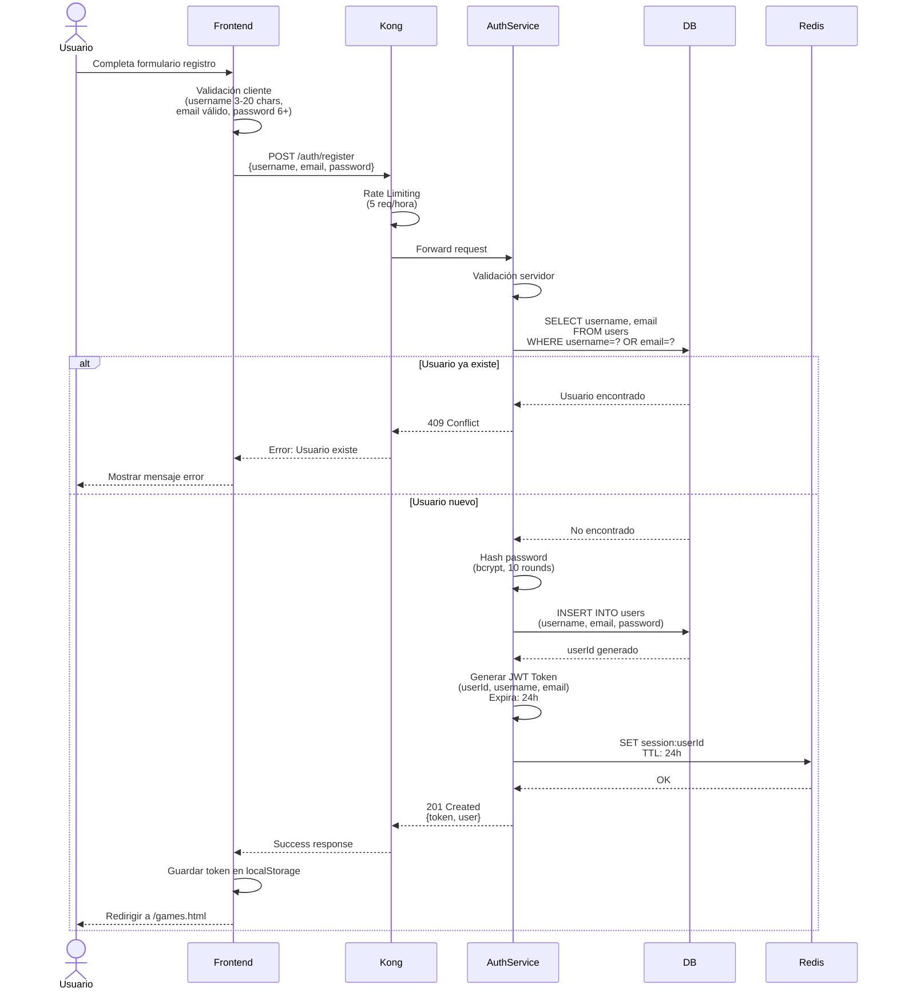
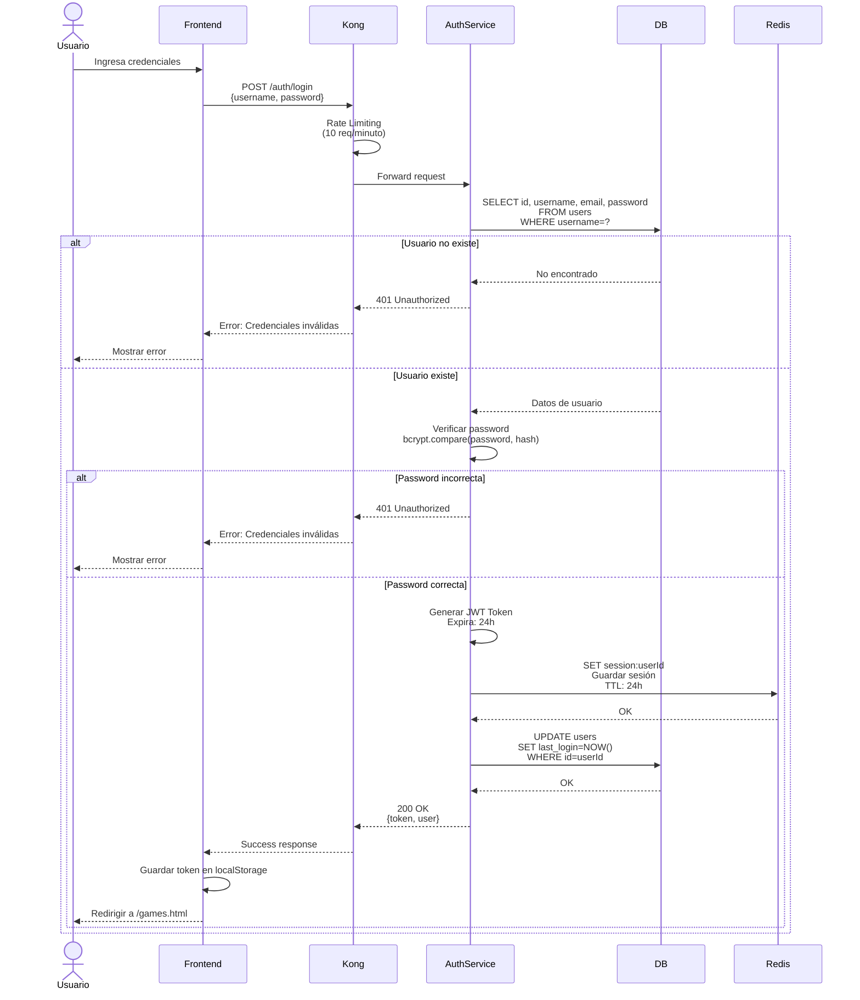
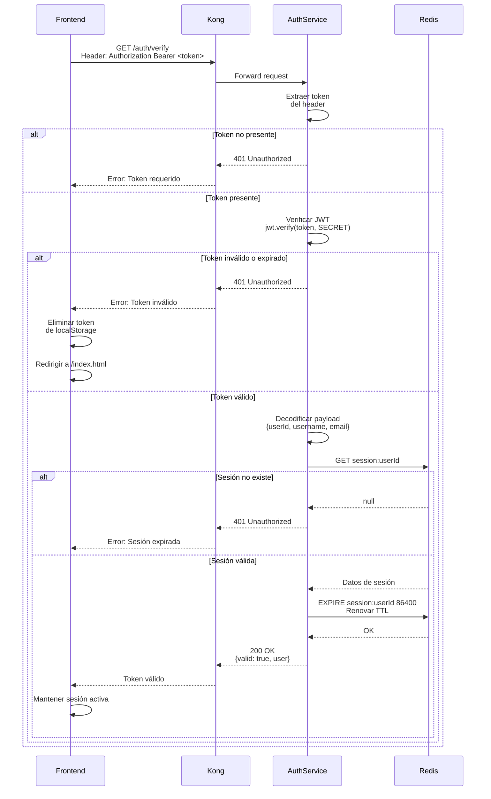
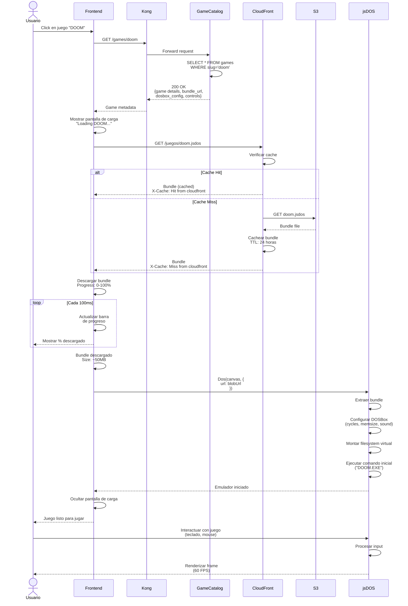
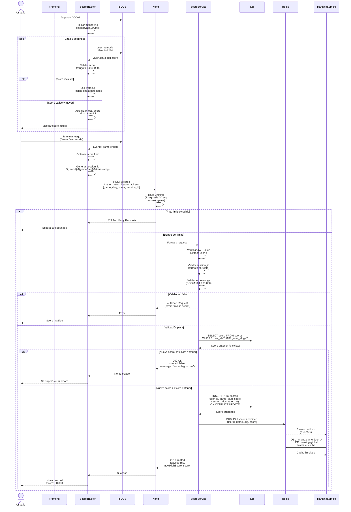
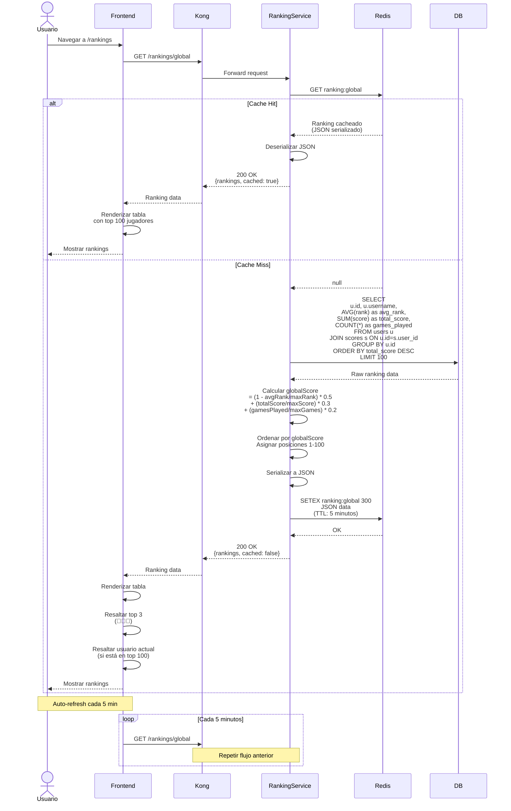
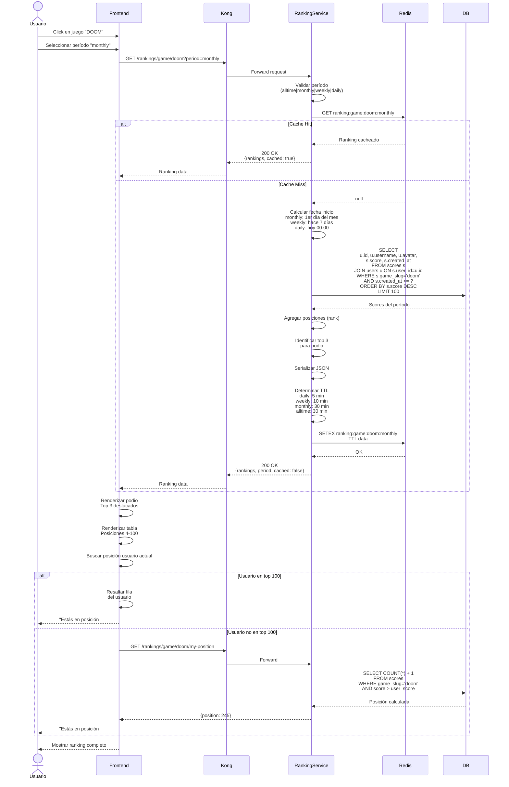
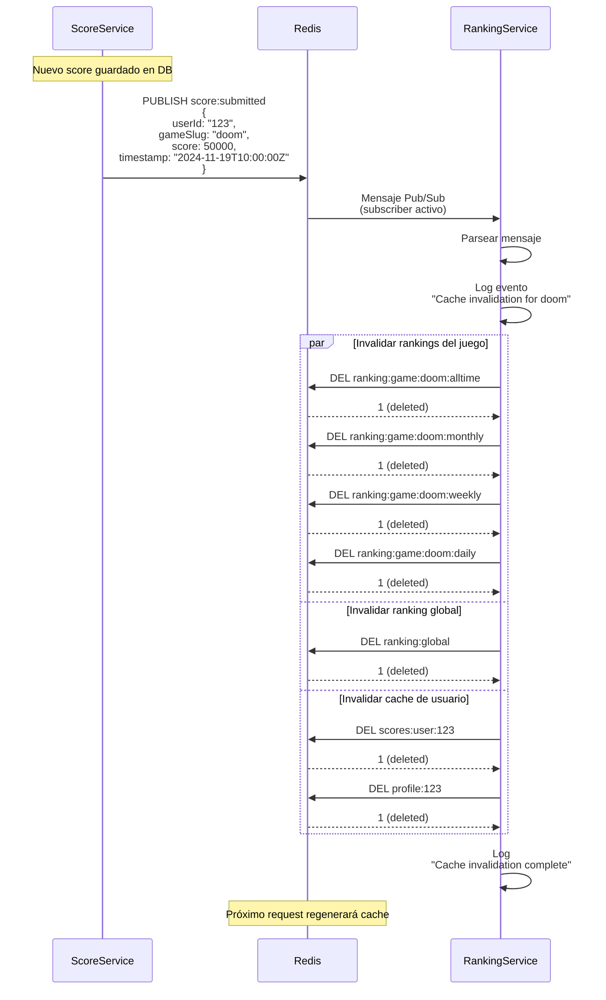
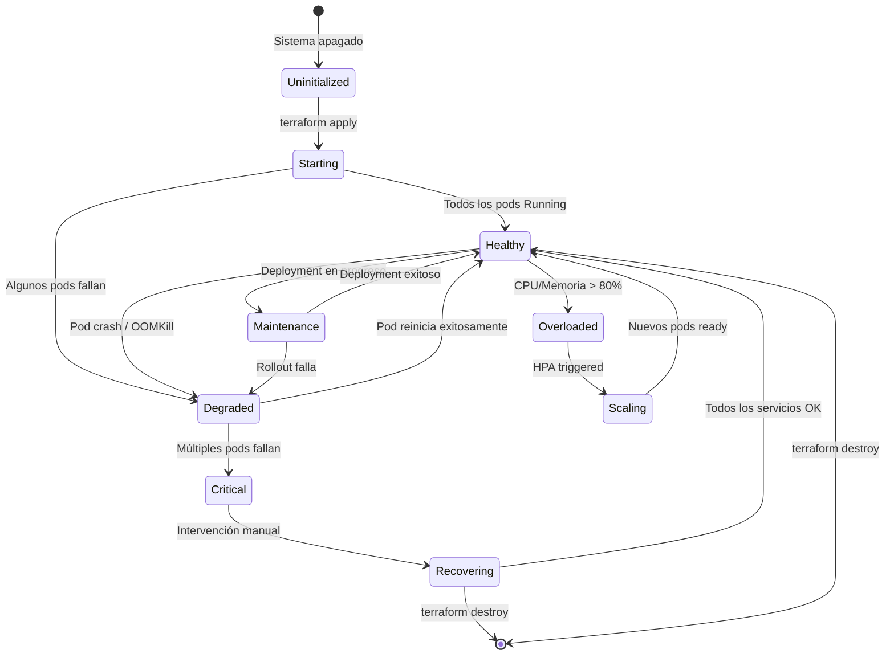
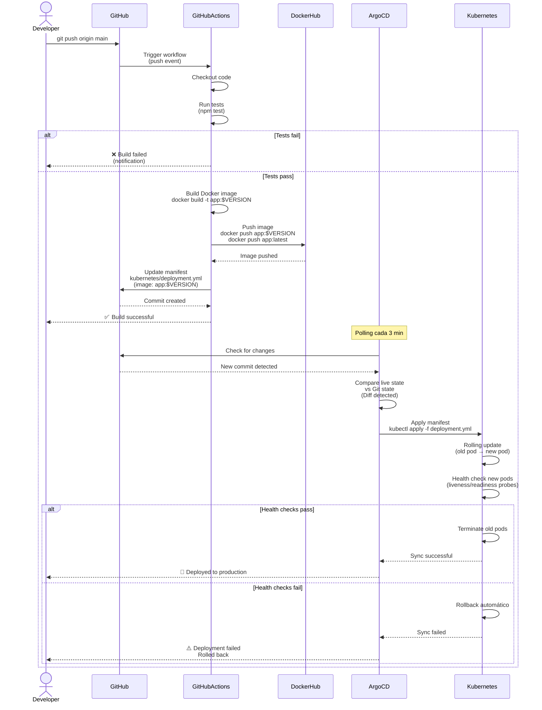

# 🔄 Diagramas de Secuencia

Diagramas detallados que muestran el flujo de datos entre componentes para los procesos más importantes de RetroGame Cloud.

---

## 🔐 Flujo de Autenticación

### Registro de Usuario

### Login de Usuario

### Verificación de Token

---

## 🎮 Flujo de Carga de Juego

---

## 🏆 Flujo de Submit Score (con Anti-Cheat)

---

## 📊 Flujo de Ranking Global

---

## 🎯 Flujo de Ranking por Juego

---

## 🔄 Flujo de Invalidación de Cache

---

## 📈 Diagrama de Estados del Sistema

---

## 🎯 Flujo de Despliegue CI/CD

---

<Card title="Documentación Relacionada" icon="book">
  Para más detalles sobre cada componente, consulta las páginas de [Servicios](/services/auth-service) y [Troubleshooting](/troubleshooting).
</Card>
