# 🔄 Diagramas de Secuencia

Diagramas detallados que muestran el flujo de datos entre componentes para los procesos más importantes de Retro Game Hub.

---

## 🔐 Flujo de Autenticación

### Registro de Usuario

```mermaid
sequenceDiagram
    actor Usuario
    participant Frontend
    participant Kong
    participant AuthService
    participant DB
    participant Redis

    Usuario->>Frontend: Completa formulario registro
    Frontend->>Frontend: Validación cliente<br/>(username 3-20 chars,<br/>email válido, password 6+)

    Frontend->>Kong: POST /auth/register<br/>{username, email, password}

    Kong->>Kong: Rate Limiting<br/>(5 req/hora)

    Kong->>AuthService: Forward request

    AuthService->>AuthService: Validación servidor

    AuthService->>DB: SELECT username, email<br/>FROM users<br/>WHERE username=? OR email=?

    alt Usuario ya existe
        DB-->>AuthService: Usuario encontrado
        AuthService-->>Kong: 409 Conflict
        Kong-->>Frontend: Error: Usuario existe
        Frontend-->>Usuario: Mostrar mensaje error
    else Usuario nuevo
        DB-->>AuthService: No encontrado

        AuthService->>AuthService: Hash password<br/>(bcrypt, 10 rounds)

        AuthService->>DB: INSERT INTO users<br/>(username, email, password)
        DB-->>AuthService: userId generado

        AuthService->>AuthService: Generar JWT Token<br/>(userId, username, email)<br/>Expira: 24h

        AuthService->>Redis: SET session:userId<br/>TTL: 24h
        Redis-->>AuthService: OK

        AuthService-->>Kong: 201 Created<br/>{token, user}
        Kong-->>Frontend: Success response

        Frontend->>Frontend: Guardar token en localStorage
        Frontend-->>Usuario: Redirigir a /games.html
    end
```



### Login de Usuario - Flujo OAuth2 Completo

```mermaid
sequenceDiagram
    actor Usuario
    participant Frontend
    participant Kong
    participant OAuth2Plugin
    participant AuthService
    participant DB
    participant Redis

    Note over Usuario,Redis: OAuth2 Authorization Code Flow

    Usuario->>Frontend: Click "Iniciar Sesión"
    Frontend->>Kong: GET /oauth2/authorize?<br/>client_id=retrogamehub<br/>&response_type=code<br/>&redirect_uri=/callback<br/>&scope=read,write

    Kong->>OAuth2Plugin: Procesar autorización
    OAuth2Plugin->>OAuth2Plugin: Validar client_id<br/>y redirect_uri

    alt Cliente no válido
        OAuth2Plugin-->>Kong: 400 Bad Request
        Kong-->>Frontend: Error: Cliente inválido
        Frontend-->>Usuario: Mostrar error
    else Cliente válido
        OAuth2Plugin-->>Kong: 302 Redirect
        Kong-->>Frontend: Redirigir a login form

        Frontend-->>Usuario: Mostrar formulario login
        Usuario->>Frontend: Introduce credenciales<br/>(username, password)

        Frontend->>Kong: POST /auth/login<br/>{username, password, client_id}

        Kong->>Kong: Rate Limiting<br/>(10 req/5min)

        Kong->>AuthService: Forward login request

        AuthService->>DB: SELECT id, username, password<br/>FROM users<br/>WHERE username=?

        alt Usuario no encontrado
            DB-->>AuthService: Usuario no existe
            AuthService-->>Kong: 401 Unauthorized
            Kong-->>Frontend: Error: Credenciales inválidas
            Frontend-->>Usuario: Mostrar error
        else Usuario encontrado
            DB-->>AuthService: Datos usuario
            AuthService->>AuthService: Verificar password<br/>(bcrypt.compare)

            alt Password incorrecto
                AuthService-->>Kong: 401 Unauthorized
                Kong-->>Frontend: Error: Credenciales inválidas
                Frontend-->>Usuario: Mostrar error
            else Password correcto
                AuthService->>AuthService: Generar authorization_code<br/>(UUID v4, TTL: 10 min)

                AuthService->>Redis: SET auth_code:code<br/>{userId, client_id, scope}<br/>TTL: 600s
                Redis-->>AuthService: OK

                AuthService-->>Kong: 302 Redirect<br/>Location: /callback?code=AUTH_CODE
                Kong-->>Frontend: Redirect con código

                Frontend->>Kong: GET /callback?code=AUTH_CODE
                Frontend->>Kong: POST /oauth2/token<br/>{grant_type=authorization_code,<br/>code=AUTH_CODE,<br/>client_id, client_secret}

                Kong->>OAuth2Plugin: Procesar token exchange
                OAuth2Plugin->>Redis: GET auth_code:AUTH_CODE
                Redis-->>OAuth2Plugin: {userId, client_id, scope}

                OAuth2Plugin->>OAuth2Plugin: Validar código y cliente

                OAuth2Plugin->>OAuth2Plugin: Generar tokens:<br/>- access_token (JWT, 1h)<br/>- refresh_token (UUID, 30d)

                OAuth2Plugin->>Redis: DEL auth_code:AUTH_CODE
                OAuth2Plugin->>Redis: SET refresh_token:TOKEN<br/>{userId, client_id}<br/>TTL: 2592000s

                OAuth2Plugin->>Redis: SET access_token:TOKEN<br/>{userId, client_id, scope}<br/>TTL: 3600s

                OAuth2Plugin-->>Kong: 200 OK<br/>{access_token, refresh_token,<br/>token_type: "Bearer",<br/>expires_in: 3600}

                Kong-->>Frontend: Token response
                Frontend->>Frontend: Guardar tokens en localStorage
                Frontend-->>Usuario: Redirigir a dashboard
            end
        end
    end
```



### Refresh Token Flow


### Logout y Revocación de Token

```mermaid
sequenceDiagram
    actor Usuario
    participant Frontend
    participant Kong
    participant OAuth2Plugin
    participant Redis

    Usuario->>Frontend: Click "Cerrar Sesión"

    Frontend->>Kong: POST /oauth2/revoke<br/>{token=ACCESS_TOKEN,<br/>token_type_hint=access_token}
    Kong->>OAuth2Plugin: Procesar revocación
    OAuth2Plugin->>Redis: DEL access_token:ACCESS_TOKEN
    Redis-->>OAuth2Plugin: OK

    Frontend->>Kong: POST /oauth2/revoke<br/>{token=REFRESH_TOKEN,<br/>token_type_hint=refresh_token}
    Kong->>OAuth2Plugin: Procesar revocación
    OAuth2Plugin->>Redis: DEL refresh_token:REFRESH_TOKEN
    Redis-->>OAuth2Plugin: OK

    OAuth2Plugin-->>Kong: 200 OK Token revocado
    Kong-->>Frontend: Success

    Frontend->>Frontend: Limpiar localStorage<br/>- access_token<br/>- refresh_token<br/>- user_data

    Frontend-->>Usuario: Redirigir a página principal
```



---

## 🎮 Flujo de Gestión de Juegos

### Cargar Lista de Juegos

```mermaid
sequenceDiagram
    actor Usuario
    participant Frontend
    participant Kong
    participant GamesService
    participant DB
    participant Redis
    participant CDN

    Usuario->>Frontend: Accede a /games.html
    Frontend->>Kong: GET /api/games?<br/>page=1&limit=12&platform=all<br/>Authorization: Bearer TOKEN

    Kong->>Kong: Validar JWT token
    Kong->>Kong: Rate Limiting<br/>(100 req/min)

    Kong->>GamesService: Forward request

    GamesService->>Redis: GET games_cache:page1_12_all
    
    alt Cache hit
        Redis-->>GamesService: Datos cacheados
        GamesService-->>Kong: 200 OK {games, pagination}
        Kong-->>Frontend: Response
    else Cache miss
        Redis-->>GamesService: null

        GamesService->>DB: SELECT g.*, p.name as platform<br/>FROM games g<br/>JOIN platforms p ON g.platform_id = p.id<br/>LIMIT 12 OFFSET 0

        DB-->>GamesService: Lista de juegos

        GamesService->>GamesService: Procesar datos:<br/>- Generar URLs de imágenes<br/>- Formatear metadatos

        GamesService->>Redis: SET games_cache:page1_12_all<br/>TTL: 300s
        Redis-->>GamesService: OK

        GamesService-->>Kong: 200 OK {games, pagination}
        Kong-->>Frontend: Response
    end

    loop Para cada juego
        Frontend->>CDN: GET /images/games/game_id/cover.jpg
        CDN-->>Frontend: Imagen del juego
    end

    Frontend-->>Usuario: Mostrar grid de juegos
```



### Subir Nuevo Juego

```mermaid
sequenceDiagram
    actor Usuario
    participant Frontend
    participant Kong
    participant GamesService
    participant FileService
    participant DB
    participant S3
    participant Redis

    Usuario->>Frontend: Completa formulario<br/>+ selecciona archivos
    Frontend->>Frontend: Validación cliente:<br/>- ROM < 50MB<br/>- Imagen < 5MB<br/>- Campos requeridos

    Frontend->>Kong: POST /api/games<br/>multipart/form-data<br/>{gameData + files}
    Kong->>Kong: Validar JWT + permisos
    Kong->>Kong: Request size limit: 100MB

    Kong->>GamesService: Forward request

    GamesService->>GamesService: Validar datos del juego
    GamesService->>FileService: POST /upload/rom<br/>{file, userId, gameId}

    FileService->>FileService: Validar archivo ROM:<br/>- Extensiones permitidas<br/>- Virus scan<br/>- Integridad

    alt Archivo inválido
        FileService-->>GamesService: 400 Bad Request
        GamesService-->>Kong: Error validación
        Kong-->>Frontend: Error archivo
        Frontend-->>Usuario: Mostrar error
    else Archivo válido
        FileService->>S3: PUT /roms/userId/gameId/rom.zip
        S3-->>FileService: Upload success

        FileService->>FileService: Generar metadata:<br/>- Checksum MD5<br/>- Tamaño<br/>- Tipo MIME

        FileService-->>GamesService: {fileUrl, metadata}

        GamesService->>FileService: POST /upload/cover<br/>{imageFile, userId, gameId}

        FileService->>FileService: Procesar imagen:<br/>- Redimensionar (300x400)<br/>- Optimizar calidad

        FileService->>S3: PUT /images/games/gameId/cover.jpg
        S3-->>FileService: Upload success

        FileService-->>GamesService: {imageUrl, metadata}

        GamesService->>DB: BEGIN TRANSACTION
        GamesService->>DB: INSERT INTO games<br/>(title, description, platform_id,<br/>user_id, rom_url, cover_url,<br/>file_size, checksum)

        DB-->>GamesService: gameId generado

        GamesService->>DB: COMMIT TRANSACTION
        GamesService->>Redis: DEL games_cache:*<br/>(Invalidar cache)

        GamesService-->>Kong: 201 Created {game}
        Kong-->>Frontend: Success response
        Frontend-->>Usuario: Redirigir a página del juego
    end
```



---

## 💬 Flujo de Sistema de Chat

### Conexión WebSocket


### Envío de Mensaje

```mermaid
sequenceDiagram
    actor Usuario
    participant Frontend
    participant Kong
    participant ChatService
    participant Redis
    participant DB

    Usuario->>Frontend: Escribe mensaje + Enter
    Frontend->>Frontend: Validar mensaje:<br/>- No vacío<br/>- Longitud < 500 chars<br/>- Rate limit cliente

    Frontend->>ChatService: WebSocket message<br/>{type: "message", content, gameId}

    ChatService->>ChatService: Rate limiting<br/>(10 msg/min por usuario)

    alt Rate limit excedido
        ChatService-->>Frontend: {type: "error", message: "Demasiados mensajes"}
        Frontend-->>Usuario: Mostrar error temporal
    else Mensaje válido
        ChatService->>ChatService: Filtrar contenido:<br/>- Palabras prohibidas<br/>- URLs sospechosas

        ChatService->>DB: INSERT INTO chat_messages<br/>(user_id, game_id, content, timestamp)
        DB-->>ChatService: messageId

        ChatService->>ChatService: Preparar mensaje broadcast:<br/>{id, userId, username, content, timestamp}

        ChatService->>Redis: PUBLISH game123:messages<br/>{messageData}

        ChatService->>Redis: SMEMBERS active_users:game123
        Redis-->>ChatService: Lista usuarios conectados

        loop Para cada usuario conectado
            ChatService->>Redis: GET user
```