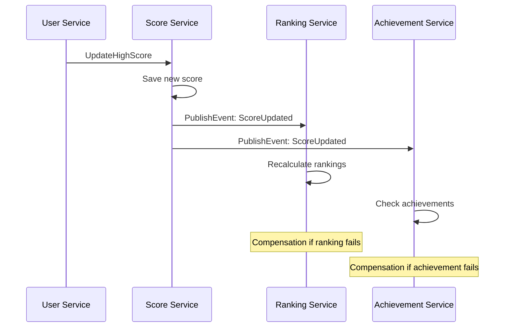
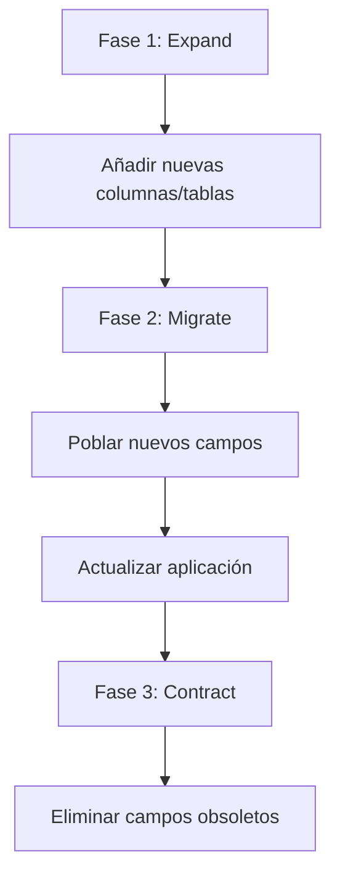
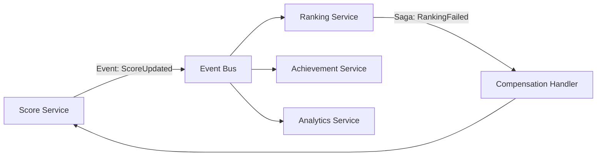

# 2.5. Arquitectura de Datos y Modelos de Dominio

La arquitectura de datos de RetroGameCloud sigue los principios de **Database per Service** para garantizar la autonomía de los microservicios y evitar acoplamiento a través de bases de datos compartidas.

## Estrategia de Persistencia por Servicio

### Tecnologías de Persistencia

<Tabs>
<Tab title="PostgreSQL">
Base de datos principal para datos transaccionales críticos:
- **Auth Service**: Credenciales y sesiones de usuario
- **User Service**: Perfiles y preferencias
- **Game Catalog Service**: Metadatos de juegos
- **Score Service**: Puntuaciones y estadísticas
- **Ranking Service**: Rankings calculados y históricos
</Tab>
<Tab title="Redis">
Cache y almacenamiento de datos temporales:
- **Sesiones activas** (Auth Service)
- **Rankings en tiempo real** (Ranking Service)
- **Cache de metadatos** (Game Catalog Service)
- **Leaderboards temporales** (Score Service)
</Tab>
<Tab title="AWS S3">
Almacenamiento de objetos:
- **ROMs de juegos** (Game Catalog Service)
- **Avatares de usuario** (User Service)
- **Snapshots de partidas** (Score Service)
</Tab>
</Tabs>

## Modelos de Datos por Servicio

### Auth Service

```sql
-- Esquema: auth_db

CREATE TABLE users_auth (
    id UUID PRIMARY KEY DEFAULT gen_random_uuid(),
    email VARCHAR(255) UNIQUE NOT NULL,
    password_hash VARCHAR(255) NOT NULL,
    is_active BOOLEAN DEFAULT true,
    last_login TIMESTAMP,
    failed_attempts INTEGER DEFAULT 0,
    locked_until TIMESTAMP NULL,
    created_at TIMESTAMP DEFAULT NOW(),
    updated_at TIMESTAMP DEFAULT NOW()
);

CREATE TABLE refresh_tokens (
    id UUID PRIMARY KEY DEFAULT gen_random_uuid(),
    user_id UUID NOT NULL REFERENCES users_auth(id) ON DELETE CASCADE,
    token_hash VARCHAR(255) NOT NULL,
    expires_at TIMESTAMP NOT NULL,
    is_revoked BOOLEAN DEFAULT false,
    created_at TIMESTAMP DEFAULT NOW()
);

-- Índices para optimización
CREATE INDEX idx_users_auth_email ON users_auth(email);
CREATE INDEX idx_users_auth_active ON users_auth(is_active);
CREATE INDEX idx_refresh_tokens_user_id ON refresh_tokens(user_id);
CREATE INDEX idx_refresh_tokens_expires ON refresh_tokens(expires_at);
```

### User Service

```sql
-- Esquema: user_db

CREATE TABLE user_profiles (
    id UUID PRIMARY KEY DEFAULT gen_random_uuid(),
    auth_user_id UUID UNIQUE NOT NULL, -- Referencia externa
    username VARCHAR(50) UNIQUE NOT NULL,
    display_name VARCHAR(100),
    avatar_url TEXT,
    bio TEXT,
    country_code VARCHAR(3),
    timezone VARCHAR(50),
    preferences JSONB DEFAULT '{}',
    is_public BOOLEAN DEFAULT true,
    created_at TIMESTAMP DEFAULT NOW(),
    updated_at TIMESTAMP DEFAULT NOW()
);

CREATE TABLE user_achievements (
    id UUID PRIMARY KEY DEFAULT gen_random_uuid(),
    user_id UUID NOT NULL REFERENCES user_profiles(id) ON DELETE CASCADE,
    achievement_type VARCHAR(50) NOT NULL,
    achievement_data JSONB,
    earned_at TIMESTAMP DEFAULT NOW()
);

-- Índices
CREATE INDEX idx_user_profiles_auth_user_id ON user_profiles(auth_user_id);
CREATE INDEX idx_user_profiles_username ON user_profiles(username);
CREATE INDEX idx_user_achievements_user_id ON user_achievements(user_id);
CREATE INDEX idx_user_achievements_type ON user_achievements(achievement_type);
```

### Game Catalog Service

```sql
-- Esquema: game_catalog_db

CREATE TABLE games (
    id UUID PRIMARY KEY DEFAULT gen_random_uuid(),
    title VARCHAR(255) NOT NULL,
    slug VARCHAR(255) UNIQUE NOT NULL,
    description TEXT,
    developer VARCHAR(255),
    publisher VARCHAR(255),
    release_year INTEGER,
    genre VARCHAR(100),
    platform VARCHAR(50),
    rom_file_path TEXT NOT NULL,
    rom_size_bytes BIGINT,
    thumbnail_url TEXT,
    screenshot_urls TEXT[],
    is_active BOOLEAN DEFAULT true,
    play_count BIGINT DEFAULT 0,
    created_at TIMESTAMP DEFAULT NOW(),
    updated_at TIMESTAMP DEFAULT NOW()
);

CREATE TABLE game_metadata (
    game_id UUID PRIMARY KEY REFERENCES games(id) ON DELETE CASCADE,
    emulator_config JSONB DEFAULT '{}',
    controls_mapping JSONB DEFAULT '{}',
    performance_hints JSONB DEFAULT '{}',
    content_rating VARCHAR(20),
    tags TEXT[]
);

-- Índices
CREATE INDEX idx_games_slug ON games(slug);
CREATE INDEX idx_games_genre ON games(genre);
CREATE INDEX idx_games_platform ON games(platform);
CREATE INDEX idx_games_active ON games(is_active);
CREATE INDEX idx_games_play_count ON games(play_count DESC);
```

### Score Service

```sql
-- Esquema: score_db

CREATE TABLE game_sessions (
    id UUID PRIMARY KEY DEFAULT gen_random_uuid(),
    user_id UUID NOT NULL, -- Referencia externa
    game_id UUID NOT NULL, -- Referencia externa
    session_start TIMESTAMP DEFAULT NOW(),
    session_end TIMESTAMP,
    duration_seconds INTEGER,
    final_score BIGINT,
    max_level_reached INTEGER,
    snapshot_data JSONB,
    is_completed BOOLEAN DEFAULT false,
    created_at TIMESTAMP DEFAULT NOW()
);

CREATE TABLE high_scores (
    id UUID PRIMARY KEY DEFAULT gen_random_uuid(),
    user_id UUID NOT NULL,
    game_id UUID NOT NULL,
    score BIGINT NOT NULL,
    level_reached INTEGER,
    achieved_at TIMESTAMP DEFAULT NOW(),
    session_id UUID REFERENCES game_sessions(id),
    
    -- Constraint para evitar duplicados por usuario/juego
    UNIQUE(user_id, game_id)
);

-- Índices
CREATE INDEX idx_game_sessions_user_id ON game_sessions(user_id);
CREATE INDEX idx_game_sessions_game_id ON game_sessions(game_id);
CREATE INDEX idx_high_scores_game_score ON high_scores(game_id, score DESC);
CREATE INDEX idx_high_scores_user_id ON high_scores(user_id);
```

### Ranking Service

```sql
-- Esquema: ranking_db

CREATE TABLE global_rankings (
    id UUID PRIMARY KEY DEFAULT gen_random_uuid(),
    game_id UUID NOT NULL,
    user_id UUID NOT NULL,
    username VARCHAR(50) NOT NULL, -- Desnormalizado para performance
    score BIGINT NOT NULL,
    rank_position INTEGER NOT NULL,
    last_updated TIMESTAMP DEFAULT NOW(),
    
    UNIQUE(game_id, user_id)
);

CREATE TABLE ranking_snapshots (
    id UUID PRIMARY KEY DEFAULT gen_random_uuid(),
    game_id UUID NOT NULL,
    snapshot_date DATE NOT NULL,
    ranking_data JSONB NOT NULL, -- Top 100 del día
    created_at TIMESTAMP DEFAULT NOW(),
    
    UNIQUE(game_id, snapshot_date)
);

-- Índices
CREATE INDEX idx_global_rankings_game_rank ON global_rankings(game_id, rank_position);
CREATE INDEX idx_global_rankings_user ON global_rankings(user_id);
CREATE INDEX idx_ranking_snapshots_game_date ON ranking_snapshots(game_id, snapshot_date DESC);
```

## Patrones de Consistencia Eventual

### Eventos de Dominio

<Note>
Los microservicios publican eventos de dominio para mantener la consistencia eventual entre servicios.
</Note>

```json
{
  "eventType": "UserScoreUpdated",
  "aggregateId": "user-123",
  "eventId": "evt-456",
  "timestamp": "2024-01-15T10:30:00Z",
  "version": 1,
  "data": {
    "userId": "user-123",
    "gameId": "game-789",
    "newScore": 15000,
    "previousScore": 12000,
    "sessionId": "session-abc"
  }
}
```

### Saga Pattern para Operaciones Distribuidas



### Estrategias de Compensación

<Tabs>
<Tab title="Timeout Pattern">
```javascript
// Ejemplo de timeout en actualización de ranking
const updateRankingWithTimeout = async (scoreEvent) => {
  try {
    await Promise.race([
      rankingService.updateRanking(scoreEvent),
      new Promise((_, reject) => 
        setTimeout(() => reject(new Error('Timeout')), 5000)
      )
    ]);
  } catch (error) {
    // Compensation: Revert score update
    await scoreService.revertScore(scoreEvent.sessionId);
    throw error;
  }
};
```
</Tab>
<Tab title="Circuit Breaker">
```javascript
// Circuit breaker para llamadas entre servicios
class CircuitBreaker {
  constructor(threshold = 5, timeout = 60000) {
    this.failureCount = 0;
    this.threshold = threshold;
    this.timeout = timeout;
    this.state = 'CLOSED';
    this.nextAttempt = Date.now();
  }

  async call(operation) {
    if (this.state === 'OPEN') {
      if (Date.now() < this.nextAttempt) {
        throw new Error('Circuit breaker is OPEN');
      }
      this.state = 'HALF_OPEN';
    }

    try {
      const result = await operation();
      this.onSuccess();
      return result;
    } catch (error) {
      this.onFailure();
      throw error;
    }
  }
}
```
</Tab>
</Tabs>

## Estrategias de Migración y Versionado

### Versionado de Esquemas

<Warning>
Todas las migraciones deben ser backwards-compatible para deployments blue-green.
</Warning>

```sql
-- Tabla de control de migraciones
CREATE TABLE schema_migrations (
    version VARCHAR(50) PRIMARY KEY,
    description TEXT,
    applied_at TIMESTAMP DEFAULT NOW(),
    checksum VARCHAR(64)
);

-- Ejemplo de migración versionada
-- V001__initial_schema.sql
-- V002__add_user_preferences.sql
-- V003__add_game_metadata_table.sql
```

### Estrategia de Migración Multi-Fase



## Optimizaciones y Rendimiento

### Índices Especializados

<Tabs>
<Tab title="Índices Compuestos">
```sql
-- Optimización para consultas de ranking por juego
CREATE INDEX idx_scores_game_score_user ON high_scores(game_id, score DESC, user_id);

-- Optimización para búsqueda de juegos
CREATE INDEX idx_games_search ON games USING gin(to_tsvector('spanish', title || ' ' || description));
```
</Tab>
<Tab title="Índices Parciales">
```sql
-- Índice solo para usuarios activos
CREATE INDEX idx_active_users ON user_profiles(created_at) WHERE is_public = true;

-- Índice solo para juegos activos
CREATE INDEX idx_active_games_genre ON games(genre) WHERE is_active = true;
```
</Tab>
</Tabs>

### Particionado de Tablas

```sql
-- Particionado de sesiones por fecha
CREATE TABLE game_sessions (
    id UUID,
    user_id UUID,
    game_id UUID,
    session_start TIMESTAMP,
    -- otros campos...
) PARTITION BY RANGE (session_start);

-- Particiones mensuales
CREATE TABLE game_sessions_2024_01 PARTITION OF game_sessions
FOR VALUES FROM ('2024-01-01') TO ('2024-02-01');

CREATE TABLE game_sessions_2024_02 PARTITION OF game_sessions
FOR VALUES FROM ('2024-02-01') TO ('2024-03-01');
```

## Monitoreo de Datos

### Métricas de Calidad de Datos

```yaml
# Alertas de monitoreo
data_quality_checks:
  - name: "Scores sin usuario válido"
    query: "SELECT COUNT(*) FROM high_scores WHERE user_id NOT IN (SELECT auth_user_id FROM user_profiles)"
    threshold: 0
    
  - name: "Sesiones huérfanas"
    query: "SELECT COUNT(*) FROM game_sessions WHERE session_end IS NULL AND session_start < NOW() - INTERVAL '24 hours'"
    threshold: 100
    
  - name: "Rankings desactualizados"
    query: "SELECT COUNT(*) FROM global_rankings WHERE last_updated < NOW() - INTERVAL '1 hour'"
    threshold: 50
```

### Sincronización entre Servicios



La arquitectura de datos de RetroGameCloud garantiza la consistencia eventual, alta disponibilidad y escalabilidad horizontal mediante el uso de patrones probados como Database per Service, Event Sourcing y Saga Pattern.