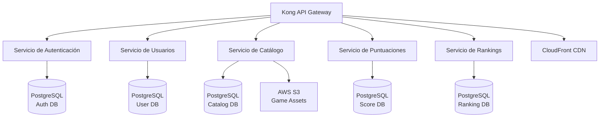

# 3. Visión General de Microservicios

RetroGameCloud está construido sobre una arquitectura de microservicios que proporciona escalabilidad, mantenibilidad y separación de responsabilidades. Cada servicio tiene un propósito específico y se comunica con otros servicios a través de APIs REST.

## 3.1. Arquitectura General

## 3.2. Tabla Comparativa de Servicios

| Servicio | Puerto | Base de Datos | Dependencias Principales | Estado |
|----------|--------|---------------|-------------------------|--------|
| [Auth Service](/services/auth-service) | 8001 | PostgreSQL (auth_db) | JWT, bcrypt, OAuth2 | ✅ Activo |
| [User Service](/services/user-service) | 8002 | PostgreSQL (user_db) | Auth Service | ✅ Activo |
| [Game Catalog](/services/game-catalog) | 8003 | PostgreSQL (catalog_db) | S3, CloudFront | ✅ Activo |
| [Score Service](/services/score-service) | 8004 | PostgreSQL (score_db) | Auth, User Services | ✅ Activo |
| [Ranking Service](/services/ranking-service) | 8005 | PostgreSQL (ranking_db) | Score Service | ✅ Activo |

## 3.3. Servicios por Categoría

<Tabs>
  <Tab title="Autenticación y Usuarios">
    <Card title="Auth Service" icon="shield-check" href="/services/auth-service">
      Gestiona autenticación, autorización y tokens JWT. Punto central de seguridad del sistema.
    </Card>
    <Card title="User Service" icon="users" href="/services/user-service">
      Administra perfiles de usuarios, preferencias y configuraciones personales.
    </Card>
  </Tab>
  
  <Tab title="Gaming">
    <Card title="Game Catalog" icon="gamepad-2" href="/services/game-catalog">
      Catálogo de juegos retro con metadatos, assets y gestión de contenido multimedia.
    </Card>
    <Card title="Score Service" icon="trophy" href="/services/score-service">
      Registro y gestión de puntuaciones individuales de jugadores.
    </Card>
    <Card title="Ranking Service" icon="crown" href="/services/ranking-service">
      Generación y mantenimiento de rankings globales y por categorías.
    </Card>
  </Tab>
</Tabs>

## 3.4. Patrones de Comunicación

### 3.4.1. Comunicación Síncrona
- **REST APIs**: Comunicación principal entre servicios
- **HTTP/HTTPS**: Protocolo de transporte estándar
- **JSON**: Formato de intercambio de datos

### 3.4.2. Autenticación entre Servicios
- **Service-to-Service JWT**: Tokens específicos para comunicación interna
- **API Gateway**: Kong como punto de entrada único
- **mTLS**: Comunicación segura entre servicios críticos

## 3.5. Gestión de Datos

### 3.5.1. Bases de Datos por Servicio
Cada microservicio mantiene su propia base de datos PostgreSQL:

- **Aislamiento de datos**: Cada servicio es propietario de sus datos
- **Escalabilidad independiente**: Optimización específica por servicio
- **Resistencia a fallos**: Fallos aislados por servicio

### 3.5.2. Consistencia de Datos
- **Eventual Consistency**: Para operaciones no críticas
- **Strong Consistency**: Para operaciones de autenticación y transacciones críticas
- **Event Sourcing**: Registro de eventos para auditoría

## 3.6. Monitoreo y Observabilidad

<Info>
Todos los servicios implementan:
- **Health Checks**: Endpoints `/health` y `/ready`
- **Metrics**: Exposición de métricas Prometheus
- **Logging**: Logs estructurados en JSON
- **Tracing**: Distributed tracing con Jaeger
</Info>

## 3.7. Resiliencia

### 3.7.1. Patrones Implementados
- **Circuit Breaker**: Prevención de cascadas de fallos
- **Retry Logic**: Reintentos con backoff exponencial
- **Timeout Management**: Timeouts configurables por endpoint
- **Rate Limiting**: Protección contra sobrecarga

### 3.7.2. Recuperación ante Fallos
- **Graceful Degradation**: Funcionalidad reducida ante fallos
- **Fallback Mechanisms**: Respuestas alternativas
- **Auto-scaling**: Escalado automático basado en métricas

## 3.8. Seguridad

### 3.8.1. Autenticación y Autorización
- **JWT Tokens**: Autenticación stateless
- **RBAC**: Control de acceso basado en roles
- **OAuth 2.0**: Integración con proveedores externos
- **Rate Limiting**: Protección contra ataques

### 3.8.2. Comunicación Segura
- **TLS 1.3**: Cifrado en tránsito
- **API Keys**: Autenticación de servicios
- **Input Validation**: Validación estricta de entradas
- **CORS**: Configuración de políticas de origen cruzado

<Warning>
La comunicación entre servicios siempre debe pasar por el API Gateway en producción. Las conexiones directas están restringidas a redes internas.
</Warning>

## 3.9. Enlaces Rápidos

<CardGroup cols={2}>
  <Card title="Ver Auth Service" icon="shield-check" href="/services/auth-service">
    Documentación completa del servicio de autenticación
  </Card>
  <Card title="Ver User Service" icon="users" href="/services/user-service">
    Documentación del servicio de gestión de usuarios
  </Card>
  <Card title="Ver Game Catalog" icon="gamepad-2" href="/services/game-catalog">
    Documentación del catálogo de juegos
  </Card>
  <Card title="Ver Score Service" icon="trophy" href="/services/score-service">
    Documentación del servicio de puntuaciones
  </Card>
</CardGroup>