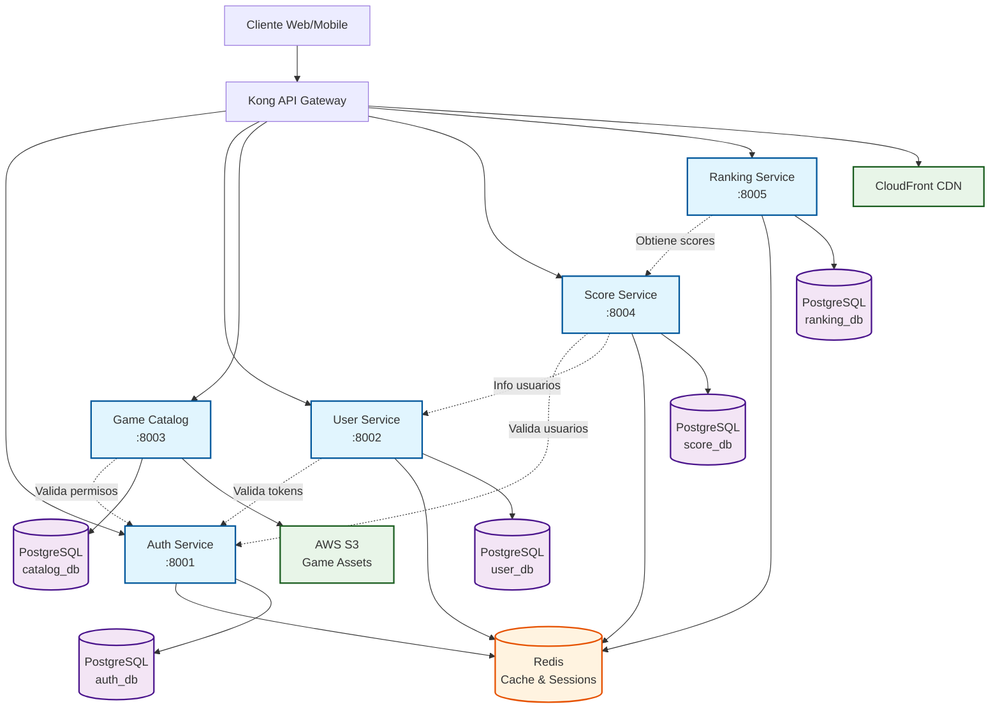

# 3. Visión General de Microservicios

RetroGameCloud está construido sobre una arquitectura de microservicios que proporciona escalabilidad, mantenibilidad y separación de responsabilidades. Cada servicio tiene un propósito específico y se comunica con otros servicios a través de APIs REST.

## 3.1. Arquitectura General

<div className="mermaid">



</div>

## 3.2. Inventario de Servicios

| Servicio | Puerto | Responsabilidad | Estado | Versión |
|----------|--------|-----------------|--------|---------|
| **Auth Service** | 8001 | Autenticación y autorización | ✅ Activo | v2.1.0 |
| **User Service** | 8002 | Gestión de perfiles de usuario | ✅ Activo | v1.8.3 |
| **Game Catalog** | 8003 | Catálogo y metadatos de juegos | ✅ Activo | v1.5.2 |
| **Score Service** | 8004 | Puntuaciones y logros | ✅ Activo | v1.4.1 |
| **Ranking Service** | 8005 | Rankings y leaderboards | ✅ Activo | v1.2.7 |

## 3.3. Service Level Objectives (SLOs)

Los siguientes SLOs definen las expectativas de rendimiento y disponibilidad para cada microservicio:

### 3.3.1. Auth Service

<div className="bg-blue-50 p-4 rounded-lg border-l-4 border-blue-500">
<div className="grid grid-cols-2 gap-4">
<div>
<strong>Latencia</strong>
<ul className="mt-1 text-sm">
<li>P95: ≤ 100ms</li>
<li>P99: ≤ 250ms</li>
</ul>
</div>
<div>
<strong>Disponibilidad</strong>
<ul className="mt-1 text-sm">
<li>Uptime: ≥ 99.9%</li>
<li>Tasa de error: ≤ 0.1%</li>
</ul>
</div>
</div>
<div className="mt-2">
<strong>Throughput:</strong> 1,000 RPM por instancia
</div>
</div>

### 3.3.2. User Service

<div className="bg-green-50 p-4 rounded-lg border-l-4 border-green-500">
<div className="grid grid-cols-2 gap-4">
<div>
<strong>Latencia</strong>
<ul className="mt-1 text-sm">
<li>P95: ≤ 150ms</li>
<li>P99: ≤ 400ms</li>
</ul>
</div>
<div>
<strong>Disponibilidad</strong>
<ul className="mt-1 text-sm">
<li>Uptime: ≥ 99.5%</li>
<li>Tasa de error: ≤ 0.5%</li>
</ul>
</div>
</div>
<div className="mt-2">
<strong>Throughput:</strong> 800 RPM por instancia
</div>
</div>

### 3.3.3. Game Catalog Service

<div className="bg-purple-50 p-4 rounded-lg border-l-4 border-purple-500">
<div className="grid grid-cols-2 gap-4">
<div>
<strong>Latencia</strong>
<ul className="mt-1 text-sm">
<li>P95: ≤ 200ms</li>
<li>P99: ≤ 500ms</li>
</ul>
</div>
<div>
<strong>Disponibilidad</strong>
<ul className="mt-1 text-sm">
<li>Uptime: ≥ 99.5%</li>
<li>Tasa de error: ≤ 0.3%</li>
</ul>
</div>
</div>
<div className="mt-2">
<strong>Throughput:</strong> 1,200 RPM por instancia
</div>
</div>

### 3.3.4. Score Service

<div className="bg-orange-50 p-4 rounded-lg border-l-4 border-orange-500">
<div className="grid grid-cols-2 gap-4">
<div>
<strong>Latencia</strong>
<ul className="mt-1 text-sm">
<li>P95: ≤ 120ms</li>
<li>P99: ≤ 300ms</li>
</ul>
</div>
<div>
<strong>Disponibilidad</strong>
<ul className="mt-1 text-sm">
<li>Uptime: ≥ 99.7%</li>
<li>Tasa de error: ≤ 0.2%</li>
</ul>
</div>
</div>
<div className="mt-2">
<strong>Throughput:</strong> 2,000 RPM por instancia
</div>
</div>

### 3.3.5. Ranking Service

<div className="bg-red-50 p-4 rounded-lg border-l-4 border-red-500">
<div className="grid grid-cols-2 gap-4">
<div>
<strong>Latencia</strong>
<ul className="mt-1 text-sm">
<li>P95: ≤ 180ms</li>
<li>P99: ≤ 450ms</li>
</ul>
</div>
<div>
<strong>Disponibilidad</strong>
<ul className="mt-1 text-sm">
<li>Uptime: ≥ 99.3%</li>
<li>Tasa de error: ≤ 0.5%</li>
</ul>
</div>
</div>
<div className="mt-2">
<strong>Throughput:</strong> 600 RPM por instancia
</div>
</div>

## 3.4. Matriz de Dependencias

| Servicio | Dependencias Internas | Dependencias Externas | Criticidad |
|----------|----------------------|----------------------|------------|
| **Auth Service** | - | Redis, PostgreSQL | 🔴 Crítico |
| **User Service** | Auth Service | Redis, PostgreSQL | 🟡 Alto |
| **Game Catalog** | Auth Service | PostgreSQL, S3, CDN | 🟡 Alto |
| **Score Service** | Auth Service, User Service | Redis, PostgreSQL | 🟠 Medio |
| **Ranking Service** | Score Service | Redis, PostgreSQL | 🟢 Bajo |

## 3.5. Monitoreo de SLOs

### 3.5.1. Métricas Clave

- **Golden Signals**: Latencia, Tráfico, Errores, Saturación
- **Business Metrics**: Usuarios activos, Juegos jugados, Scores registrados
- **Infrastructure Metrics**: CPU, Memoria, Conexiones DB, Cache hit ratio

### 3.5.2. Alertas por Violación de SLO

```yaml
# Ejemplo de configuración de alertas
alerts:
  - name: "auth-service-latency-high"
    condition: "p95_latency > 100ms"
    severity: "warning"
    action: "scale-up"
  
  - name: "auth-service-availability-low" 
    condition: "uptime < 99.9%"
    severity: "critical"
    action: "page-oncall"
```

## 3.6. Estrategia de Escalado

### Horizontal Pod Autoscaling (HPA)

| Servicio | Min Pods | Max Pods | Trigger CPU | Trigger Memory |
|----------|----------|----------|-------------|----------------|
| Auth Service | 3 | 10 | 70% | 80% |
| User Service | 2 | 8 | 75% | 85% |
| Game Catalog | 2 | 6 | 80% | 85% |
| Score Service | 3 | 12 | 70% | 80% |
| Ranking Service | 1 | 4 | 80% | 85% |

<div className="bg-gray-50 p-4 rounded-lg mt-6">
<h3 className="text-lg font-semibold mb-2">📊 Dashboard de Monitoreo</h3>
<p>Todos los SLOs se monitorean en tiempo real a través de:</p>
<ul className="list-disc ml-6 mt-2">
<li><strong>Grafana:</strong> Dashboards de métricas por servicio</li>
<li><strong>Prometheus:</strong> Recolección y almacenamiento de métricas</li>
<li><strong>AlertManager:</strong> Gestión de alertas y notificaciones</li>
<li><strong>Jaeger:</strong> Distributed tracing para latencia end-to-end</li>
</ul>
</div>