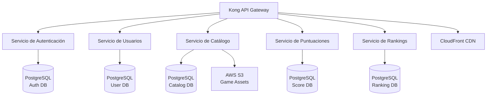
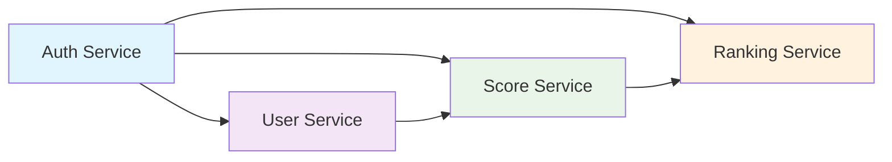

# Visión General de Microservicios

RetroGameCloud está construido sobre una arquitectura de microservicios que proporciona escalabilidad, mantenibilidad y separación de responsabilidades. Cada servicio tiene un propósito específico y se comunica con otros servicios a través de APIs REST.

## Arquitectura General

<div className="mermaid">



</div>

## Tabla Comparativa de Servicios

| Servicio | Puerto | Base de Datos | Dependencias Principales | Estado |
|----------|--------|---------------|-------------------------|--------|
| [Auth Service](/services/auth-service) | 8001 | PostgreSQL (auth_db) | JWT, bcrypt, OAuth2 | ✅ Activo |
| [User Service](/services/user-service) | 8002 | PostgreSQL (user_db) | Auth Service | ✅ Activo |
| [Game Catalog](/services/game-catalog) | 8003 | PostgreSQL (catalog_db) | S3, CloudFront | ✅ Activo |
| [Score Service](/services/score-service) | 8004 | PostgreSQL (score_db) | Auth, User Services | ✅ Activo |
| [Ranking Service](/services/ranking-service) | 8005 | PostgreSQL (ranking_db) | Score Service | ✅ Activo |

## Servicios por Categoría

<Tabs>
  <Tab title="Autenticación y Usuarios">
    <Card title="Auth Service" icon="shield-check" href="/services/auth-service">
      Gestiona la autenticación, autorización y tokens JWT. Incluye OAuth2 y integración con proveedores externos.
    </Card>

    <Card title="User Service" icon="user" href="/services/user-service">
      Administra perfiles de usuario, preferencias y configuraciones personales.
    </Card>
  </Tab>

  <Tab title="Contenido y Juegos">
    <Card title="Game Catalog Service" icon="gamepad-2" href="/services/game-catalog">
      Catálogo completo de juegos retro con metadatos, assets y gestión de contenido.
    </Card>
  </Tab>

  <Tab title="Puntuaciones y Rankings">
    <Card title="Score Service" icon="trophy" href="/services/score-service">
      Registro y gestión de puntuaciones de jugadores con validación y histórico.
    </Card>

    <Card title="Ranking Service" icon="chart-line" href="/services/ranking-service">
      Sistema de clasificaciones globales y por juego con algoritmos de ranking.
    </Card>
  </Tab>
</Tabs>

## Comunicación Entre Servicios

### Patrón de Autenticación

<Note>
Todos los servicios (excepto Auth) requieren validación de token JWT para operaciones autenticadas. El flujo típico es:

1. El cliente obtiene un token del Auth Service
2. El token se incluye en el header `Authorization: Bearer <token>`
3. Cada servicio valida el token antes de procesar la petición
</Note>

### Dependencias de Servicios



## Configuración de Infraestructura

### Kubernetes Resources

<Warning>
Cada microservicio se despliega como un conjunto independiente de recursos de Kubernetes:

- **Deployment**: Para la gestión de pods

- **Service**: Para la comunicación interna

- **ConfigMap**: Para configuraciones no sensibles

- **Secret**: Para credenciales y claves
</Warning>

### Variables de Entorno Comunes

```yaml

# Configuración común para todos los servicios
NODE_ENV: production
PORT: 800X  # Específico para cada servicio
DB_HOST: postgres-service
DB_PORT: 5432
JWT_SECRET: <secret-ref>
API_GATEWAY_URL: https://api.retrogamecloud.com

```

## Monitoreo y Observabilidad

### Métricas Prometheus

Todos los servicios exponen métricas en el endpoint `/metrics`:

- **Métricas HTTP**: Latencia, códigos de respuesta, throughput

- **Métricas de Base de Datos**: Conexiones activas, tiempo de consulta

- **Métricas de Aplicación**: Usuarios activos, juegos jugados, puntuaciones registradas

### Health Checks

Cada servicio implementa endpoints de salud:

- `GET /health` - Estado general del servicio

- `GET /ready` - Disponibilidad para recibir tráfico

- `GET /metrics` - Métricas para Prometheus

## Guías de Desarrollo

### Estándares de API

<Tabs>
  <Tab title="Respuestas">
    ```json
    {
      "success": true,
      "data": {},
      "message": "Descripción de la operación",
      "timestamp": "2024-01-01T00:00:00Z"
    }
    ```

  </Tab>

  <Tab title="Errores">
    ```json
    {
      "success": false,
      "error": {
        "code": "ERROR_CODE",
        "message": "Mensaje descriptivo del error"
      },
      "timestamp": "2024-01-01T00:00:00Z"
    }
    ```

  </Tab>

  <Tab title="Headers">
    ```http
    Authorization: Bearer <jwt_token>
    Content-Type: application/json
    X-Request-ID: <uuid>
    ```

  </Tab>
</Tabs>

### Testing

Cada servicio incluye:

- **Tests unitarios**: Jest con cobertura > 80%

- **Tests de integración**: Supertest para endpoints

- **Tests de contrato**: Pact para comunicación entre servicios

## Próximos Pasos

<Card title="Explorar Servicios" icon="arrow-right">
  Selecciona un servicio específico de la tabla superior para ver su documentación detallada, incluyendo todos sus endpoints y ejemplos de uso.
</Card>

- --

## Enlaces Rápidos

- [Referencia completa de la API](/api-reference)

- [Guía de despliegue](/deployment)

- [Configuración de desarrollo](/development/setup)

- [Monitoreo y alertas](/monitoring)