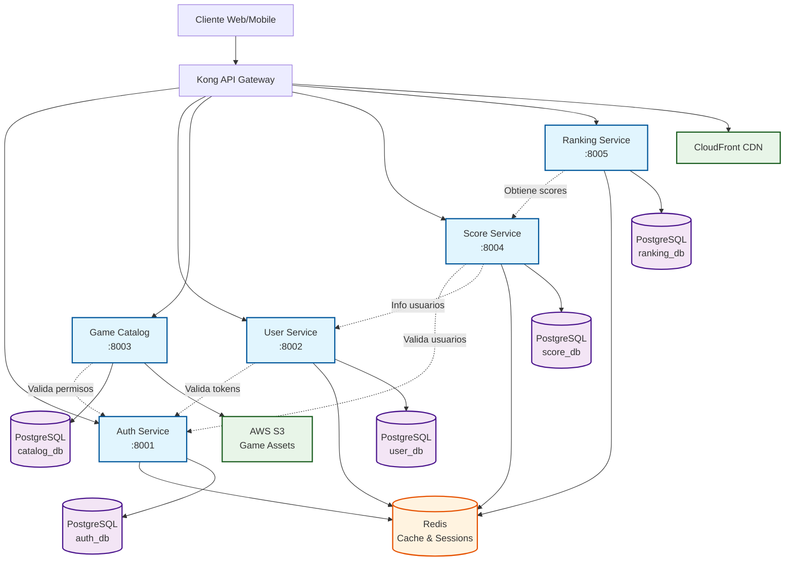
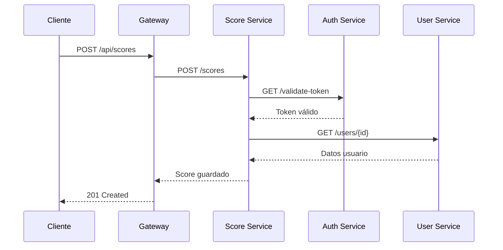

# 3. Visión General de Microservicios

RetroGameCloud está construido sobre una arquitectura de microservicios que proporciona escalabilidad, mantenibilidad y separación de responsabilidades. Cada servicio tiene un propósito específico y se comunica con otros servicios a través de APIs REST.

## 3.1. Arquitectura General

<div className="mermaid">



</div>

## 3.2. Service Level Objectives (SLOs)

### 3.2.1. Métricas de Rendimiento por Microservicio

| Servicio | Latencia P95 | Disponibilidad | Tasa Error Max | Descripción |
|----------|--------------|----------------|----------------|-------------|
| **Auth Service** | < 100ms | 99.9% | < 0.1% | Servicio crítico - autenticación y autorización |
| **User Service** | < 150ms | 99.5% | < 0.5% | Gestión de perfiles y datos de usuario |
| **Game Catalog** | < 200ms | 99.0% | < 1.0% | Catálogo de juegos y metadatos |
| **Score Service** | < 50ms | 99.9% | < 0.1% | Registro de puntuaciones en tiempo real |
| **Ranking Service** | < 300ms | 99.0% | < 1.0% | Cálculos de rankings globales |

### 3.2.2. Justificación de SLOs

<div className="grid grid-cols-1 md:grid-cols-2 gap-4">

<div className="border rounded-lg p-4">
**Auth Service - 99.9% / 100ms P95**
- Servicio crítico del que dependen todos los demás
- Latencia baja esencial para UX fluida
- Tolerancia mínima a errores
</div>

<div className="border rounded-lg p-4">
**Score Service - 99.9% / 50ms P95**
- Funcionalidad core del gaming
- Debe ser ultra-rápido para gameplay en tiempo real
- Los errores afectan directamente la experiencia de juego
</div>

<div className="border rounded-lg p-4">
**User Service - 99.5% / 150ms P95**
- Importante pero no crítico para funcionalidad core
- Tolerancia media a errores
- Latencia aceptable para operaciones de perfil
</div>

<div className="border rounded-lg p-4">
**Ranking Service - 99.0% / 300ms P95**
- Operaciones complejas de agregación
- Mayor tolerancia a latencia por naturaleza analítica
- Funcionalidad complementaria
</div>

</div>

### 3.2.3. Monitoreo y Alertas

```yaml
# Configuración de alertas por SLO
alerts:
  latency_p95:
    threshold_multiplier: 1.2  # Alerta al 120% del SLO
    evaluation_window: "5m"
    
  availability:
    threshold_offset: -0.1%    # Alerta 0.1% antes del límite
    evaluation_window: "10m"
    
  error_rate:
    threshold_multiplier: 0.8  # Alerta al 80% del límite
    evaluation_window: "5m"
```

## 3.3. Inventario de Servicios

### 3.3.1. Servicios Core

| Servicio | Puerto | Propósito | Dependencias |
|----------|--------|-----------|--------------|
| **auth-service** | 8001 | Autenticación JWT, gestión de sesiones | Redis, PostgreSQL |
| **user-service** | 8002 | Perfiles de usuario, preferencias | PostgreSQL, auth-service |
| **game-catalog** | 8003 | Catálogo de juegos, metadata | PostgreSQL, S3 |
| **score-service** | 8004 | Puntuaciones, logros | PostgreSQL, Redis, auth-service |
| **ranking-service** | 8005 | Rankings globales, estadísticas | PostgreSQL, score-service |

### 3.3.2. Infraestructura

| Componente | Propósito | Configuración |
|------------|-----------|---------------|
| **Kong Gateway** | API Gateway, rate limiting, auth | Puerto 8000/8443 |
| **PostgreSQL** | Base de datos principal | Cluster multi-master |
| **Redis** | Cache distribuido, sesiones | Cluster 3 nodos |
| **AWS S3** | Almacenamiento de assets | Buckets por ambiente |

## 3.4. Patrones de Comunicación

### 3.4.1. Comunicación Síncrona



### 3.4.2. Manejo de Errores

| Tipo Error | Código HTTP | Acción | Retry |
|------------|-------------|---------|-------|
| **Validation** | 400 | Retornar error | No |
| **Auth** | 401/403 | Redirect login | No |
| **Not Found** | 404 | Error específico | No |
| **Rate Limit** | 429 | Backoff | Sí |
| **Server Error** | 500 | Circuit breaker | Sí |

## 3.5. Configuración de Desarrollo

### 3.5.1. Docker Compose

```yaml
version: '3.8'
services:
  auth-service:
    build: ./services/auth
    ports: ['8001:8001']
    environment:
      - DATABASE_URL=postgresql://auth_db
      - REDIS_URL=redis://redis:6379
    
  user-service:
    build: ./services/user
    ports: ['8002:8002']
    depends_on: [auth-service]
    
  # ... otros servicios
```

### 3.5.2. Variables de Entorno

| Variable | Servicio | Descripción | Requerida |
|----------|----------|-------------|-----------|
| `DATABASE_URL` | Todos | Conexión PostgreSQL | ✅ |
| `REDIS_URL` | Auth, Score | Conexión Redis | ✅ |
| `JWT_SECRET` | Auth | Clave para tokens | ✅ |
| `AWS_S3_BUCKET` | Catalog | Bucket de assets | ✅ |
| `LOG_LEVEL` | Todos | Nivel de logging | ❌ |

## 3.6. Próximos Pasos

<div className="flex flex-col gap-4">

**📋 Documentación Detallada**
- [Auth Service](/services/auth) - Autenticación y autorización
- [User Service](/services/user) - Gestión de usuarios
- [Game Catalog](/services/catalog) - Catálogo de juegos
- [Score Service](/services/scores) - Sistema de puntuaciones
- [Ranking Service](/services/rankings) - Rankings y estadísticas

**🔧 Recursos Técnicos**
- [Guía de Despliegue](/deployment/overview)
- [Monitoreo y Alertas](/monitoring/setup)
- [Desarrollo Local](/development/setup)

</div>