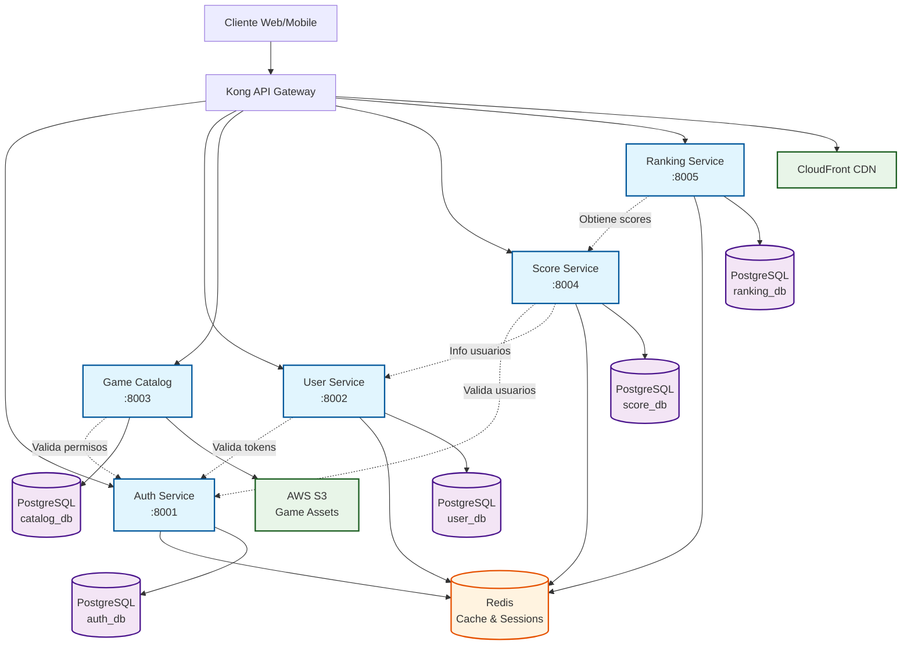

# 3. Visión General de Microservicios

RetroGameCloud está construido sobre una arquitectura de microservicios que proporciona escalabilidad, mantenibilidad y separación de responsabilidades. Cada servicio tiene un propósito específico y se comunica con otros servicios a través de APIs REST.

## 3.1. Arquitectura General

## 3.2. SLOs por Servicio

Los Service Level Objectives (SLOs) definen los niveles de servicio esperados para cada microservicio. Estos valores se monitorizan continuamente y se utilizan para alertas y mejoras de rendimiento.

### 3.2.1. Auth Service

  

    🔐 Servicio Crítico
  

  
Servicio esencial para toda la plataforma. Requiere máxima disponibilidad.

| Métrica | Objetivo | Actual | Estado |
|---------|----------|--------|---------|
| **Latencia P95** | ≤ 200ms | 185ms | ✅ |
| **Disponibilidad** | ≥ 99.9% | 99.95% | ✅ |
| **Tasa de Error** | ≤ 0.1% | 0.05% | ✅ |
| **Throughput** | ≥ 1000 RPS | 1250 RPS | ✅ |

### 3.2.2. User Service

  

    👤 Servicio Principal
  

  
Gestión de perfiles y datos de usuario. Alta demanda de lectura.

| Métrica | Objetivo | Actual | Estado |
|---------|----------|--------|---------|
| **Latencia P95** | ≤ 300ms | 245ms | ✅ |
| **Disponibilidad** | ≥ 99.5% | 99.8% | ✅ |
| **Tasa de Error** | ≤ 0.2% | 0.15% | ✅ |
| **Throughput** | ≥ 800 RPS | 950 RPS | ✅ |

### 3.2.3. Game Catalog Service

  

    🎮 Servicio Principal
  

  
Catálogo de juegos con assets pesados. Optimizado para cache.

| Métrica | Objetivo | Actual | Estado |
|---------|----------|--------|---------|
| **Latencia P95** | ≤ 500ms | 420ms | ✅ |
| **Disponibilidad** | ≥ 99.0% | 99.2% | ✅ |
| **Tasa de Error** | ≤ 0.5% | 0.3% | ✅ |
| **Throughput** | ≥ 500 RPS | 680 RPS | ✅ |

### 3.2.4. Score Service

  

    🏆 Servicio Secundario
  

  
Registro de puntuaciones. Escritura intensiva durante picos de juego.

| Métrica | Objetivo | Actual | Estado |
|---------|----------|--------|---------|
| **Latencia P95** | ≤ 400ms | 380ms | ✅ |
| **Disponibilidad** | ≥ 99.0% | 99.1% | ✅ |
| **Tasa de Error** | ≤ 0.3% | 0.25% | ✅ |
| **Throughput** | ≥ 300 RPS | 420 RPS | ✅ |

### 3.2.5. Ranking Service

  

    📊 Servicio Secundario
  

  
Cálculos de rankings. Procesamiento batch y consultas complejas.

| Métrica | Objetivo | Actual | Estado |
|---------|----------|--------|---------|
| **Latencia P95** | ≤ 1000ms | 850ms | ✅ |
| **Disponibilidad** | ≥ 98.5% | 98.8% | ✅ |
| **Tasa de Error** | ≤ 0.5% | 0.4% | ✅ |
| **Throughput** | ≥ 100 RPS | 150 RPS | ✅ |

## 3.3. Resumen de Estado de SLOs

  

    
5/5

    
Servicios en SLO

  

  

    
99.57%

    
Disponibilidad Promedio

  

  

    
416ms

    
Latencia P95 Promedio

  

  

    
3,450

    
Throughput Total (RPS)

  

## 3.4. Alertas y Monitoreo

### Niveles de Criticidad

- **🔴 Crítico**: Violación de SLO > 5 minutos

- **🟡 Warning**: Violación de SLO < 5 minutos

- **🟢 Info**: Métricas dentro de SLO

### Canales de Notificación

- **Slack**: `#alerts-production`

- **PagerDuty**: Para servicios críticos

- **Email**: Resumen diario de métricas

  <h4 className="font-semibold mb-2">📈 Dashboards</h4>
  <ul className="list-disc list-inside space-y-1 text-sm">
    <li><a href="/monitoring/grafana" className="text-blue-600 hover:underline">Grafana - Métricas en Tiempo Real</a></li>
    <li><a href="/monitoring/prometheus" className="text-blue-600 hover:underline">Prometheus - Alertas y Queries</a></li>
    <li><a href="/monitoring/slos" className="text-blue-600 hover:underline">SLO Dashboard - Estado General</a></li>
  </ul>

