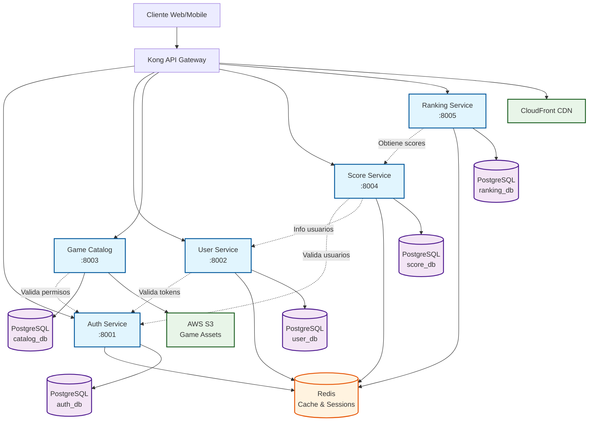
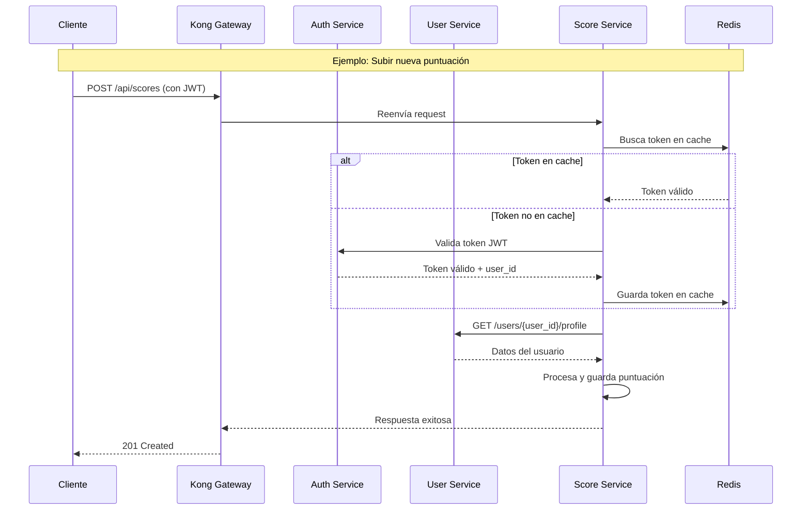

# 3. Visión General de Microservicios

RetroGameCloud está construido sobre una arquitectura de microservicios que proporciona escalabilidad, mantenibilidad y separación de responsabilidades. Cada servicio tiene un propósito específico y se comunica con otros servicios a través de APIs REST.

## 3.1. Arquitectura General

<div className="mermaid">



</div>

## 3.2. Flujo de Comunicación

<div className="mermaid">



</div>

## 3.3. Tabla Comparativa de Servicios

| Servicio | Puerto | Base de Datos | Cache | Dependencias Principales | Estado |
|----------|--------|---------------|--------|-------------------------|--------|
| [Auth Service](/services/auth-service) | 8001 | PostgreSQL (auth_db) | Redis | JWT, bcrypt, OAuth2 | ✅ Activo |
| [User Service](/services/user-service) | 8002 | PostgreSQL (user_db) | Redis | Auth Service | ✅ Activo |
| [Game Catalog](/services/game-catalog) | 8003 | PostgreSQL (catalog_db) | Redis | Auth, S3, CloudFront | ✅ Activo |
| [Score Service](/services/score-service) | 8004 | PostgreSQL (score_db) | Redis | Auth, User Services | ✅ Activo |
| [Ranking Service](/services/ranking-service) | 8005 | PostgreSQL (ranking_db) | Redis | Score Service | ✅ Activo |

## 3.4. Servicios por Categoría

<Tabs>
  <Tab title="Autenticación y Usuarios">
    <CardGroup cols={2}>
      <Card title="Auth Service" icon="shield-check" href="/services/auth-service">
        Gestión de autenticación, autorización y tokens JWT
        - Login/Logout/Register
        - Validación de tokens
        - OAuth2 integration
      </Card>
      <Card title="User Service" icon="users" href="/services/user-service">
        Gestión de perfiles y datos de usuarios
        - Perfiles de usuario
        - Preferencias de juego
        - Historial de actividad
      </Card>
    </CardGroup>
  </Tab>

  <Tab title="Juegos y Contenido">
    <Card title="Game Catalog" icon="gamepad-2" href="/services/game-catalog">
      Catálogo de juegos retro y gestión de assets
      - Biblioteca de ROMs
      - Metadatos de juegos
      - Integración con S3/CDN
    </Card>
  </Tab>

  <Tab title="Puntuaciones y Rankings">
    <CardGroup cols={2}>
      <Card title="Score Service" icon="trophy" href="/services/score-service">
        Gestión de puntuaciones y logros
        - Registro de scores
        - Sistema de logros
        - Validación de puntuaciones
      </Card>
      <Card title="Ranking Service" icon="chart-bar" href="/services/ranking-service">
        Rankings globales y leaderboards
        - Tablas de clasificación
        - Rankings por juego
        - Estadísticas agregadas
      </Card>
    </CardGroup>
  </Tab>
</Tabs>

## 3.5. Patrones de Comunicación

### 3.5.1. Sincronización de Datos

- **Cache distribuido**: Redis para sesiones y datos frecuentes

- **Service-to-Service**: HTTP REST para comunicación directa

- **Rate limiting**: Kong Gateway controla límites por servicio

### 3.5.2. Manejo de Errores

- **Circuit breaker**: Prevención de fallos en cascada

- **Retry policies**: Reintentos automáticos configurables

- **Fallback responses**: Respuestas por defecto en caso de fallo

### 3.5.3. Seguridad

- **JWT tokens**: Autenticación stateless

- **Service mesh**: Comunicación segura entre servicios

- **API rate limiting**: Protección contra abuso

## 3.6. Dependencias Críticas

<Warning>
Los siguientes servicios son críticos para el funcionamiento del sistema:

- **Kong Gateway**: Punto de entrada único

- **Redis**: Cache distribuido y sesiones

- **Auth Service**: Validación de tokens para todos los servicios
</Warning>

<Tip>
Para desarrollo local, todos los servicios pueden ejecutarse con:

```bash
docker-compose up -d

```

</Tip>