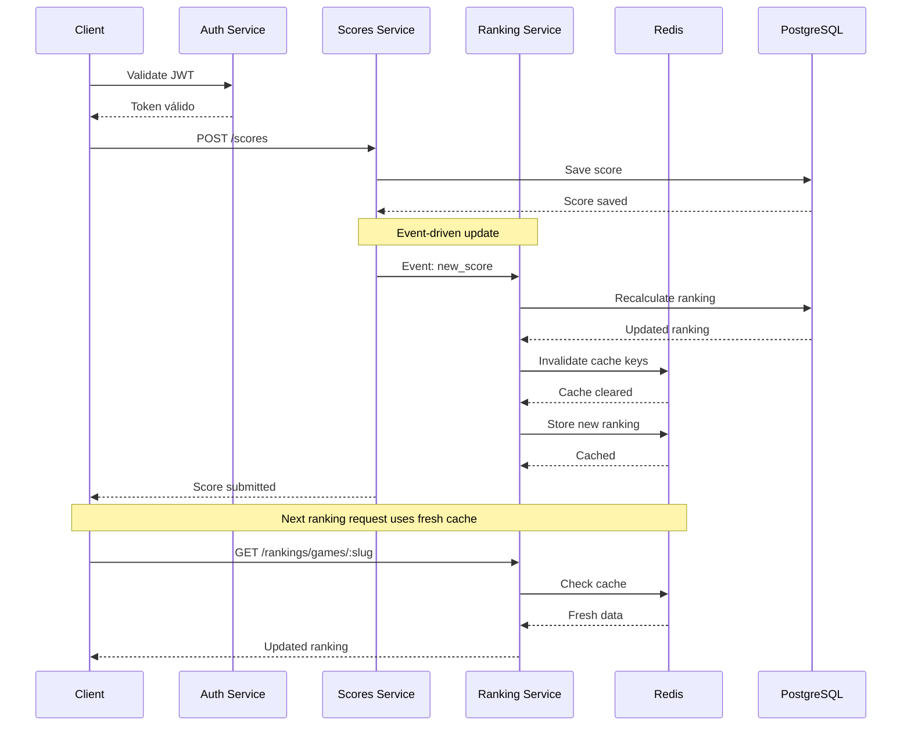

## Descripción

El servicio de rankings proporciona tablas de clasificación (leaderboards) para cada juego, mostrando los mejores jugadores y sus puntuaciones. Utiliza cache Redis para alta performance y se actualiza automáticamente cuando se guardan nuevos scores.

<CardGroup cols={3}>
  <Card title="Top Rankings" icon="medal">
    Los mejores jugadores

    Por cada juego o global
  </Card>

  <Card title="Real-time" icon="bolt">
    Actualización inmediata

    Al guardar scores
  </Card>

  <Card title="Cache Redis" icon="database">
    Performance optimizada

    Reducir carga en PostgreSQL
  </Card>
</CardGroup>

## Arquitectura

<CardGroup cols={2}>
  <Card title="Base de Datos" icon="database">
    **PostgreSQL**: Almacenamiento persistente de rankings

    **Redis**: Cache de rankings frecuentemente consultados
  </Card>

  <Card title="Configuración" icon="gear">
    **Puerto**: 3005

    **Dependencias**: Auth Service, Scores Service
  </Card>
</CardGroup>

## Flujo de Actualización de Rankings

La sincronización entre scores y rankings es un proceso crítico que involucra múltiples servicios:



### Estrategia de Invalidación de Cache

<CardGroup cols={2}>
  <Card title="Keys Afectados" icon="key">
    **Por Score**: `ranking:game:{slug}:*`

    **Global**: `ranking:global:*`

    **Temporal**: `ranking:*:daily`, `ranking:*:weekly`
  </Card>

  <Card title="Patrón de Update" icon="refresh">
    1. **Invalidar** cache existente
    2. **Recalcular** ranking en DB
    3. **Pre-cache** top rankings
    4. **Notificar** clientes via WebSocket
  </Card>
</CardGroup>

## Funcionalidades Principales

- **Rankings por juego**: Top 10 mejores scores por cada juego

- **Ranking global**: Mejores jugadores entre todos los juegos

- **Cache inteligente**: Redis para consultas frecuentes

- **Actualización automática**: Sync con nuevos scores

- **Filtros temporales**: Rankings diarios, semanales, mensuales

## Endpoints Principales

El servicio expone los siguientes endpoints REST:

<CardGroup cols={2}>
  <Card title="Rankings por Juego" icon="gamepad-2">
    `GET /api/rankings/games/:gameSlug`

    Obtiene el top 10 de un juego específico
  </Card>

  <Card title="Ranking Global" icon="globe">
    `GET /api/rankings/global`

    Mejores jugadores entre todos los juegos
  </Card>
</CardGroup>

<CardGroup cols={2}>
  <Card title="Rankings Temporales" icon="calendar">
    `GET /api/rankings/games/:gameSlug/period/:period`

    Rankings por período (daily, weekly, monthly)
  </Card>

  <Card title="Posición del Usuario" icon="user">
    `GET /api/rankings/games/:gameSlug/user/:userId`

    Posición específica de un usuario
  </Card>
</CardGroup>

## Optimizaciones de Performance

### Cache Strategy

<CardGroup cols={2}>
  <Card title="Hot Data" icon="fire">
    **Top 10**: Cache permanente con TTL de 1 hora

    **Invalidación**: Solo por nuevos scores en top 10
  </Card>

  <Card title="Cold Data" icon="snowflake">
    **Rankings completos**: Cache bajo demanda

    **TTL**: 15 minutos para rankings extensos
  </Card>
</CardGroup>

### Estructura de Cache Redis

```yaml

# Rankings por juego (top 10)
ranking:game:{gameSlug}:top10
  - Sorted Set con scores y userIds
  - TTL: 3600 segundos

# Ranking global
ranking:global:top10
  - Sorted Set con scores agregados
  - TTL: 3600 segundos

# Rankings temporales
ranking:game:{gameSlug}:daily:{date}
ranking:game:{gameSlug}:weekly:{week}
ranking:game:{gameSlug}:monthly:{month}
  - TTL variable según período

```

## Eventos y Sincronización

### Event Handling

<CardGroup cols={2}>
  <Card title="Eventos Entrantes" icon="arrow-down">
    **new_score**: Nuevo score guardado

    **score_updated**: Score existente actualizado

    **user_banned**: Usuario baneado del ranking
  </Card>

  <Card title="Eventos Salientes" icon="arrow-up">
    **ranking_updated**: Ranking recalculado

    **new_leader**: Nuevo líder en ranking

    **position_changed**: Cambio de posición significativo
  </Card>
</CardGroup>

### WebSocket Notifications

Para actualizaciones en tiempo real a los clientes:

```javascript
// Notificación de nuevo líder
{
  type: 'ranking_update',
  gameSlug: 'snake-game',
  event: 'new_leader',
  data: {
    userId: '123',
    username: 'PlayerOne',
    score: 15000,
    previousLeader: 'PlayerTwo'
  }
}

```

## Monitoreo y Métricas

<CardGroup cols={3}>
  <Card title="Cache Performance" icon="chart-line">
    - Hit rate de Redis
    - Tiempo de invalidación
    - Frecuencia de updates
  </Card>

  <Card title="Ranking Stats" icon="chart-bar">
    - Rankings más consultados
    - Frecuencia de cambios
    - Top jugadores activos
  </Card>

  <Card title="System Health" icon="heart-pulse">
    - Latencia de endpoints
    - Errores de sync
    - Memoria Redis utilizada
  </Card>
</CardGroup>