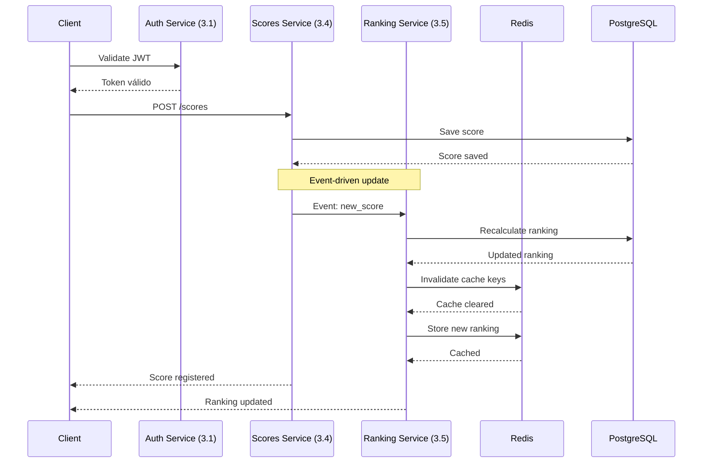

## Descripción

El servicio de rankings proporciona tablas de clasificación (leaderboards) para cada juego, mostrando los mejores jugadores y sus puntuaciones. Utiliza cache Redis para alta performance y se actualiza automáticamente cuando se guardan nuevos scores.

<CardGroup cols={3}>
  <Card title="Top Rankings" icon="medal">
    Los mejores jugadores

    Por cada juego o global
  </Card>

  <Card title="Real-time" icon="bolt">
    Actualización inmediata

    Al guardar scores
  </Card>

  <Card title="Cache Redis" icon="database">
    Performance optimizada

    Reducir carga en PostgreSQL
  </Card>
</CardGroup>

## Arquitectura

<CardGroup cols={2}>
  <Card title="Base de Datos" icon="database">
    **PostgreSQL**: Almacenamiento persistente de rankings

    **Redis**: Cache de rankings frecuentemente consultados
  </Card>

  <Card title="Configuración" icon="gear">
    **Puerto**: 3005

    **Dependencias**: [3.1. Auth Service](auth-service), [3.4. Score Service](score-service)
  </Card>
</CardGroup>

## Flujo de Actualización de Rankings

La sincronización entre scores y rankings es un proceso crítico que involucra múltiples servicios:



## API Endpoints

### Rankings Principales

<CodeGroup>

```http GET /rankings/global
GET /rankings/global
Authorization: Bearer {jwt_token}

Parámetros de consulta:
- limit: número de resultados (default: 50, max: 100)
- offset: paginación (default: 0)
```

```http GET /rankings/game/{gameId}
GET /rankings/game/{gameId}
Authorization: Bearer {jwt_token}

Parámetros de consulta:
- limit: número de resultados (default: 50, max: 100)
- offset: paginación (default: 0)
- timeframe: all|today|week|month (default: all)
```

</CodeGroup>

### Rankings de Usuario

<CodeGroup>

```http GET /rankings/user/{userId}/position
GET /rankings/user/{userId}/position
Authorization: Bearer {jwt_token}

Obtiene la posición actual del usuario en rankings globales y por juego
```

```http GET /rankings/user/{userId}/history
GET /rankings/user/{userId}/history
Authorization: Bearer {jwt_token}

Historial de posiciones del usuario a lo largo del tiempo
```

</CodeGroup>

## Estrategias de Cache

### Niveles de Cache

<Tabs>
  <Tab title="Cache L1 - Redis">
    ```javascript
    // Rankings más consultados
    const cacheKeys = {
      globalTop100: 'ranking:global:top:100',
      gameTop50: 'ranking:game:{gameId}:top:50',
      userPosition: 'ranking:user:{userId}:position'
    }

    // TTL diferenciado
    const cacheTTL = {
      topRankings: 300, // 5 minutos
      userPositions: 600, // 10 minutos
      gameRankings: 180 // 3 minutos
    }
    ```
  </Tab>

  <Tab title="Invalidación Inteligente">
    ```javascript
    // Solo invalida rankings afectados
    async function invalidateRankingCache(userId, gameId, newScore) {
      const affectedKeys = [
        `ranking:global:*`,
        `ranking:game:${gameId}:*`,
        `ranking:user:${userId}:*`
      ]
      
      await redis.del(affectedKeys)
      
      // Pre-calcula rankings más consultados
      await precomputeTopRankings(gameId)
    }
    ```
  </Tab>
</Tabs>

## Modelos de Datos

### Estructura de Rankings

```javascript
// Ranking Entry
{
  id: "uuid",
  userId: "user_uuid",
  gameId: "game_uuid",
  score: 95000,
  position: 1,
  username: "player_name",
  avatar: "avatar_url",
  achievedAt: "2024-01-15T10:30:00Z",
  gameMetadata: {
    level: 10,
    difficulty: "hard",
    playTime: "00:15:30"
  }
}

// Ranking Response
{
  rankings: [RankingEntry],
  pagination: {
    total: 1500,
    limit: 50,
    offset: 0,
    hasNext: true
  },
  metadata: {
    lastUpdated: "2024-01-15T10:35:00Z",
    gameTitle: "Space Shooter",
    timeframe: "all"
  }
}
```

## Performance y Optimizaciones

### Consultas Optimizadas

<CardGroup cols={2}>
  <Card title="Índices de Base de Datos" icon="database">
    ```sql
    -- Índices compuestos para rankings
    CREATE INDEX idx_rankings_game_score 
      ON rankings(game_id, score DESC, created_at);
    
    CREATE INDEX idx_rankings_user_game 
      ON rankings(user_id, game_id, score DESC);
    
    CREATE INDEX idx_rankings_global 
      ON rankings(score DESC, created_at DESC);
    ```
  </Card>

  <Card title="Batch Processing" icon="layers">
    ```javascript
    // Actualización en lotes para mejor performance
    async function batchUpdateRankings(scores) {
      const updates = scores.map(score => ({
        userId: score.userId,
        gameId: score.gameId,
        newPosition: calculatePosition(score)
      }))
      
      await db.batchUpdate('rankings', updates)
    }
    ```
  </Card>
</CardGroup>

## Eventos y Notificaciones

### Sistema de Eventos

```javascript
// Event: Ranking Position Changed
{
  event: 'ranking.position.changed',
  data: {
    userId: 'user_uuid',
    gameId: 'game_uuid',
    previousPosition: 5,
    newPosition: 3,
    improvement: 2,
    timestamp: '2024-01-15T10:30:00Z'
  }
}

// Event: New High Score in Rankings
{
  event: 'ranking.new.record',
  data: {
    userId: 'user_uuid',
    gameId: 'game_uuid',
    score: 98500,
    previousRecord: 95000,
    isGlobalRecord: false,
    isGameRecord: true
  }
}
```

## Métricas y Monitoreo

<CardGroup cols={2}>
  <Card title="Métricas de Performance" icon="chart-line">
    - Tiempo de respuesta de rankings
    - Hit rate del cache Redis
    - Frecuencia de actualización de rankings
    - Latencia de sincronización con scores
  </Card>

  <Card title="Métricas de Negocio" icon="users">
    - Jugadores en top rankings
    - Competitividad por juego
    - Evolución de rankings en el tiempo
    - Engagement basado en posiciones
  </Card>
</CardGroup>

## Escalabilidad

### Estrategias de Scaling

<Tabs>
  <Tab title="Particionamiento">
    ```javascript
    // Particionamiento por juego para mejor distribución
    const getShardKey = (gameId) => {
      return `ranking_shard_${gameId % SHARD_COUNT}`
    }

    // Rankings globales agregados desde shards
    const getGlobalRankings = async () => {
      const shardResults = await Promise.all(
        shards.map(shard => shard.getTopRankings(100))
      )
      
      return mergeAndSortRankings(shardResults)
    }
    ```
  </Tab>

  <Tab title="Cache Distribuido">
    ```javascript
    // Múltiples instancias Redis para alta disponibilidad
    const cacheCluster = new Redis.Cluster([
      { host: 'redis-1', port: 6379 },
      { host: 'redis-2', port: 6379 },
      { host: 'redis-3', port: 6379 }
    ])

    // Replicación maestro-esclavo para lecturas
    const readReplicas = ['redis-read-1', 'redis-read-2']
    ```
  </Tab>
</Tabs>