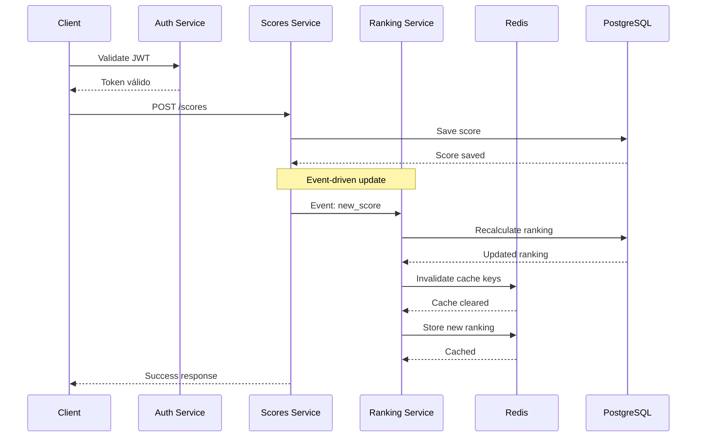

## Descripción

El servicio de rankings proporciona tablas de clasificación (leaderboards) para cada juego, mostrando los mejores jugadores y sus puntuaciones. Utiliza cache Redis para alta performance y se actualiza automáticamente cuando se guardan nuevos scores.

<CardGroup cols={3}>
  <Card title="Top Rankings" icon="medal">
    Los mejores jugadores

    Por cada juego o global
  </Card>

  <Card title="Real-time" icon="bolt">
    Actualización inmediata

    Al guardar scores
  </Card>

  <Card title="Cache Redis" icon="database">
    Performance optimizada

    Reducir carga en PostgreSQL
  </Card>
</CardGroup>

## Arquitectura

<CardGroup cols={2}>
  <Card title="Base de Datos" icon="database">
    **PostgreSQL**: Almacenamiento persistente de rankings

    **Redis**: Cache de rankings frecuentemente consultados
  </Card>

  <Card title="Configuración" icon="gear">
    **Puerto**: 3005

    **Dependencias**: Auth Service, Scores Service
  </Card>
</CardGroup>

## Flujo de Actualización de Rankings

La sincronización entre scores y rankings es un proceso crítico que involucra múltiples servicios:



## Problemas Comunes

<Warning>
Esta sección cubre los errores más frecuentes del servicio de rankings y sus soluciones rápidas.
</Warning>

### Cache Redis Desincronizado

* *Error**: Los rankings mostrados no coinciden con los datos reales de la base de datos.

* *Logs relevantes**:

```bash
[WARN] Cache hit for game:123 but data inconsistent
[ERROR] Redis key ranking:game:123 contains stale data

```

* *Soluciones rápidas**:
<Steps>
  <Step title="Limpieza manual del cache">
    ```bash
    # Conectar a Redis
    redis-cli -h localhost -p 6379

    # Limpiar rankings específicos
    DEL ranking:game:*
    DEL ranking:global
    ```

  </Step>
  <Step title="Recálculo forzado">
    ```bash
    curl -X POST http://localhost:3005/admin/recalculate-rankings \
      -H "Authorization: Bearer $ADMIN_TOKEN" \
      -H "Content-Type: application/json" \
      -d '{"gameId": "all"}'
    ```

  </Step>
</Steps>

### Eventos Perdidos de Scores

* *Error**: Los nuevos scores no actualizan automáticamente los rankings.

* *Logs relevantes**:

```bash
[ERROR] Failed to process score event: Connection refused
[WARN] Event queue backup detected: 15 pending events
[ERROR] RabbitMQ connection lost, events not processed

```

* *Soluciones rápidas**:
<Steps>
  <Step title="Verificar cola de eventos">
    ```bash
    # Revisar estado de RabbitMQ
    rabbitmqctl list_queues name messages

    # Buscar cola de rankings
    rabbitmqctl list_queues | grep ranking
    ```

  </Step>
  <Step title="Procesar eventos pendientes">
    ```bash
    # Endpoint para procesar eventos pendientes
    curl -X POST http://localhost:3005/admin/process-pending-events \
      -H "Authorization: Bearer $ADMIN_TOKEN"
    ```

  </Step>
</Steps>

### Performance Degradada

* *Error**: Consultas de rankings muy lentas, timeouts frecuentes.

* *Logs relevantes**:

```bash
[WARN] Ranking query took 5.2s for game:456
[ERROR] Database connection pool exhausted
[SLOW] SELECT from rankings WHERE game_id=? took 8934ms

```

* *Soluciones rápidas**:
<Steps>
  <Step title="Verificar índices de base de datos">
    ```sql
    -- Verificar índices existentes
    SELECT indexname FROM pg_indexes WHERE tablename = 'rankings';

    -- Crear índices faltantes si es necesario
    CREATE INDEX CONCURRENTLY idx_rankings_game_score
    ON rankings(game_id, score DESC);
    ```

  </Step>
  <Step title="Optimizar cache">
    ```bash
    # Verificar uso de memoria Redis
    redis-cli info memory

    # Establecer TTL apropiado
    redis-cli EXPIRE ranking:game:popular_game 3600
    ```

  </Step>
</Steps>

### Datos Corruptos en Rankings

* *Error**: Rankings muestran puntuaciones imposibles o jugadores duplicados.

* *Logs relevantes**:

```bash
[ERROR] Duplicate player_id in ranking calculation
[WARN] Score validation failed: negative score detected
[ERROR] Ranking integrity check failed for game:789

```

* *Soluciones rápidas**:
<Steps>
  <Step title="Validación de integridad">
    ```sql
    -- Buscar duplicados
    SELECT player_id, game_id, COUNT(*)
    FROM rankings
    GROUP BY player_id, game_id
    HAVING COUNT(*) > 1;

    -- Buscar scores inválidos
    SELECT * FROM rankings WHERE score < 0 OR score > 999999;
    ```

  </Step>
  <Step title="Limpieza y reconstrucción">
    ```bash
    # API para reconstruir rankings desde scores válidos
    curl -X POST http://localhost:3005/admin/rebuild-rankings \
      -H "Authorization: Bearer $ADMIN_TOKEN" \
      -d '{"gameId": "789", "validateScores": true}'
    ```

  </Step>
</Steps>

<Tip>

* *Monitoreo proactivo**: Configura alertas para detectar estos problemas antes de que afecten a los usuarios:

- Cache hit ratio < 80%

- Tiempo de respuesta > 2 segundos

- Eventos pendientes > 10

- Discrepancias entre cache y DB
</Tip>