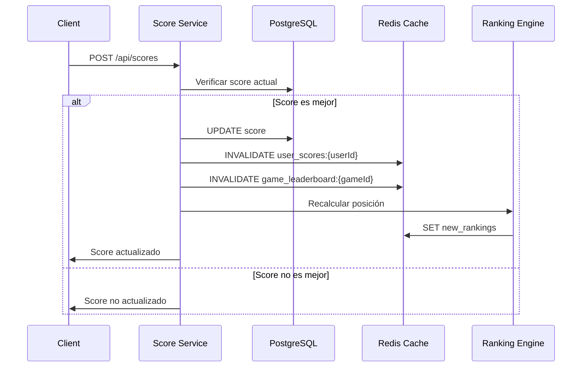

## Descripción

El servicio de puntuaciones permite a los jugadores guardar y actualizar sus mejores scores en cada juego. Solo guarda el score más alto por usuario y juego, proporcionando un sistema de rankings y logros personalizado con invalidación inteligente de cache.

<CardGroup cols={3}>
  <Card title="JWT Protected" icon="lock">
    Autenticación requerida

    Solo usuarios autenticados
  </Card>

  <Card title="Best Score Only" icon="star">
    Solo el mejor

    Actualiza si supera el anterior
  </Card>

  <Card title="Real-time" icon="bolt">
    Guardado instantáneo

    Sin delay
  </Card>
</CardGroup>

## Arquitectura del Servicio

| Característica | Detalle |
|---|---|
| **Puerto** | 5003 |
| **Base de Datos** | PostgreSQL (scores) |
| **Dependencias** | Auth Service, Games Service |
| **Cache** | Redis para rankings |

## Flujo de Actualización de Puntuaciones

El proceso de submit score involucra múltiples servicios y capas de cache para mantener rankings actualizados:

## Características Principales

### 🎯 Gestión de Puntuaciones

- Almacenamiento del mejor score por usuario/juego
- Validación automática contra scores existentes
- Historial de mejoras de puntuaciones

### 🏆 Sistema de Rankings

- Rankings globales por juego
- Comparativas entre usuarios
- Estadísticas de rendimiento

### 📊 Analytics de Jugador

- Progress tracking individual
- Métricas de mejora
- Logros desbloqueados

### ⚡ Cache Inteligente

- Invalidación selectiva por usuario y juego
- Rankings precalculados en Redis
- TTL automático para rankings globales

## Estrategia de Cache

<CardGroup cols={2}>
  <Card title="User Scores Cache" icon="user">
    **Key Pattern:** `user_scores:{userId}`

    **TTL:** 1 hora

    **Invalidación:** Al actualizar score
  </Card>

  <Card title="Game Leaderboards" icon="trophy">
    **Key Pattern:** `game_leaderboard:{gameId}`

    **TTL:** 15 minutos

    **Invalidación:** Al cambiar top rankings
  </Card>
</CardGroup>

## Endpoints

El servicio expone los siguientes endpoints principales:

<CardGroup cols={2}>
  <Card title="Guardar Puntuación" icon="save" href="/api-reference/scores/save-score">
    `POST /api/scores`

    Guarda o actualiza la puntuación de un jugador
  </Card>

  <Card title="Scores de Usuario" icon="user" href="/api-reference/scores/get-user-scores">
    `GET /api/scores/user/:userId`

    Obtiene todas las puntuaciones de un usuario
  </Card>

  <Card title="Ranking Global" icon="trophy" href="/api-reference/scores/get-leaderboard">
    `GET /api/scores/leaderboard/:game`

    Rankings globales por juego
  </Card>

  <Card title="Comparar Scores" icon="balance-scale" href="/api-reference/scores/compare-scores">
    `GET /api/scores/compare`

    Compara puntuaciones entre usuarios
  </Card>
</CardGroup>

## Proceso de Invalidación de Cache

### Triggers de Invalidación

<Steps>
  <Step title="Submit de Nueva Puntuación">
    Cuando un usuario envía un score, se verifica si supera su mejor marca actual
  </Step>

  <Step title="Validación de Mejora">
    Si el nuevo score es mejor, se actualiza la base de datos PostgreSQL
  </Step>

  <Step title="Cache de Usuario">
    Se invalida `user_scores:{userId}` para refrescar las puntuaciones personales
  </Step>

  <Step title="Cache de Leaderboard">
    Se invalida `game_leaderboard:{gameId}` si el score afecta el top ranking
  </Step>

  <Step title="Recálculo de Posiciones">
    El ranking engine recalcula las posiciones y actualiza el cache con nuevos datos
  </Step>
</Steps>

### Optimizaciones de Performance

- **Lazy Loading:** Rankings se recalculan solo cuando son solicitados
- **Batch Updates:** Múltiples scores se procesan en lotes durante picos de tráfico
- **Conditional Invalidation:** Solo se invalidan caches que realmente se ven afectados

## Consideraciones de Escalabilidad

<Warning>
Durante eventos con alto volumen de submits (torneos), el sistema implementa:

- **Queue System:** Redis Bull para procesar scores en background
- **Rate Limiting:** Máximo 10 submits por minuto por usuario
- **Partial Cache Updates:** Solo se actualizan posiciones relevantes en rankings
</Warning>

## Monitoreo

El servicio incluye métricas específicas para:

- Cache hit ratio por tipo de consulta
- Tiempo de invalidación de rankings
- Frecuencia de actualizaciones de score por juego
- Latencia de recálculos de posiciones