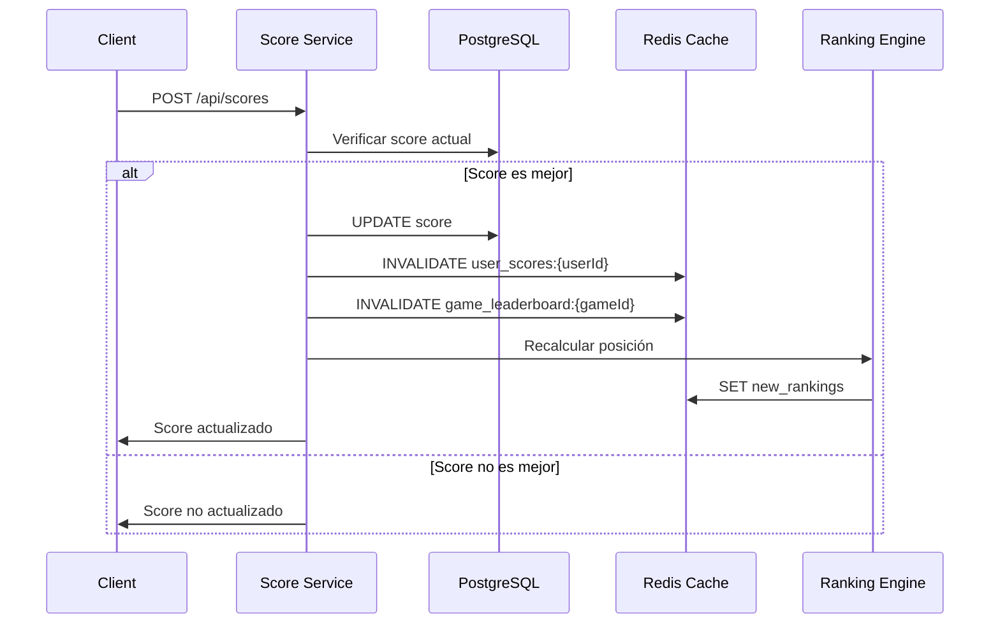

## Descripción

El servicio de puntuaciones permite a los jugadores guardar y actualizar sus mejores scores en cada juego. Solo guarda el score más alto por usuario y juego, proporcionando un sistema de rankings y logros personalizado con invalidación inteligente de cache.

<CardGroup cols={3}>
  <Card title="JWT Protected" icon="lock">
    Autenticación requerida

    Solo usuarios autenticados
  </Card>

  <Card title="Best Score Only" icon="star">
    Solo el mejor

    Actualiza si supera el anterior
  </Card>

  <Card title="Real-time" icon="bolt">
    Guardado instantáneo

    Sin delay
  </Card>
</CardGroup>

## Arquitectura del Servicio

| Característica | Detalle |
|---|---|
| **Puerto** | 5003 |
| **Base de Datos** | PostgreSQL (scores) |
| **Dependencias** | Auth Service, Games Service |
| **Cache** | Redis para rankings |

## Flujo de Actualización de Puntuaciones

El proceso de submit score involucra múltiples servicios y capas de cache para mantener rankings actualizados:



## Características Principales

### 🎯 Gestión de Puntuaciones

- Almacenamiento del mejor score por usuario/juego
- Validación automática contra records anteriores
- Sistema de rankings dinámico
- Cache inteligente para optimizar consultas

### 🏆 Sistema de Leaderboards

- Rankings globales por juego
- Posiciones calculadas en tiempo real
- Cache de rankings para respuesta rápida
- Invalidación automática al actualizar scores

### ⚡ Optimizaciones de Rendimiento

- Cache distribuido con Redis
- Queries optimizadas con índices compuestos
- Invalidación selectiva de cache
- Paginación eficiente en rankings

## Problemas Comunes

### 🚨 Cache Desactualizado

**Problema:** Los rankings no reflejan scores recientes

**Síntomas:**
```bash
# Usuario reporta score no visible en leaderboard
curl -H "Authorization: Bearer $TOKEN" /api/leaderboard/game123
# Respuesta muestra datos obsoletos
```

**Logs a revisar:**
```bash
# Buscar errores de invalidación de cache
docker logs score-service | grep "Cache invalidation failed"
docker logs redis | grep "COMMAND FAILED"
```

**Solución rápida:**
```bash
# Limpiar cache manualmente
redis-cli DEL "game_leaderboard:*"
redis-cli DEL "user_scores:*"

# Reiniciar servicio si persiste
docker restart score-service
```

### 🔄 Scores Duplicados

**Problema:** Múltiples entries del mismo usuario/juego

**Síntomas:**
```sql
-- Verificar duplicados
SELECT user_id, game_id, COUNT(*) 
FROM scores 
GROUP BY user_id, game_id 
HAVING COUNT(*) > 1;
```

**Logs relevantes:**
```bash
# Buscar race conditions
docker logs score-service | grep "Constraint violation"
docker logs score-service | grep "Transaction conflict"
```

**Solución:**
```sql
-- Limpiar duplicados manteniendo el mejor score
WITH ranked_scores AS (
  SELECT *, ROW_NUMBER() OVER (
    PARTITION BY user_id, game_id 
    ORDER BY score DESC, created_at DESC
  ) as rn
  FROM scores
)
DELETE FROM scores 
WHERE id IN (
  SELECT id FROM ranked_scores WHERE rn > 1
);
```

### 🐌 Rankings Lentos

**Problema:** Leaderboards tardan en cargar

**Síntomas:**
```bash
# Timeout en consultas de ranking
curl -w "%{time_total}" /api/leaderboard/popular-game
# > 5 segundos de respuesta
```

**Logs a reviever:**
```bash
# Queries lentas
docker logs score-service | grep "Query took"
docker logs postgresql | grep "slow query"
```

**Solución inmediata:**
```sql
-- Verificar índices
EXPLAIN ANALYZE SELECT * FROM scores 
WHERE game_id = 'game123' 
ORDER BY score DESC LIMIT 100;

-- Recrear índices si es necesario
REINDEX INDEX idx_scores_game_score;
```

### 🔐 Errores de Autenticación

**Problema:** Scores no se guardan por token inválido

**Síntomas:**
```bash
# Error 401 al enviar score
POST /api/scores
Authorization: Bearer expired_token
# Response: {"error": "Token expired"}
```

**Logs típicos:**
```bash
docker logs score-service | grep "JWT verification failed"
docker logs score-service | grep "Invalid token"
```

**Solución:**
```bash
# Verificar conectividad con auth service
curl http://auth-service:5001/health

# Revisar configuración JWT
docker exec score-service env | grep JWT
```

### 📊 Inconsistencias en Rankings

**Problema:** Posiciones incorrectas en leaderboard

**Síntomas:**
```bash
# Usuario con score alto aparece en posición baja
GET /api/leaderboard/game123
# Usuario con 10000 puntos en posición 50
```

**Solución de emergencia:**
```bash
# Forzar recálculo de rankings
curl -X POST -H "Authorization: Bearer $ADMIN_TOKEN" \
  /api/admin/recalculate-rankings/game123

# O via base de datos
docker exec -it postgresql psql -d gamedb -c \
  "SELECT user_id, score, 
   ROW_NUMBER() OVER (ORDER BY score DESC) as position 
   FROM scores WHERE game_id = 'game123';"
```

## API Endpoints

### POST /api/scores
Enviar nuevo score

### GET /api/leaderboard/:gameId
Obtener ranking de un juego

### GET /api/user-scores/:userId
Obtener scores de un usuario

### POST /api/admin/recalculate-rankings/:gameId
Recalcular rankings (admin only)