## Descripción

El servicio de puntuaciones permite a los jugadores guardar y actualizar sus mejores scores en cada juego. Solo guarda el score más alto por usuario y juego, proporcionando un sistema de rankings y logros personalizado con invalidación inteligente de cache.

<CardGroup cols={3}>
  <Card title="JWT Protected" icon="lock">
    Autenticación requerida

    Solo usuarios autenticados
  </Card>

  <Card title="Best Score Only" icon="star">
    Solo el mejor

    Actualiza si supera el anterior
  </Card>

  <Card title="Real-time" icon="bolt">
    Guardado instantáneo

    Sin delay
  </Card>
</CardGroup>

## Arquitectura del Servicio

| Característica | Detalle |
|---|---|
| **Puerto** | 5003 |
| **Base de Datos** | PostgreSQL (scores) |
| **Dependencias** | Auth Service (3.1), Games Service (3.3) |
| **Cache** | Redis para rankings |

## Flujo de Actualización de Puntuaciones

El proceso de submit score involucra múltiples servicios y capas de cache para mantener rankings actualizados:

```mermaid
sequenceDiagram
    participant Client
    participant ScoreAPI as Score Service
    participant DB as PostgreSQL
    participant Cache as Redis Cache
    participant Rankings as Ranking Engine

    Client->>ScoreAPI: POST /api/scores
    ScoreAPI->>DB: Verificar score actual

    alt Score es mejor
        ScoreAPI->>DB: UPDATE score
        ScoreAPI->>Cache: INVALIDATE user_scores:{userId}
        ScoreAPI->>Cache: INVALIDATE game_leaderboard:{gameId}
        ScoreAPI->>Rankings: Recalcular posición
        Rankings->>Cache: SET new_rankings
        ScoreAPI->>Client: Score actualizado
    else Score no es mejor
        ScoreAPI->>Client: Score no actualizado
    end
```



## Características Principales

### 🎯 Gestión de Puntuaciones

- **Best Score Only**: Almacena únicamente la mejor puntuación por usuario/juego
- **Validación Automática**: Verificación de integridad y comparación de scores
- **Actualización Condicional**: Solo actualiza si el nuevo score es superior
- **Auditoría Completa**: Registro de todas las submissions con timestamps

### 🏆 Sistema de Rankings

- **Leaderboards Dinámicos**: Rankings actualizados en tiempo real
- **Cache Inteligente**: Redis para consultas rápidas de rankings
- **Invalidación Selectiva**: Solo actualiza cache afectado por cambios
- **Rankings Globales**: Top players por juego con paginación

### 📊 Análisis y Estadísticas

- **Métricas de Rendimiento**: Estadísticas detalladas por usuario
- **Progresión Temporal**: Historial de mejoras de puntuaciones
- **Comparativas**: Rankings relativos y percentiles
- **Agregaciones**: Estadísticas por juego y período

## Endpoints Principales

### Gestión de Scores

```http
POST /api/scores
Content-Type: application/json
Authorization: Bearer {jwt_token}

{
  "gameId": "tetris-classic",
  "score": 125000,
  "metadata": {
    "level": 8,
    "lines": 240,
    "duration": 180000
  }
}
```

### Consulta de Rankings

```http
GET /api/scores/leaderboard/{gameId}?limit=10&offset=0
```

### Scores de Usuario

```http
GET /api/scores/user/{userId}
```

## Modelo de Datos

### Tabla Scores

```sql
CREATE TABLE scores (
    id SERIAL PRIMARY KEY,
    user_id INTEGER NOT NULL,
    game_id VARCHAR(50) NOT NULL,
    score INTEGER NOT NULL,
    metadata JSONB,
    achieved_at TIMESTAMP DEFAULT CURRENT_TIMESTAMP,
    updated_at TIMESTAMP DEFAULT CURRENT_TIMESTAMP,
    UNIQUE(user_id, game_id)
);

CREATE INDEX idx_scores_game_score ON scores(game_id, score DESC);
CREATE INDEX idx_scores_user ON scores(user_id);
```

### Cache Structure

```redis
# Leaderboard por juego (top 100)
game_leaderboard:tetris-classic -> ZSET (score -> user_id)

# Scores de usuario
user_scores:123 -> HASH (game_id -> score)

# Posición en ranking
user_rank:123:tetris-classic -> INTEGER
```

## Integración con Otros Servicios

### Dependencia del Auth Service (3.1)

```javascript
// Middleware de autenticación
const verifyToken = async (req, res, next) => {
  const response = await fetch(`${AUTH_SERVICE}/verify`, {
    headers: { Authorization: req.headers.authorization }
  });
  
  if (!response.ok) {
    return res.status(401).json({ error: 'Token inválido' });
  }
  
  req.user = await response.json();
  next();
};
```

### Validación con Games Service (3.3)

```javascript
// Verificar que el juego existe
const validateGame = async (gameId) => {
  const response = await fetch(`${GAMES_SERVICE}/api/games/${gameId}`);
  return response.ok;
};
```

### Comunicación con Ranking Service (3.5)

```javascript
// Notificar cambio de score al servicio de rankings
const notifyRankingUpdate = async (userId, gameId, newScore) => {
  await fetch(`${RANKING_SERVICE}/api/rankings/update`, {
    method: 'POST',
    headers: { 'Content-Type': 'application/json' },
    body: JSON.stringify({ userId, gameId, newScore })
  });
};
```

## Estrategia de Cache

### Invalidación Inteligente

```javascript
const invalidateCache = async (userId, gameId) => {
  const pipeline = redis.pipeline();
  
  // Invalidar scores del usuario
  pipeline.del(`user_scores:${userId}`);
  
  // Invalidar leaderboard del juego
  pipeline.del(`game_leaderboard:${gameId}`);
  
  // Invalidar ranking del usuario en el juego
  pipeline.del(`user_rank:${userId}:${gameId}`);
  
  await pipeline.exec();
};
```

### Cache Warming

```javascript
// Pre-cargar leaderboards populares
const warmPopularLeaderboards = async () => {
  const popularGames = await getPopularGames();
  
  for (const game of popularGames) {
    await generateLeaderboard(game.id);
  }
};
```

## Rendimiento y Escalabilidad

### Optimizaciones de Base de Datos

- **Índices Compuestos**: Para consultas de rankings eficientes
- **Particionado**: Por juego para grandes volúmenes
- **Connection Pooling**: Pool de conexiones optimizado
- **Query Optimization**: Consultas optimizadas para rankings

### Estrategias de Cache

- **TTL Dinámico**: Expiración basada en popularidad del juego
- **Cache Aside**: Patrón de cache para datos dinámicos
- **Bulk Operations**: Operaciones en lote para actualizaciones masivas
- **Cache Hierarchy**: Multiple niveles de cache

### Métricas y Monitoring

```javascript
// Métricas de rendimiento
const metrics = {
  scoreSubmissions: new Counter('score_submissions_total'),
  cacheHitRate: new Histogram('cache_hit_rate'),
  dbQueryTime: new Histogram('db_query_duration_ms'),
  rankingUpdateTime: new Histogram('ranking_update_duration_ms')
};
```

## Consideraciones de Seguridad

### Validación de Datos

- **Score Limits**: Límites máximos por juego para prevenir abuse
- **Rate Limiting**: Límite de submissions por usuario/minuto
- **Sanitización**: Validación estricta de metadata
- **Audit Trail**: Log completo de todas las operaciones

### Anti-Cheating

```javascript
// Validación de scores sospechosos
const validateScoreIntegrity = (gameId, score, metadata) => {
  const gameConfig = getGameConfig(gameId);
  
  if (score > gameConfig.maxPossibleScore) {
    throw new Error('Score imposible detectado');
  }
  
  // Validaciones específicas por juego
  return validateGameSpecificRules(gameId, score, metadata);
};
```

## Docker y Deployment

### Dockerfile

```dockerfile
FROM node:18-alpine

WORKDIR /app

COPY package*.json ./
RUN npm ci --only=production

COPY . .

EXPOSE 5003

CMD ["npm", "start"]
```

### Health Checks

```javascript
app.get('/health', async (req, res) => {
  try {
    // Verificar conexión DB
    await db.query('SELECT 1');
    
    // Verificar conexión Redis
    await redis.ping();
    
    res.json({ status: 'healthy', timestamp: new Date().toISOString() });
  } catch (error) {
    res.status(503).json({ status: 'unhealthy', error: error.message });
  }
});
```

## Testing

### Tests de Integración

```javascript
describe('Score Service Integration', () => {
  test('should update score when new score is higher', async () => {
    const response = await request(app)
      .post('/api/scores')
      .set('Authorization', `Bearer ${validToken}`)
      .send({
        gameId: 'tetris-classic',
        score: 150000
      });
      
    expect(response.status).toBe(200);
    expect(response.body.updated).toBe(true);
  });
  
  test('should not update score when new score is lower', async () => {
    const response = await request(app)
      .post('/api/scores')
      .set('Authorization', `Bearer ${validToken}`)
      .send({
        gameId: 'tetris-classic',
        score: 50000
      });
      
    expect(response.status).toBe(200);
    expect(response.body.updated).toBe(false);
  });
});
```

## Próximos Pasos

- **Logros y Badges**: Sistema de achievements basado en scores
- **Torneos**: Competencias temporales con leaderboards especiales
- **ML Analytics**: Detección inteligente de patrones de cheating
- **Real-time Notifications**: WebSocket para updates en tiempo real